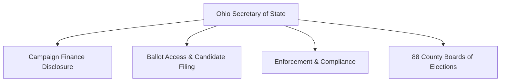

# Ohio Campaign Finance Overview

> **STALENESS WARNING:** This reference reflects Ohio Revised Code Chapter 3517 and Secretary of State rules as of early 2025. Ohio adjusts contribution limits based on the Consumer Price Index (CPI) at the beginning of each odd-numbered year. The Ohio General Assembly may also amend campaign finance law. Always verify current limits and requirements at [sos.state.oh.us/campaign-finance/](https://www.sos.state.oh.us/campaign-finance/).

> **EDUCATIONAL DISCLAIMER:** This is educational information, not legal advice. Ohio's CPI-adjusted contribution limits change every two years. Consult an Ohio election law attorney for guidance specific to your campaign and always verify current-cycle limits with the Secretary of State.

---

## Filing Agency

**Ohio Secretary of State**
- Website: [sos.state.oh.us](https://www.sos.state.oh.us)
- Administers campaign finance disclosure for statewide and General Assembly candidates
- County and municipal candidates file with their **county Board of Elections**
- Ohio has 88 county Boards of Elections that handle local filings

---

## Unique Features of Ohio Campaign Finance Law

1. **CPI-adjusted contribution limits** -- limits increase at the start of each odd-numbered year based on the Consumer Price Index, making Ohio one of the few states with automatic inflation adjustment
2. **Corporate contributions to candidates are prohibited** -- corporations may contribute to PACs but not directly to candidates
3. **No limit on personal funds** -- candidates may spend unlimited personal funds
4. **Joint fundraising committees** -- Ohio permits joint fundraising between candidates and party committees
5. **Inaugural committees** -- statewide officeholders may establish separate committees for inaugural events with distinct reporting requirements
6. **Political contributing entities (PCEs)** -- organizations that contribute to candidates or committees but are not traditional PACs must register and report

---

## Contribution Limits (2025-2026 Cycle -- Verify for CPI Adjustments)

| Donor Type | Statewide Candidates (per election) | General Assembly (per election) | County/Local (per election) | Notes |
|-----------|-------------------------------------|-------------------------------|---------------------------|-------|
| Individual | **$13,838** | **$13,838** | **$13,838** | CPI-adjusted; verify current amount |
| Corporation | **Prohibited** | **Prohibited** | **Prohibited** | May contribute to PACs |
| Labor Union | **Prohibited** (direct) | **Prohibited** | **Prohibited** | May contribute through PACs |
| PAC | **$13,838** | **$13,838** | **$13,838** | Same as individual limits |
| Political Party (state) | **$83,034** | **$83,034** | N/A | CPI-adjusted; higher limit |
| Political Party (county) | **$83,034** | **$83,034** | Varies | CPI-adjusted |
| Candidate to Own Campaign | **No limit** | **No limit** | **No limit** | Personal funds unlimited |
| Small Donor PAC | Higher limits may apply | Higher limits | Higher limits | Must meet small-donor criteria |

*Note: All dollar figures above are approximate based on the 2025 CPI adjustment. Verify current limits at the Secretary of State's website, as they change every odd-numbered year.*

### Aggregate Limits
- Ohio does **not** impose aggregate limits on total contributions from an individual to all candidates combined
- Separate per-candidate, per-election limits apply

---

## Committee Registration

### Candidate Committees
- File a **Designation of Treasurer** with the Secretary of State (statewide/General Assembly) or county Board of Elections (local)
- Must be filed before accepting contributions or making expenditures
- Must designate a campaign treasurer

### Political Action Committees
- File registration with the Secretary of State
- Must designate a treasurer and custodian of records
- Must register before soliciting or accepting contributions

### Political Contributing Entities (PCEs)
- Organizations that contribute to candidates/committees but are not PACs must register as PCEs
- Subject to disclosure requirements

---

## Ballot Access

### Major Party Candidates (Republican / Democrat)
- File a **Declaration of Candidacy** and **petition** with the Secretary of State or county Board of Elections
- Petition signatures required vary by office (e.g., 1,000 signatures for statewide office; 50 signatures for State Representative)
- Filing deadline is typically in February of the election year (approximately 90 days before the primary)
- Primary elections held in May (moved from March in recent cycles -- verify current date)

### Independent and Minor Party Candidates
- Must collect petition signatures (typically 1% of the total vote cast for governor in the last election for statewide office)
- Filing deadline is earlier than major party candidates in some cases
- Minor parties must maintain ballot access by meeting vote thresholds

### Write-In Candidates
- Must file a declaration of intent as a write-in candidate by a specified deadline before the election

---

## Reporting Schedule

### Regular Reports (Semi-Annual / Annual)
- **Pre-election report** (12 days before the primary or general election)
- **Post-election report** (38 days after the primary or general election) -- this has been referred to as the semi-annual report
- **Annual report** -- due in January (covers the full prior year for non-election years)

### Election-Related Reports
| Report | Due Date | Coverage |
|--------|----------|----------|
| **12-day pre-primary** | 12 days before primary | Through 20 days before primary |
| **12-day pre-general** | 12 days before general | Through 20 days before general |
| **Post-general / semi-annual** | ~38 days after general | Remainder of period through Dec 31 |
| **Annual (non-election year)** | Last business day of January | Full prior calendar year |

### Late Contribution Reporting
- Contributions of **$1,000 or more** received after the close of the last pre-election report and before the election must be reported within **2 business days**

### Itemization Thresholds
- Contributions over **$25** from a single source in a reporting period must be itemized
- Expenditures over **$25** must be itemized
- Ohio has a notably low itemization threshold compared to most states

---

## Prohibited Contributions

- **Corporate contributions** directly to candidates (including professional corporations)
- **Labor union contributions** directly to candidates
- Contributions in the **name of another** (straw donors)
- **Foreign national** contributions
- **Cash contributions exceeding $100**
- **Anonymous contributions exceeding $25** -- must be returned or donated to the state treasury
- Contributions from **regulated utilities** to certain candidates (Public Utilities Commission races)
- Contributions while the **General Assembly is in session** from certain regulated entities (specific restrictions apply)

---

## Key Differences from Federal Law

| Feature | Federal | Ohio |
|---------|---------|------|
| Individual contribution limit | $3,300/election (2023-24) | **~$13,838/election** (CPI-adjusted) |
| Limit adjustment | Every odd year (inflation) | **Every odd year (CPI)** |
| Corporate contributions | Prohibited | **Prohibited** (same) |
| Union contributions | Prohibited (direct) | **Prohibited** (direct, same) |
| PAC-to-candidate limit | $5,000/election | **~$13,838/election** (same as individual) |
| Party-to-candidate limit | Coordinated expenditure limits | **~$83,034/election** |
| Itemization threshold | $200/cycle | **$25/period** (much lower) |
| Cash cap | $100 | **$100** (same) |
| Public financing | Presidential | **None** |

---

## Local Rules Notes

- **County and municipal candidates** file with their county Board of Elections rather than the Secretary of State
- **Columbus, Cleveland, Cincinnati** and other major cities follow state campaign finance law; Ohio does not generally authorize municipalities to impose their own separate campaign finance limits
- Ohio's **88 county Boards of Elections** are the primary local election administrators
- **Township, village, and school board** candidates have the same filing obligations but lower activity thresholds
- Some local jurisdictions may have charter provisions affecting campaign finance -- check local charter documents
- **Judicial candidates** are subject to the same contribution limits as other candidates but also subject to the Ohio Code of Judicial Conduct regarding campaign activity

---

## Electronic Filing

- The Secretary of State provides an electronic filing system for campaign finance reports
- Electronic filing is **required** for statewide and General Assembly candidates and PACs
- Local candidates filing with county Boards of Elections may file on paper below certain thresholds
- The filing system is available at the Secretary of State's campaign finance portal

---

## Resources

- **Ohio Secretary of State -- Campaign Finance:** [sos.state.oh.us/campaign-finance/](https://www.sos.state.oh.us/campaign-finance/)
- **Ohio Revised Code Chapter 3517:** Campaign finance law
- **Current Contribution Limits:** Published by the Secretary of State each odd-numbered year
- **County Boards of Elections Directory:** Available on the Secretary of State's website
- **Campaign Finance Handbook:** Published by the Secretary of State
