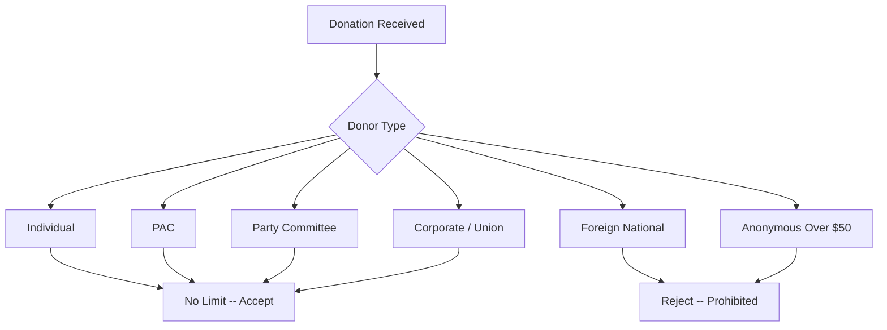

# Pennsylvania Contribution Limits (Detailed)

> **STALENESS WARNING:** This reference was written in April 2026. Pennsylvania's
> campaign finance laws may be amended by the General Assembly at any time. Verify
> current rules at https://www.dos.pa.gov/VotingElections/ before making compliance
> decisions.

> **EDUCATIONAL DISCLAIMER:** This document is for educational and informational purposes
> only. It does not constitute legal advice. Campaigns should consult a qualified election
> law attorney or the Pennsylvania Department of State for guidance specific to their
> situation.

---

## Background

Pennsylvania is one of a small number of states that impose **no contribution limits**
on donations to candidates. This means individuals, corporations, unions, and PACs
can contribute unlimited amounts to candidate committees. Pennsylvania relies on
a **disclosure-only** system rather than contribution caps to regulate campaign finance.

Key history:
- Pennsylvania has never enacted contribution limits at the state level
- Multiple legislative attempts to impose limits have failed
- The state's approach is: unlimited contributions + mandatory disclosure
- This makes Pennsylvania one of the most permissive states for campaign donors

---

## Current Rules: No Limits

### Individual Contributions to Candidates

| Office | Limit Per Election |
|--------|--------------------|
| Governor | **No limit** |
| Lieutenant Governor | **No limit** |
| Attorney General | **No limit** |
| State Treasurer | **No limit** |
| State Auditor General | **No limit** |
| State Senator | **No limit** |
| State Representative | **No limit** |
| County/municipal offices | **No limit** |
| Judicial offices | **No limit** |

### Corporate and Union Contributions

| Source | Permitted? | Limit |
|--------|-----------|-------|
| Corporate treasury | **Yes** | **No limit** |
| Union treasury | **Yes** | **No limit** |
| Corporate PAC | **Yes** | **No limit** |
| Union PAC | **Yes** | **No limit** |

Pennsylvania allows direct corporate and union treasury contributions with no cap.
This is among the most permissive frameworks in the nation.

### PAC Contributions to Candidates

| Donor | Limit |
|-------|-------|
| PAC to any candidate | **No limit** |
| PAC to PAC | **No limit** |
| PAC to party committee | **No limit** |

### Party Committee Contributions

| Donor | Limit |
|-------|-------|
| State party to candidate | **No limit** |
| County/local party to candidate | **No limit** |
| National party to state candidate | **No limit** |

---

## What IS Regulated

While Pennsylvania does not limit contribution amounts, several rules still apply:

### Personal Use Prohibition
Campaign funds may **not** be used for personal purposes. Prohibited uses include:
- [ ] Mortgage or rent on personal residence
- [ ] Personal vehicle payments
- [ ] Personal clothing (unless campaign-specific)
- [ ] Country club or social club dues
- [ ] Tuition or education expenses for candidate or family

### Disclosure Requirements
All contributions and expenditures must be disclosed through periodic reports
(see separate disclosure-requirements.md). This is the primary regulatory
mechanism in Pennsylvania.

### Anonymous Contributions
- Contributions over $50 from anonymous sources are prohibited
- Cash contributions over $100 are prohibited

### Foreign National Contributions
Federal law prohibits foreign national contributions; this applies to
Pennsylvania elections as well.

---

## Comparison: Pennsylvania vs. Neighboring States

| State | Individual Limit | Corporate Contributions |
|-------|-----------------|------------------------|
| **Pennsylvania** | **No limit** | **Allowed, no limit** |
| Ohio | ~$13,838/election | Banned |
| New York | $18,600-$69,700 | Allowed, with limits |
| New Jersey | $5,300/election | Allowed, with limits |
| West Virginia | $1,000/election | Banned |
| Maryland | $6,000/cycle | Banned |

---

## Self-Funding

Candidates may contribute unlimited amounts from their own personal funds.
Given the absence of contribution limits generally, self-funding is unrestricted
in the same way as all other contributions.

---

## States Without Contribution Limits

Pennsylvania joins a small group of states with no contribution limits:

| State | Notes |
|-------|-------|
| Pennsylvania | Disclosure-only system |
| Virginia | No limits |
| Utah | No limits |
| Texas | No individual limits (corporate limited) |
| Oregon | Previously no limits; voters approved limits in 2024 |

---

## Prohibited Contributions (Quick Reference)

| Source | Permitted? | Notes |
|--------|-----------|-------|
| Individuals | Yes | **No limit** |
| Corporations | Yes | **No limit** |
| Unions | Yes | **No limit** |
| PACs | Yes | **No limit** |
| Party committees | Yes | **No limit** |
| Foreign nationals | **No** | Prohibited |
| Anonymous (over $50) | **No** | Must identify donor |
| Cash (over $100) | **No** | Must use traceable method |
| Government contractors | Yes | No restriction at state level |

---

## Local Exception: Philadelphia

Philadelphia has enacted **local contribution limits** that apply to candidates
for city office. See local-rules.md for full details. Key highlights:
- Individual limit: ~$13,400 per election to city candidates
- Corporate contributions: banned for city races
- These apply only to Philadelphia city elections, not state races

---

## Sources & Verification

- Pennsylvania Election Code, 25 Pa.C.S. (formerly Title 25 P.S.)
- Pennsylvania Department of State, Bureau of Commissions, Elections and Legislation
- https://www.dos.pa.gov/VotingElections/
- Last verified: April 2026
