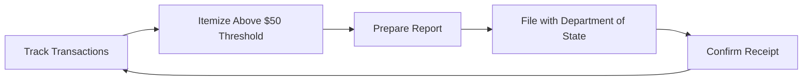

# Pennsylvania Disclosure Requirements (Detailed)

> **STALENESS WARNING:** This reference was written in April 2026. Pennsylvania
> disclosure schedules and thresholds may change through legislative action. Verify
> current requirements at https://www.dos.pa.gov/VotingElections/ before making
> compliance decisions.

> **EDUCATIONAL DISCLAIMER:** This document is for educational and informational purposes
> only. It does not constitute legal advice. Campaigns should consult a qualified election
> law attorney or the Pennsylvania Department of State for guidance specific to their
> situation.

---

## Overview

Because Pennsylvania has no contribution limits, disclosure is the primary
regulatory mechanism for campaign finance. All candidates, political committees,
and political action committees must file periodic reports detailing contributions
received and expenditures made.

---

## Filing Schedule

### Election Year Reports

| Report | Deadline | Covers Through |
|--------|----------|----------------|
| Pre-primary | 2nd Friday before primary | Through the prior Monday |
| Pre-general | 2nd Friday before general | Through the prior Monday |
| Post-election (cycle 5) | 30 days after general | Through 20 days after general |
| Annual | January 31 | Through December 31 |

### Non-Election Year Reports

| Report | Deadline | Covers Through |
|--------|----------|----------------|
| Annual | January 31 | Through December 31 |

### Special Notes
- In odd-numbered election years (municipal elections), the same pre-election
  schedule applies for those races.
- Reports are cumulative within the reporting period.

---

## Itemization Thresholds

### Contributions Received

| Donor Type | Itemization Threshold |
|------------|----------------------|
| All contributors | $50 per year aggregate |

When a contributor exceeds $50 in aggregate contributions within the cycle,
the campaign must report:
- [ ] Full name of contributor
- [ ] Complete mailing address
- [ ] Occupation and employer (for individuals)
- [ ] Date and amount of each contribution
- [ ] Aggregate total

### Expenditures

| Threshold | Requirement |
|-----------|-------------|
| All expenditures over $25 | Must be itemized |
| Expenditures under $25 | May be reported in aggregate |

For each itemized expenditure:
- [ ] Payee name and address
- [ ] Date and amount
- [ ] Purpose/description of expenditure

---

## Electronic Filing

### Threshold for Electronic Filing
- Committees that receive or spend **$250 or more** must file electronically
- Committees below $250 may file on paper

### Filing System
Pennsylvania uses an online reporting system maintained by the Department of State.
Reports are filed through the state campaign finance website.

### Electronic Filing Checklist
- [ ] Register committee with the Department of State
- [ ] Obtain account credentials for online filing system
- [ ] Designate a treasurer (legally required)
- [ ] File statement of organization within 20 days of committee formation
- [ ] Submit reports electronically by the deadline
- [ ] Verify submission confirmation received

---

## Who Must File

| Entity | Filing Requirement |
|--------|-------------------|
| Candidate committees | All reports on schedule |
| Political committees (PACs) | All reports on schedule |
| Party committees | All reports on schedule |
| Independent expenditure groups | When spending exceeds threshold |
| Ballot measure committees | All reports on schedule |

### Threshold for Registration
A political committee must register and file reports if it receives contributions
or makes expenditures exceeding $250 in a calendar year.

---

## Late Filing Penalties

| Violation | Penalty |
|-----------|---------|
| Late filing | $10/day for first 6 days |
| Late filing (7+ days) | $20/day |
| Maximum penalty per report | $250 |
| Failure to file | Referral for prosecution; additional civil penalties |

The Department of State sends late notices, but it is the filer's responsibility
to meet deadlines regardless of whether a notice is received.

---

## Independent Expenditure Reporting

Organizations making independent expenditures in Pennsylvania must report them:

| Requirement | Details |
|------------|---------|
| Registration | Must register as political committee if over $250 |
| Reporting | Same schedule as candidate committees |
| Disclaimer | Must include "paid for by" identification |

---

## Public Access

Campaign finance reports are publicly available through:
- Pennsylvania Department of State website (searchable database)
- In-person inspection at the Department of State
- Bulk data available for download

Website: https://www.campaignfinanceonline.pa.gov/

---

## Record Retention

Campaigns must maintain records to verify filed reports:
- [ ] Bank statements and canceled checks
- [ ] Deposit records and contributor cards
- [ ] Credit card statements
- [ ] Invoices and receipts for expenditures
- [ ] Contracts for services
- [ ] Retain records for at least 3 years after filing

---

## Common Compliance Pitfalls

- [ ] Missing the $50 itemization threshold -- track aggregate contributions carefully
- [ ] Failing to report in-kind contributions (goods and services at fair market value)
- [ ] Not registering the committee within 20 days of formation
- [ ] Overlooking the annual report in non-election years
- [ ] Not reporting debts and obligations as they are incurred

---

## Sources & Verification

- Pennsylvania Election Code, 25 Pa.C.S. Chapter 16
- Pennsylvania Department of State Campaign Finance page
- https://www.dos.pa.gov/VotingElections/
- https://www.campaignfinanceonline.pa.gov/
- Last verified: April 2026
