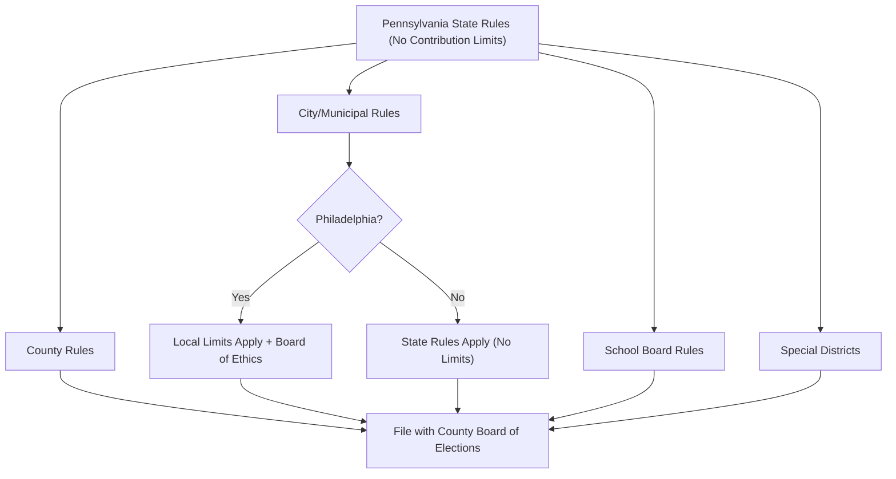

# Pennsylvania Local Election Rules (Detailed)

> **STALENESS WARNING:** This reference was written in April 2026. Local election rules
> in Pennsylvania vary by municipality and county. Philadelphia in particular has its own
> campaign finance regulations. Verify current local requirements with the appropriate
> county board of elections or city ethics board before filing.

> **EDUCATIONAL DISCLAIMER:** This document is for educational and informational purposes
> only. It does not constitute legal advice. Candidates should consult a qualified election
> law attorney or the relevant local election authority for guidance specific to their
> situation.

---

## Overview

Pennsylvania has 67 counties, over 2,500 municipalities (boroughs, townships, and
cities), and 500 school districts. Local election rules are governed by a combination
of the Pennsylvania Election Code and local home rule charters. While the state
imposes no contribution limits, some municipalities -- notably Philadelphia -- have
enacted their own campaign finance regulations.

---

## Philadelphia

Philadelphia is the most significant local exception to Pennsylvania's no-limits
campaign finance framework.

### Philadelphia Contribution Limits

| Donor Type | Limit Per Election |
|------------|-------------------|
| Individual to city candidate | ~$13,400 |
| PAC to city candidate | ~$13,400 |
| Corporate contributions | **Banned** for city races |
| Union contributions | Subject to individual limits |
| Party committee to city candidate | **No limit** |
| Self-funding | **No limit** |

### Key Philadelphia Rules
- [ ] Limits apply to candidates for mayor, city council, and other city offices
- [ ] Limits are adjusted periodically for inflation
- [ ] Corporate contributions to city candidates are **prohibited**
- [ ] Philadelphia Board of Ethics enforces local campaign finance law
- [ ] Pay-to-play restrictions: contractors with city contracts >$10,000 face
      additional contribution limits
- [ ] Lobbyist registration and disclosure required

### Philadelphia Filing
- Campaign finance reports filed with the Philadelphia Board of Ethics
- State-level reports also required with the Department of State
- Dual reporting obligation for city candidates

### Philadelphia Ethics Board
- Website: https://www.phila.gov/departments/board-of-ethics/
- Enforces campaign finance, lobbying, and financial disclosure rules
- Can impose fines and penalties for violations

---

## Pittsburgh

Pittsburgh is a home rule charter city but does **not** impose local contribution
limits beyond state law.

### Pittsburgh Election Structure

| Office | Details |
|--------|---------|
| Mayor | 4-year term, partisan election |
| City Council (9 districts) | 4-year term, partisan |
| City Controller | 4-year term, partisan |
| Election type | Partisan primary and general |

### Pittsburgh-Specific Notes
- [ ] No local contribution limits (state no-limit framework applies)
- [ ] Campaign finance filed with Allegheny County or Department of State
- [ ] Pittsburgh Ethics Hearing Board handles city ethics complaints
- [ ] City employees face restrictions on political activity during work hours

---

## Allegheny County

| Office | Details |
|--------|---------|
| County Executive | 4-year term, partisan |
| County Council (13 districts) | 4-year term, partisan |
| Row offices (DA, Treasurer, etc.) | 4-year term, partisan |

### Allegheny County Notes
- [ ] Home rule charter adopted in 1998
- [ ] No additional local campaign finance limits
- [ ] File campaign finance reports with Allegheny County Elections Division
- [ ] County council districts redrawn after each census

---

## County Row Office Elections

Pennsylvania counties elect numerous "row officers" in partisan elections:

| Office | Term | Election Cycle |
|--------|------|---------------|
| District Attorney | 4 years | Odd-year municipal cycle |
| Sheriff | 4 years | Odd-year municipal cycle |
| County Treasurer | 4 years | Odd-year municipal cycle |
| Register of Wills | 4 years | Odd-year municipal cycle |
| Clerk of Courts | 4 years | Odd-year municipal cycle |
| Controller/Auditor | 4 years | Odd-year municipal cycle |
| Coroner | 4 years | Odd-year municipal cycle |
| Recorder of Deeds | 4 years | Odd-year municipal cycle |

### Row Office Notes
- [ ] All row offices are partisan elections
- [ ] Candidates file petitions with county board of elections
- [ ] State campaign finance rules apply (no contribution limits)
- [ ] Some counties have merged or eliminated certain row offices through home rule

---

## School Board Elections

Pennsylvania school board elections are unique and vary by district type:

### Elected School Boards (Majority of Districts)

| Detail | Rule |
|--------|------|
| Board size | 9 members (typically) |
| Term length | 4 years |
| Election type | Varies: partisan in some, nonpartisan in others |
| Petition signatures | 10 signatures from registered voters |
| Filing fee | None |
| Cross-filing | Permitted (candidate may run in both party primaries) |

### Philadelphia School Board
- Philadelphia's school board was historically appointed by the mayor
- Act 111 of 2022 authorized a partially elected board beginning 2025
- Check current status for election schedule

### School Board Checklist
- [ ] Determine if your district has partisan or nonpartisan elections
- [ ] File petition with county board of elections
- [ ] Cross-filing option: petition both party primaries
- [ ] Register campaign committee if raising/spending funds
- [ ] No local contribution limits apply (state rules govern)

---

## Municipal Types in Pennsylvania

| Type | Government Structure | Election Notes |
|------|---------------------|---------------|
| City (3rd class) | Mayor-council | Partisan elections |
| Borough | Mayor-council | Partisan elections |
| Township (1st class) | Board of commissioners | Partisan elections |
| Township (2nd class) | Board of supervisors | Partisan elections |
| Home rule municipality | Varies by charter | As specified in charter |

---

## Cross-Filing

Pennsylvania allows cross-filing for certain local and judicial offices:

| Office | Cross-Filing Permitted? |
|--------|------------------------|
| School board | Yes |
| Judicial offices | Yes |
| Borough/township offices | No (partisan only) |
| City offices | No (partisan only) |
| County offices | No (partisan only) |

Cross-filing means a candidate may file petitions in both major party primaries
and potentially win both nominations.

---

## Sources & Verification

- Pennsylvania Election Code, 25 Pa.C.S.
- Philadelphia Home Rule Charter and campaign finance ordinance
- Philadelphia Board of Ethics
- Allegheny County Home Rule Charter
- Pennsylvania Department of State
- https://www.dos.pa.gov/VotingElections/
- Last verified: April 2026
