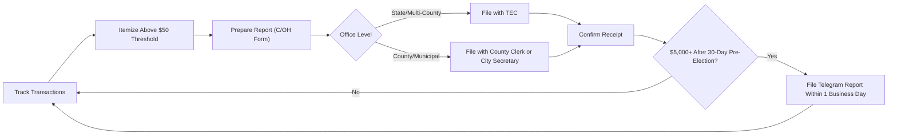

# Texas Disclosure & Reporting Requirements

> **STALENESS WARNING:** This reference was written in April 2026. Filing deadlines,
> itemization thresholds, and electronic filing rules may change through legislation or
> TEC rulemaking. Always verify current requirements at https://www.ethics.state.tx.us
> before filing.

> **EDUCATIONAL DISCLAIMER:** This document is for educational and informational purposes
> only. It does not constitute legal advice. Campaigns should consult a qualified election
> law attorney or the Texas Ethics Commission (TEC) for guidance specific to their situation.

---

## Filing Agency

Campaign finance reports are filed with the **Texas Ethics Commission (TEC)** for state
and multi-county offices, or with the **local filing authority** (county clerk or city
secretary) for county and municipal offices.

- **Electronic filing:** Required for candidates and committees that exceed $20,000 in
  contributions or expenditures in a reporting period.
- **Filing system:** TEC Electronic Filing (TEC-FIF) at https://www.ethics.state.tx.us
- **Paper forms:** Permitted for filers below the $20,000 threshold.

---

## Report Types

### Semi-Annual Reports

All active candidate and officeholder committees must file semi-annual reports,
regardless of election activity.

| Report | Coverage Period | Due Date |
|--------|---------------|----------|
| January Semi-Annual | July 1 - December 31 | January 15 |
| July Semi-Annual | January 1 - June 30 | July 15 |

### Pre-Election Reports

Candidates on an upcoming ballot must file pre-election reports.

| Report | Coverage | Due Date |
|--------|----------|----------|
| 30-Day Pre-Election | From close of last report through 40th day before election | 30th day before election |
| 8-Day Pre-Election | From close of 30-day report through 10th day before election | 8th day before election |

Pre-election reports are required for:
- Primary elections (first Tuesday in March)
- Primary runoff elections
- General elections (first Tuesday after first Monday in November)
- Special elections

### Runoff Reports

If a runoff election is required, additional pre-election reports are filed on the
same 30-day/8-day schedule relative to the runoff date.

### Final Report / Termination

A committee that is closing must file a final report showing a zero balance and no
outstanding debts, accompanied by a dissolution designation.

---

## Itemization Thresholds

### Contributions

| Category | Threshold | Required Information |
|----------|-----------|---------------------|
| Itemized political contributions | Over $50 (general) / Over $20 (for candidates) | Full name, address, date, amount, occupation/employer if over $500 |
| Non-itemized contributions | $50 or less ($20 or less for candidates) | May be reported in aggregate |
| Occupation/employer required | Over $500 | Must report contributor's occupation and employer |
| Anonymous contributions | $50 or less | Permitted; reported in aggregate |
| Anonymous contributions | Over $50 | **Prohibited** -- must be returned or donated to charity |

### Expenditures

| Category | Threshold | Required Information |
|----------|-----------|---------------------|
| Itemized expenditures | Over $100 | Payee name, address, date, amount, purpose/category |
| Non-itemized expenditures | $100 or less | May be reported in aggregate |
| Credit card expenditures | Over $100 | Must itemize the vendor (not just the credit card company) |

---

## Late Contribution and Expenditure Reports

### Telegram Reports (Modified Reporting)

When a candidate is on an upcoming ballot, certain large contributions and expenditures
must be reported more quickly:

- **Contributions of $5,000 or more** received after the 30-day pre-election report
  deadline but before the election must be reported within **one business day**.
- **Expenditures from personal funds of $5,000 or more** by the candidate must also be
  reported within one business day during this window.

These are sometimes called "telegram reports" and must be filed electronically or by
fax.

---

## Independent Expenditure Reports

Any person or committee making independent expenditures must report them:

- **$100 or more threshold:** Independent expenditures of $100 or more must be reported.
- **Within one business day** if $1,000 or more is spent during the period after the
  30-day pre-election report.
- Reports must identify the candidate supported or opposed.

---

## Report Forms Reference

| Form | Purpose | Who Files |
|------|---------|----------|
| CTA (Appointment of Treasurer) | Committee registration | All candidates and committees |
| C/OH (Candidate/Officeholder Report) | Regular campaign finance report | Candidates and officeholders |
| GPAC (General-Purpose Committee Report) | Regular report | General-purpose PACs |
| SPAC (Specific-Purpose Committee Report) | Regular report | Specific-purpose PACs |
| JCOH (Judicial Candidate Report) | Judicial candidate report | Judicial candidates |
| COHLSS (Contribution/Expenditure Report - Legislative Session) | Session moratorium report | Legislative candidates |

---

## Electronic Filing Details

- **Threshold:** Candidates and committees exceeding $20,000 in contributions or
  expenditures during a reporting period must file electronically.
- **System:** TEC Electronic Filing Interface (TEC-FIF).
- **Software:** The TEC provides free filing software. Third-party software is
  permitted if it meets TEC format requirements.
- **Below threshold:** Paper filing is permitted but electronic filing is encouraged.
- **Local filers:** County and municipal candidates file with the local authority, which
  may or may not accept electronic filings.

---

## Record-Keeping Requirements

- **Bank account:** Campaign funds must be deposited in a campaign account at a
  financial institution in Texas.
- **Deposit timeline:** No specific statutory deadline, but prompt deposit is expected.
- **Record retention:** Records must be preserved for at least 2 years after the report
  is filed.
- **Contributor information:** Campaigns must report contributor occupation and employer
  for contributions exceeding $500.

---

## Penalties for Non-Compliance

| Violation | Penalty |
|-----------|---------|
| Late filing (1-30 days) | $500 |
| Late filing (over 30 days) | $500 + $100/day (up to $10,000) |
| Failure to file | Civil penalty up to $10,000; criminal referral possible |
| Failure to include required information | Warning letter; repeated violations subject to penalty |
| Accepting prohibited contributions | Class A misdemeanor (up to $4,000 fine and/or 1 year jail) |
| Filing false reports | Class A misdemeanor |

The TEC may impose administrative penalties, negotiate agreed orders, or refer matters
to the Travis County District Attorney.

---

## Personal Financial Disclosure

Candidates for and holders of state offices must file a **Personal Financial Statement
(PFS)** with the TEC:

- **Filing deadline:** April 30 each year while in office; also filed with candidacy
  declaration.
- **Covers:** Sources of income, real property, business interests, positions held,
  and certain gifts and loans.
- **Not required for:** County and municipal candidates (unless required by local rule).

---

## Sources & Verification

- Texas Election Code, Title 15 (Regulating Political Funds and Campaigns)
- Texas Ethics Commission Filing Guides
- TEC Advisory Opinions
- https://www.ethics.state.tx.us
- Last verified: April 2026
