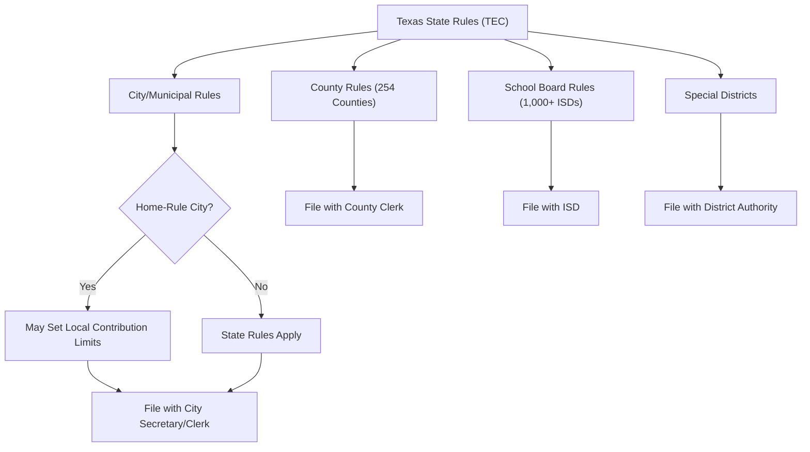

# Texas Local Office Election Rules

> **STALENESS WARNING:** This reference was written in April 2026. Local election rules
> in Texas vary significantly across home-rule cities, general-law cities, counties, and
> school districts. Always verify current rules with the relevant local election authority.

> **EDUCATIONAL DISCLAIMER:** This document is for educational and informational purposes
> only. It does not constitute legal advice. Campaigns should consult a qualified election
> law attorney or the relevant election authority for guidance specific to their situation.

---

## Overview

Texas local elections are governed by a combination of the Texas Election Code and local
charters/ordinances. Texas distinguishes between **home-rule cities** (population over
5,000 that have adopted a charter) and **general-law cities** (governed solely by state
statutes). Home-rule cities may adopt their own election procedures, campaign finance
rules, and filing requirements within state law boundaries. Texas has 254 counties,
over 1,200 cities, and over 1,000 independent school districts.

---

## Houston

### Election Authority

| Field | Details |
|-------|---------|
| **Authority** | City of Houston, City Secretary's Office |
| **Website** | https://www.houstontx.gov/citysec/ |

### Key Rules

- **Nonpartisan elections:** Houston city elections are nonpartisan.
- **Election timing:** Municipal elections in **odd-numbered years**, November. Runoff
  in December if no candidate receives a majority.
- **Term limits:** Mayor and council members limited to **two consecutive terms**.
  Mayor serves 4-year terms; council members serve 4-year terms (changed from 2-year
  terms by charter amendment).
- **Districts:** 16 council members -- 11 from single-member districts, 5 at-large.
- **Campaign finance:** State rules apply. Houston has adopted **local contribution
  limits** by ordinance:

| Office | Limit Per Election |
|--------|--------------------|
| Mayor | $5,000 |
| City Controller | $5,000 |
| City Council (at-large) | $5,000 |
| City Council (district) | $2,000 |

- **Corporate/union contributions:** Prohibited (same as state law).
- **Filing:** Campaign finance reports filed with the City Secretary.

---

## Dallas

### Election Authority

| Field | Details |
|-------|---------|
| **Authority** | City of Dallas, City Secretary's Office |
| **Website** | https://dallascityhall.com/government/citysecretary |

### Key Rules

- **Nonpartisan elections:** Dallas city elections are nonpartisan.
- **Election timing:** May of odd-numbered years. Runoff in June if needed.
- **Term limits:** Mayor and council members limited to **four consecutive two-year
  terms** (8 years).
- **Districts:** 15 council members -- 14 from single-member districts, 1 mayor
  elected citywide.
- **Campaign finance:** State rules apply. Dallas has adopted **local contribution
  limits**:

| Office | Limit Per Election |
|--------|--------------------|
| Mayor | $5,000 |
| City Council | $1,000 |

- **Ethics advisory commission:** Dallas has an Ethics Advisory Commission that
  provides guidance on campaign finance and ethics issues.
- **Filing:** Campaign finance reports filed with the City Secretary.

---

## San Antonio

### Election Authority

| Field | Details |
|-------|---------|
| **Authority** | City of San Antonio, City Clerk's Office |
| **Website** | https://www.sanantonio.gov/clerk |

### Key Rules

- **Nonpartisan elections:** San Antonio city elections are nonpartisan.
- **Election timing:** May of odd-numbered years. Runoff in June if needed.
- **Term limits:** Mayor and council members limited to **four two-year terms**
  (8 years total, by 2018 charter amendment changing from 2 terms).
- **Districts:** 11 council members -- 10 from single-member districts, 1 mayor
  elected citywide.
- **Campaign finance:** State rules apply. San Antonio has adopted **local contribution
  limits**:

| Office | Limit Per Election |
|--------|--------------------|
| Mayor | $1,000 |
| City Council | $500 |

- **Ethics review board:** San Antonio has an Ethics Review Board that oversees
  campaign finance compliance.
- **Filing:** Reports filed with the City Clerk.

---

## Austin

### Election Authority

| Field | Details |
|-------|---------|
| **Authority** | City of Austin, City Clerk's Office |
| **Website** | https://www.austintexas.gov/cityclerk |

### Key Rules

- **Nonpartisan elections:** Austin city elections are nonpartisan.
- **Election timing:** November of even-numbered years (consolidated with general
  elections since 2014 charter changes). Runoff in December if needed.
- **Term limits:** Mayor and council members limited to **two consecutive four-year
  terms**.
- **Districts:** 11 council members -- 10 from single-member districts (since 2014),
  1 mayor elected citywide.
- **Campaign finance:** State rules apply. Austin has adopted **local contribution
  limits**:

| Office | Limit Per Election |
|--------|--------------------|
| Mayor | $400 |
| City Council | $400 |

- **Austin Ethics Review Commission:** Oversees campaign finance and lobbying
  compliance.
- **Filing:** Reports filed with the City Clerk.
- **Fair Campaign Finance provision:** Austin's charter includes provisions for
  voluntary spending limits; candidates who accept limits receive benefits in official
  voter guides.

---

## Home-Rule City Variations

Texas home-rule cities (population over 5,000 with an adopted charter) have significant
discretion in election matters:

| Feature | Home-Rule Authority |
|---------|-------------------|
| Contribution limits | May impose local limits (many do) |
| Election timing | May set own schedule (May, November, or other) |
| Term limits | Set by charter |
| Runoff thresholds | Typically majority required; charter may specify |
| Filing requirements | May require local filings in addition to state |
| Ethics commissions | May establish local ethics bodies |

### Common Variations

- **Election dates:** Most home-rule cities hold elections in May (uniform election date)
  or November (consolidated with state elections). Some charters specify other dates.
- **Contribution limits:** Range widely, from no additional limits to limits as low as
  $200 per election.
- **Runoff elections:** Typically held 4-6 weeks after the initial election.

---

## School Board Elections

Texas has over 1,000 independent school districts (ISDs), each with an elected board
of trustees.

- **Nonpartisan elections** held on the **uniform election date** (first Saturday in May
  for most districts, or November if consolidated).
- **Filing period:** Typically January-February. Candidates file an Application for a
  Place on the Ballot with the ISD.
- **Filing fee:** Varies by district; many charge no fee. Some require a filing fee or
  petition (typically 25-50 signatures).
- **Campaign finance:** State TEC rules apply. Reports are filed with the ISD (not the
  TEC) unless the candidate exceeds state filing thresholds.
- **Term:** Most school board members serve 3-year or 4-year staggered terms.
- **No contribution limits** beyond state rules (corporate/union ban applies).
- **Single-member districts vs. at-large:** Varies by ISD. Many larger districts use
  single-member trustee districts.

---

## County Offices

### County Elected Officials

| Office | Term | Election Cycle |
|--------|------|---------------|
| County Judge | 4 years | Gubernatorial cycle |
| County Commissioner (4 precincts) | 4 years | Staggered |
| Sheriff | 4 years | Presidential cycle |
| County Clerk | 4 years | Presidential cycle |
| District Clerk | 4 years | Presidential cycle |
| County Treasurer | 4 years | Gubernatorial cycle |
| Tax Assessor-Collector | 4 years | Presidential cycle |
| Constable | 4 years | Gubernatorial cycle |
| Justice of the Peace | 4 years | Gubernatorial cycle |

### Key Rules for County Races

- **Partisan elections** held in even-numbered years through party primaries.
- **Filing:** Candidates file with the county party chair during the primary filing period.
- **Filing fees:** Vary by office and county population.
- **Campaign finance:** State TEC rules apply. Reports are filed with the county clerk
  (county offices) or TEC (district-level offices that span multiple counties).
- **No local contribution limits** for county races.

---

## Special District Elections

Texas has numerous special districts (water, hospital, emergency services, MUDs, etc.).

- Elections typically held on the **May uniform election date** or **November**.
- **Filing:** Candidates file with the district.
- **Campaign finance:** State rules apply if activity exceeds reporting thresholds. Most
  special district races involve minimal campaign activity.
- **Low voter turnout:** Many special district elections have very low participation.

---

## Sources & Verification

- Texas Election Code
- Texas Local Government Code
- City Charters of Houston, Dallas, San Antonio, Austin
- Texas Ethics Commission Filing Guides
- https://www.sos.texas.gov/elections
- https://www.ethics.state.tx.us
- Last verified: April 2026
