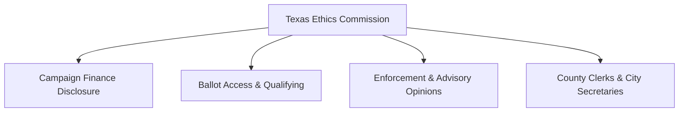

# Texas Campaign Finance Overview

> **STALENESS WARNING:** This reference reflects Texas Election Code and Texas Ethics Commission (TEC) rules as of early 2025. The Texas Legislature meets in odd-numbered years and may amend campaign finance laws. Contribution limits, reporting thresholds, and filing requirements can change. Always verify current requirements at [ethics.state.tx.us](https://www.ethics.state.tx.us).

> **EDUCATIONAL DISCLAIMER:** This is educational information, not legal advice. Texas campaign finance law has unique features that differ significantly from federal law. Consult a Texas election law attorney for guidance specific to your campaign.

---

## Filing Agency

**Texas Ethics Commission (TEC)**
- Website: [ethics.state.tx.us](https://www.ethics.state.tx.us)
- Administers campaign finance disclosure for statewide, legislative, and judicial candidates
- Provides electronic filing software and online filing system
- County and municipal candidates may file with their local filing authority (county clerk, city secretary) rather than the TEC

---

## Unique Features of Texas Campaign Finance Law

1. **No individual contribution limits** -- Texas does not cap contributions from individuals to candidates
2. **Corporate contributions to candidates are prohibited** -- corporations (including LLCs electing corporate treatment) may not contribute directly to candidates
3. **No PAC contribution limits** -- PACs may give unlimited amounts to candidates
4. **$100 cash contribution limit** -- cash contributions exceeding $100 are prohibited; contributions over $100 must be by check, money order, or electronic means
5. **Officeholder accounts** -- Texas allows officeholders to maintain separate accounts for officeholder expenses even outside election periods
6. **Judicial campaign fairness rules** -- separate, lower voluntary limits apply to judicial candidates under the Judicial Campaign Fairness Act

---

## Contribution Limits

| Donor Type | To Candidate | To PAC | Notes |
|-----------|-------------|--------|-------|
| Individual | **No limit** | **No limit** | Must be disclosed; $100 cash cap |
| Corporation | **Prohibited** | Allowed (to general-purpose PACs) | Direct-purpose PAC contributions also prohibited |
| Labor Union | **Prohibited** | Allowed (to general-purpose PACs) | Same as corporate restriction |
| PAC (General Purpose) | **No limit** | **No limit** | Must be registered with TEC |
| PAC (Specific Purpose) | **No limit** (to supported candidate) | N/A | Supports a single candidate or measure |
| Candidate to Own Campaign | **No limit** | N/A | Personal funds are unlimited |
| Out-of-State PAC | **No limit** | **No limit** | Must file with TEC before contributing |
| Cash (any source) | **$100 max** | **$100 max** | Over $100 must be traceable instrument |

### Judicial Campaign Fairness Act (JCFA)

Judicial candidates face separate voluntary limits. If a judicial candidate agrees to abide by these limits, they may note their compliance. The JCFA sets per-election contribution limits from individuals and PACs based on the court level (e.g., statewide appellate courts vs. district courts).

---

## Committee Registration

### Candidate Committees
- File a **Candidate/Officeholder Campaign Finance Registration** (Form CTA) with the TEC or local filing authority
- Must be filed before accepting any contributions or making any expenditures
- Must designate a campaign treasurer

### Political Action Committees
- **General-purpose committees** (support/oppose multiple candidates or measures) file Form GPR
- **Specific-purpose committees** (support/oppose a single candidate or measure) file Form STA
- Must register before accepting contributions or making expenditures exceeding $940 (threshold adjusted periodically)

---

## Ballot Access

### Major Party Candidates (Republican / Democrat)
- File for a place on the primary ballot with the state or county party chair
- Filing fee or petition option: filing fee is a percentage of the office salary (typically 1-2%), or collect signatures (varies by office)
- Primary elections held in March of even-numbered years
- Runoffs held approximately 2 months after the primary if no candidate receives a majority

### Independent and Third-Party Candidates
- Must file a declaration of intent and collect petition signatures
- Signature requirements vary by office (e.g., 1% of total votes cast for governor in the last general election for statewide office)
- Petition signers must not have voted in any party's primary that year
- Filing deadline is typically in May following the primary

---

## Reporting Schedule

### Regular Reports (Semi-Annual)
- **January 15** semi-annual report (covers July 1 -- December 31)
- **July 15** semi-annual report (covers January 1 -- June 30)

### Election-Related Reports
- **30th day before election** -- due 30 days before the election (covers from the last report through the 40th day before the election)
- **8th day before election** -- due 8 days before the election (covers from the 39th day through the 10th day before the election)
- **Runoff report** -- due 8 days before a runoff election

### Special Session Reports
- Required when the legislature is in special session

### Itemization Thresholds
- Contributions from a single source exceeding **$90** (periodically adjusted) in a reporting period must be itemized with full donor information
- Expenditures exceeding **$190** (periodically adjusted) must be itemized
- Political contributions accepted or political expenditures made by out-of-state PACs must be reported

### Modified Reporting
- Candidates and officeholders who do not exceed $940 in contributions or expenditures during a reporting period may file a simplified "modified" report

---

## Prohibited Contributions

- **Corporate contributions** to candidates (including professional corporations and most LLCs)
- **Labor union contributions** directly to candidates
- **Cash contributions exceeding $100**
- Contributions in the **name of another** (straw donor contributions)
- **Anonymous contributions exceeding $90** (must be returned or donated to charity)
- Contributions from **foreign nationals** (also prohibited under federal law)
- Contributions made using **public funds** (taxpayer money)
- **Officeholder contributions** to their own officeholder account from campaign funds in certain circumstances

---

## Key Differences from Federal Law

| Feature | Federal | Texas |
|---------|---------|-------|
| Individual contribution limits | $3,300/election (2023-24) | **No limit** |
| Corporate contributions to candidates | Prohibited | **Prohibited** (same as federal) |
| PAC contributions to candidates | $5,000/election | **No limit** |
| Cash contribution cap | $100 | **$100** (same) |
| Reporting frequency | Quarterly or monthly | Semi-annual + pre-election |
| Electronic filing required | Yes (for most) | Yes (above threshold) |
| Public financing | Presidential only | **None** |
| Coordinated expenditure limits | Yes | **No specific limits** |

---

## Local Rules Notes

- **Cities and counties** may have their own campaign finance ordinances with additional requirements
- **Austin** has its own campaign finance rules including contribution limits for city races ($400/election for city council)
- **San Antonio** imposes contribution limits for city elections ($500/election for city council)
- **Houston, Dallas, Fort Worth** and other major cities have varying local campaign finance ordinances
- Local candidates typically file with the **city secretary** or **county clerk** rather than the TEC
- Always check the specific municipality's or county's election code for additional requirements
- Some home-rule cities impose contribution limits even though the state does not

---

## Electronic Filing

- The TEC provides free filing software and an online filing system
- Electronic filing is **mandatory** for candidates and committees that exceed certain activity thresholds (currently around $26,000 in contributions or expenditures in a reporting period)
- Below the threshold, paper filing is permitted
- The TEC's filing system is available at [ethics.state.tx.us/filinginfo/](https://www.ethics.state.tx.us/filinginfo/)

---

## Resources

- **Texas Ethics Commission:** [ethics.state.tx.us](https://www.ethics.state.tx.us)
- **Campaign Finance Guide for Candidates and Officeholders:** Available on the TEC website
- **Texas Election Code, Title 15:** Campaign finance provisions
- **TEC Advisory Opinions:** [ethics.state.tx.us/opinions/](https://www.ethics.state.tx.us/opinions/)
