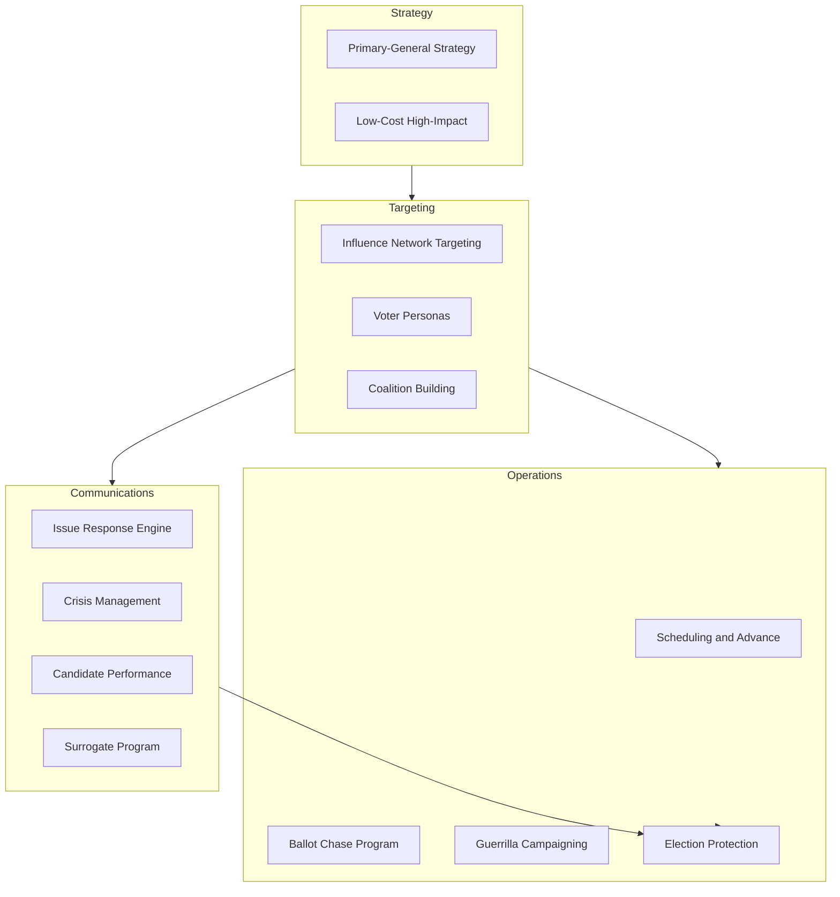

# Tactics

Strategic playbooks and frameworks for specific campaign challenges. Each file provides actionable methods you can deploy immediately.

## Files

- [ballot-chase-program.md](ballot-chase-program.md) -- Systematic tracking and follow-up to ensure every supporter actually votes
- [candidate-performance.md](candidate-performance.md) -- Delivery skills, media training, and candidate wellness
- [coalition-building.md](coalition-building.md) -- Engaging twelve key voter groups to assemble a winning coalition
- [crisis-management.md](crisis-management.md) -- The RESPOND framework with crisis-specific playbooks and templates
- [election-protection.md](election-protection.md) -- Poll watcher programs, recount prep, provisional ballot tracking, and Election Day operations
- [guerrilla-campaigning.md](guerrilla-campaigning.md) -- Creative, unconventional tactics for underdogs and small-budget races
- [influence-network-targeting.md](influence-network-targeting.md) -- Power mapping to identify and engage community influencers
- [issue-response-engine.md](issue-response-engine.md) -- Generate eight response formats from a single issue input
- [low-cost-high-impact.md](low-cost-high-impact.md) -- 20+ tactics ranked by cost-per-vote with a complete $5,000 campaign plan
- [primary-general-strategy.md](primary-general-strategy.md) -- Strategic differences between primary and general elections and how to pivot
- [scheduling-advance.md](scheduling-advance.md) -- Candidate time management, scheduling strategy, and advance work
- [surrogate-program.md](surrogate-program.md) -- Building and managing surrogates who speak on the candidate's behalf
- [voter-personas.md](voter-personas.md) -- Psychographic voter profiling to guide messaging and outreach
