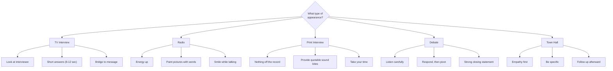

# Candidate Performance: Delivery, Media Training, and Wellness

A great platform with poor delivery loses. A mediocre platform with excellent delivery wins more often than it should. This module covers the physical, vocal, and emotional skills that make a candidate effective, plus media training for every format and the wellness practices that sustain performance across a grueling campaign.

---

## Delivery Coaching

### Voice Projection
- Project to the back of the room, not the front row. Most candidates speak too quietly.
- Record yourself and play it back -- if you sound loud to yourself, you are probably at the right volume for the audience.
- Use your diaphragm, not your throat. Breathe from your belly and push sound outward.
- Warm up before every speaking event: hum, say tongue twisters, read a paragraph aloud at varying volumes. Your voice is a muscle.

### Pacing and Pauses
- The ideal speaking pace for political communication is 140-160 words per minute. Most nervous candidates rush to 180+. Slow down.
- **The power pause:** After making a key point, stop talking for 2-3 full seconds. Let the audience absorb it. Silence after a strong line is the most powerful tool in public speaking.
- **The rule of three:** Three-part lists, three beats before a punch line, three seconds of pause. The rule of three is deeply embedded in human cognition and makes statements memorable.
- **Transitions:** Use clear bridges between sections: "Here is what I mean." "Let me tell you a story." "Now, here is the contrast." Transitions give the audience mental rest and signal structure.

### Body Language
- **Posture:** Stand tall, shoulders back, weight evenly distributed. Do not lean on the podium -- it signals weakness. Do not lock your knees.
- **Open stance:** Face the audience squarely. Keep your chest and palms open. Crossed arms, hands in pockets, and turned shoulders all signal defensiveness.
- **Gestures:** Use natural hand gestures to emphasize points. Default position: hands at your sides or loosely clasped in front. Avoid: pointing at people, gripping the podium, fidgeting with pens or papers.
- **Movement:** If there is no podium, move with purpose. Step toward the audience for a personal point. Plant your feet for a strong statement. Do not pace randomly -- it signals anxiety.
- **Facial expression:** Match your expression to your message. A serious point with a smile is confusing. Practice in front of a mirror or on video.

### Eye Contact
- **One-on-one:** Maintain eye contact 60-70% of the time. Break naturally when thinking or transitioning.
- **Small group:** Divide the room into zones. Spend 3-5 seconds with someone in each zone, then move. Do not dart your eyes.
- **Large audience:** Look at sections, not individuals. Sweep your gaze from left to center to right. Occasionally look at the back rows -- they feel ignored.

### Camera Presence
- **Look at the lens, not the screen.** The lens is the voter's eyes. Practice by recording selfie videos and talking directly into the phone camera.
- **Sit or stand slightly forward.** Leaning in projects engagement and energy.
- **Minimize movement.** Small fidgets and swivels are magnified on camera.
- **Solid colors.** Avoid busy patterns, stripes, and shiny fabrics on TV.
- **Energy up 20%.** Camera flattens your energy. What feels slightly over-animated in person reads as normal on screen.

### Managing Nerves
- **Reframe anxiety as energy.** The symptoms of nervousness (elevated heart rate, adrenaline) are identical to excitement. Tell yourself "I am excited" instead of "I am nervous." Research shows this reframing improves performance.
- **Breathe:** Before stepping on stage, take 5 deep breaths: 4 counts in, 4 counts hold, 6 counts out. This activates the parasympathetic nervous system.
- **Prepare obsessively, then let go.** Anxiety comes from uncertainty. If you have prepared, trust yourself.
- **Anchor phrase:** One sentence you know cold that you can return to if you lose your place -- your core campaign message. It buys time and keeps you on message.

### Handling Hostile Questions
1. **Never take the bait.** A hostile question is designed to provoke an emotional reaction. The moment you get angry or flustered, the questioner wins.
2. **Acknowledge, then bridge.** "I appreciate the question. Here is how I see it..." or "I understand the concern. Let me address that directly..."
3. **Answer the question you wish they asked.** Bridge to your strongest ground: "The real issue here is..." or "What voters are telling me is..."
4. **Stay physically calm.** Do not lean forward aggressively, raise your voice, or point. Open posture and steady voice signal confidence.
5. **Know when to stop.** Answer once, clearly. If pushed: "I have given you my answer. I want to make sure everyone has a chance to ask their question."

### The Art of the Pivot
The pivot is the most important debate and interview skill:
1. **Acknowledge** the question (1 sentence -- show you heard it)
2. **Bridge** to your message ("But the bigger issue is..." / "What I hear from voters is..." / "Let me put that in context...")
3. **Deliver** your message (2-3 sentences, clear and quotable)

Practice pivots until they are automatic. You should pivot from any question to your core message in under 15 seconds.

---

## Media Training

### Television
- **Look at the interviewer** during the interview, not the camera (unless delivering a direct-to-viewer statement or the producer instructs otherwise)
- **Short answers.** TV quotes are 8-12 seconds. Answers over 20 seconds give them the edit -- they will cut to the part you least want aired.
- **Never say "no comment."** Say "Here is what I can tell you."
- **Never repeat a negative framing.** If asked "Are you corrupt?" do not say "I am not corrupt." Say "My record of service speaks for itself."
- Arrive early, walk the set, know where the cameras are.
- Sit up straight, lean slightly forward.

### Radio
- **Smile while you talk.** It changes your vocal quality and makes you sound warmer and more approachable.
- **Energy up.** Radio demands more vocal energy than conversation. Stand up during phone interviews if possible.
- **Paint pictures with words.** Radio is a visual medium powered by language. Use vivid, concrete descriptions.
- Have talking points printed in front of you -- the audience cannot see them.
- Avoid filler words -- "um" and "uh" are more noticeable without visual cues.

### Print and Online Reporters
- **Nothing is off the record** unless you explicitly negotiate otherwise before speaking. And even then, be cautious.
- **Provide quotable sound bites.** Journalists want sentences they can use verbatim. Give them good ones deliberately.
- Do not say things you would not want in a headline.
- Do not speculate or answer hypotheticals.
- "Off the record" does not work retroactively. If you said it, assume it is printable.
- Take your time -- print interviews lack the time pressure of broadcast.

### Hostile Interview Techniques
When facing an adversarial interviewer:
- Stay calm and smiling. Hostility from you confirms their narrative.
- Bridge relentlessly to your message. They control the questions; you control the answers.
- If trapped in a false premise: "I do not accept the premise of the question. Here is what I know..."
- If interrupted: pause, let them finish, then say "If I may finish my thought..." Voters sympathize with the interrupted candidate.
- If ambushed with new information: "I have not seen that report. Let me review it and get back to you." Never react to information you have not verified.

---

## Candidate Wellness

### Burnout Warning Signs
Watch for these in the candidate -- three or more signals intervention is needed:
- Irritability and short temper with staff, family, or voters
- Declining event performance (less energy, less engagement, going through the motions)
- Difficulty sleeping despite exhaustion
- Loss of appetite or stress eating
- Withdrawal and isolation (canceling personal commitments, avoiding people)
- Cynicism about the campaign, voters, or the democratic process
- Physical symptoms: frequent illness, headaches, back pain
- Inability to concentrate or make decisions

### Physical Health on the Trail
- **Sleep:** Minimum 6 hours per night, target 7. Nothing degrades performance faster than sleep deprivation. Campaign managers: schedule late-night events sparingly.
- **Nutrition:** Eat real meals. Pack healthy food for the road. Stay hydrated -- dehydration causes fatigue and brain fog.
- **Exercise:** 30 minutes of physical activity at least 4 days per week. Schedule it like a meeting so it does not get bumped.
- **Medical care:** Keep all regular appointments. Get a checkup before the campaign intensifies. Carry prescriptions at all times.

### Mental Health Support
- **Normalize it.** Campaigning is psychologically demanding: constant judgment, public scrutiny, rejection at doors, opponent attacks, uncertain outcomes. Struggling is normal, not weak.
- **Support system:** 2-3 people outside the campaign the candidate can talk to honestly -- spouse, close friend, therapist, mentor. They provide perspective staff cannot.
- **Daily decompression:** A non-negotiable daily practice that separates campaign time from personal time: exercise, meditation, reading, cooking, prayer, 15 minutes of silence.
- **Professional help:** If the candidate shows signs of depression, anxiety disorder, or substance use escalation, the campaign manager should privately and compassionately encourage professional support.

### The Candidate's Inner Circle
Every candidate needs 2-3 people who will tell them the truth without fear:
- Someone who knew them before politics (keeps them grounded)
- Someone who understands campaigns (provides strategic honesty)
- Someone who cares about them as a person, not as a candidate (provides emotional safety)
- This inner circle is not the same as campaign staff. Staff have roles and agendas. The inner circle has permission to say "You are wrong" and "You need to stop."

---

## Family Resilience

### Pre-Launch Family Conversation Guide
Before the campaign launches, the candidate must have an honest conversation with their family covering:

1. **Time commitment:** How much the candidate will be away. What the weekly schedule looks like. Impact on family routines.
2. **Public scrutiny:** What may be said about the family online and in public. How to handle social media comments and news coverage. The difference between public and private life during a campaign.
3. **Financial impact:** Campaign costs, potential income disruption, fundraising obligations.
4. **Emotional toll:** Stress, frustration, uncertainty, impact on the marriage/partnership and family relationships.
5. **Roles and boundaries:** What the family is willing to do publicly (events, photos, statements) and what is strictly off-limits. Every family member gets veto power over their own participation.
6. **Exit conditions:** Under what circumstances would the candidate consider withdrawing. What would constitute a family emergency that overrides the campaign.

### Protecting Children from Public Scrutiny
- Children should never be forced to participate in campaign activities
- Establish clear rules about children in campaign materials and social media (parental consent for every single use)
- Monitor social media for any mentions of the candidate's children and respond swiftly to inappropriate content
- Brief children's schools and caregivers about the campaign
- Maintain children's routines as much as possible -- consistency is their anchor during disruption
- Age-appropriate honesty: explain the campaign in terms they can understand without burdening them

### Managing Family Schedule
- Schedule a weekly family check-in (not about strategy -- about how everyone is doing)
- Protect at least one family dinner per week and one full weekend day per month
- Include family in events they enjoy and excuse them from the rest
- Cancel a campaign event before canceling the family check-in
- Ask regularly: "How are you feeling? What do you need from me? Is anything worrying you?"

---

## Practice Exercises

**Mirror drill (5 min/day):** Deliver your 30-second stump in front of a mirror. Watch expressions, gestures, posture.

**Timer drill (10 min, 3x/week):** Set 30-second timer. Answer a random issue question. Complete response within the limit.

**Hostile question drill (15 min, 2x/week):** Staff fires the hardest questions imaginable. Practice acknowledge-bridge-deliver without flinching.

**Camera drill (10 min, 2x/week):** Record yourself answering 3 questions on your phone. Review for eye contact, filler words, fidgeting, answer length.

**Soundbite challenge (10 min/week):** Take 3 topics. Write and practice a quotable soundbite under 15 seconds for each. Test on a friend -- can they repeat it back?
