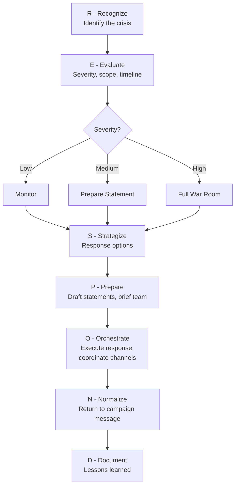

# Crisis Management: The RESPOND Framework

Every campaign will face a crisis. The difference between campaigns that survive crises and campaigns that collapse is preparation, speed, and discipline. This module provides the RESPOND framework, crisis-specific playbooks, and operational templates.

---

## The RESPOND Framework

### R — Recognize

**What:** Identify that a crisis is happening or about to happen. Most campaigns lose because they recognize too late.

**Triggers to monitor:**
- Reporter calls asking about something you did not expect
- Social media spike (mentions, negative comments, trending hashtags)
- Opponent releases an attack ad or opposition research
- Staff member reports a problem (legal, ethical, personal)
- Internal leak (emails, documents, recordings surface publicly)
- Candidate makes an unforced error (gaffe, hot mic, bad social media post)
- External event that changes the issue landscape overnight

**Speed standard:** The campaign should be aware of any emerging crisis within 30 minutes of it appearing publicly. This requires active social media monitoring and media relationship management.

### E — Evaluate

**What:** Assess the severity, likely trajectory, and available options before responding.

**Assessment questions:**
1. What exactly happened? Get the full, unvarnished facts from the source.
2. Who knows? How far has this spread?
3. Is this a one-cycle story or a multi-day story?
4. Does the candidate have genuine exposure (legal, ethical, factual)?
5. Who is driving this? Opponent, media, random social media, internal leak?
6. What is the opponent likely to do with this?
7. What do we have that mitigates or explains this?
8. What is the worst this can become?

**Severity scale:**
- **Level 1 (Minor):** Social media complaint, small factual error, minor staff issue. Handle with a quick correction or statement. Does not require candidate involvement.
- **Level 2 (Moderate):** Local media inquiry, opponent attack on a real vulnerability, staff misconduct that could go public. Requires same-day response, candidate awareness, potential public statement.
- **Level 3 (Severe):** Major media investigation, legal issue, scandal involving the candidate personally, multi-day story. Requires war room activation, legal counsel, candidate press availability, and a multi-day strategy.

### S — Strategize

**What:** Choose your response approach. There are only four basic options:

1. **Rapid full transparency:** Release all facts immediately, get ahead of the story, own the narrative. Best when the facts are on your side or the issue is minor.
2. **Controlled disclosure:** Release information strategically over time, providing context and framing. Best when the story is complex and context changes the picture.
3. **Pivot and contrast:** Acknowledge briefly, then redirect attention to the opponent or a different issue. Best when the attack is overblown or hypocritical.
4. **Absorb and move on:** Decline to engage, let the story die of its own weight. Best when engagement gives the story oxygen it would not otherwise have. Risky — only works if the story is truly minor.

**Decision rule:** When in doubt, choose option 1. Transparency almost always outperforms concealment. The coverup is worse than the crime in politics more often than not.

### P — Prepare

**What:** Draft all response materials before any public statement. Never go public without materials ready.

**Materials to prepare:**
- Written statement (100-200 words, quotable, factual)
- Q&A document (anticipate every question a reporter or voter will ask)
- Candidate talking points (5-7 bullet points for interviews)
- Surrogate talking points (simplified version for allies)
- Social media response (brief, links to full statement)
- Internal staff memo (what happened, what we are saying, what staff should do if asked)
- Timeline of events (for legal counsel and internal record)

### O — Orchestrate

**What:** Execute the response in a coordinated sequence.

**Response sequence for Level 2-3 crises:**
1. **Hour 0-1:** Internal briefing. Candidate, campaign manager, communications director, and legal counsel on a call. Agree on strategy and messaging.
2. **Hour 1-2:** Draft all materials. Legal review if applicable.
3. **Hour 2-4:** Release statement. Candidate makes approved public comments. Communications director fields media calls.
4. **Hour 4-8:** Monitor reaction. Adjust messaging if needed. Brief surrogates and key supporters.
5. **Hour 8-24:** Assess whether the story is expanding or dying. Prepare for Day 2 if expanding.
6. **Day 2+:** If the story continues, the candidate should be visible and accessible, not hiding. Shift to proactive positive messaging as quickly as possible.

### N — Normalize

**What:** Return to normal campaign operations as quickly as possible. The longer a crisis dominates the campaign's attention, the more damage it does — not just from the crisis itself, but from the lost time.

**Normalization steps:**
- Resume regular campaign schedule within 24-48 hours
- Push proactive positive content (endorsement, policy announcement, event)
- Give staff and volunteers a clear signal that "we have handled it, now we get back to work"
- Brief volunteers on what to say if voters bring it up (brief, confident, pivot)

### D — Document

**What:** Record everything for legal protection, future reference, and campaign learning.

**Document:**
- Complete timeline of the crisis and response
- All statements made (by the campaign, the opponent, media)
- Media coverage and social media analytics
- What worked and what did not work in the response
- Any legal implications or ongoing considerations
- Lessons learned for future crisis preparation

---

## Crisis Type Playbooks

### Scandal (Candidate Personal Conduct)

**Nature:** Past or present behavior by the candidate — personal relationships, financial history, substance use, offensive statements.
**Immediate action:** Get the full truth from the candidate privately before doing anything else. Ask: "Is there anything else that could come out?"
**Response approach:** If true, rapid full transparency with a genuine apology. If false or distorted, controlled disclosure with documentation.
**Key principle:** The candidate must be the one to address this. No campaign spokesperson can handle a personal scandal on the candidate's behalf.

### Staff Misconduct

**Nature:** A campaign staffer does something unethical, illegal, offensive, or embarrassing.
**Immediate action:** Suspend the staffer pending investigation. Do not defend the behavior.
**Response approach:** "We became aware of [issue], we take it seriously, and we have taken immediate action." If termination is warranted, announce it.
**Key principle:** Fast, decisive action demonstrates leadership. Delay or defense makes it the candidate's problem.

### Bad Press / Negative Story

**Nature:** A journalist publishes a negative story about the candidate — investigative piece, unflattering profile, factual errors.
**Immediate action:** Read the full story carefully. Identify factual errors versus unflattering-but-accurate reporting.
**Response approach:** Correct factual errors on the record. For accurate-but-unflattering reporting, provide context and pivot.
**Key principle:** Do not attack the reporter. Do not call the story "fake news." Respond to the substance.

### Attack Ad

**Nature:** Opponent launches a negative ad (TV, digital, mail) attacking the candidate.
**Immediate action:** Get the full ad. Fact-check every claim. Assess reach and frequency.
**Response approach:** If the claims are false, correct publicly and demand retraction. If the claims are distorted, provide context. If the claims are true, reframe.
**Key principle:** Not every attack ad requires a response. Only respond if the ad is gaining traction with persuadable voters. Responding amplifies it.

### Gaffe

**Nature:** The candidate says something wrong, offensive, or embarrassing in public.
**Immediate action:** Assess severity. Minor misstatement vs. offensive comment vs. revealing slip.
**Response approach:** For minor gaffes, correct and move on. For offensive comments, a genuine apology within hours. For revealing slips, reframe.
**Key principle:** The longer you wait, the bigger it gets. A same-day apology for a genuine mistake is almost always forgiven. A three-day defensive delay is not.

### Social Media Crisis

**Nature:** Something goes viral — a bad tweet, an embarrassing photo, a supporter's terrible post, a deceptive edited video.
**Immediate action:** Delete the offending post if it is the campaign's (screenshot it first for records). Do not delete if it is someone else's.
**Response approach:** Brief acknowledgment, correction if needed, move on. Do not engage in comment thread wars.
**Key principle:** Social media moves fast. Respond in hours, not days. But do not respond in minutes — take enough time to be thoughtful.

### Financial Irregularity

**Nature:** Campaign finance issue — late filing, questionable donation, spending irregularity, FEC complaint.
**Immediate action:** Engage election law attorney immediately. Do not make public statements about legal matters without legal review.
**Response approach:** "We take compliance seriously. We have [returned the donation / corrected the filing / engaged counsel to address this]. We are committed to full transparency."
**Key principle:** Financial issues can become criminal issues. Never make public statements without legal counsel's approval.

---

## The Apology Formula

When a genuine apology is warranted, use this structure:

1. **Acknowledge specifically** what happened. Do not use passive voice. "I said [thing]" not "mistakes were made."
2. **Take responsibility.** "I was wrong." No "I'm sorry if anyone was offended."
3. **Explain** (briefly) the context without making excuses.
4. **Commit** to specific action: "Here is what I am going to do differently."
5. **Ask** for the opportunity to demonstrate change through actions.

**A good apology:** "Yesterday I made a comment about [topic] that was wrong and hurtful. I take full responsibility. I should have known better, and I am committed to learning from this. I have [specific action], and I will continue to earn back your trust through my actions."

**A bad apology:** "I am sorry if my comments were taken out of context and offended anyone. That was not my intention."

---

## Inoculation Strategy

Inoculation means addressing your vulnerabilities before the opponent does. It works by giving voters a frame to process the attack before they hear it.

**When to inoculate:**
- You know the opposition has research on a specific vulnerability
- The vulnerability is factual (you cannot hide it)
- You can provide context that reframes the facts

**How to inoculate:**
- Address it in a controlled setting (friendly interview, campaign speech, supporter event)
- Frame it on your terms: "You may hear that I [vulnerability]. Here is the full story."
- Provide context, take responsibility if warranted, and pivot to how it made you stronger or wiser
- Once voters have your frame, the opponent's attack lands on prepared ground

---

## War Room Setup (Level 3 Crises)

**Personnel:**
- Campaign manager (decision authority)
- Communications director (messaging lead)
- Legal counsel (available by phone)
- Digital director (social media monitoring and response)
- Candidate (available but not in the room for all discussions — present for decisions)

**Equipment:**
- Dedicated phone line and email for media inquiries
- Social media monitoring dashboard
- TV/news stream
- Printer for drafting and reviewing statements
- Whiteboard for timeline and message tracking

**Rules:**
- One spokesperson to the media (communications director unless the candidate must speak)
- All statements reviewed by at least two people before release
- No staff social media posts about the crisis without approval
- Hourly check-ins until the crisis is downgraded
- Document everything in real time
