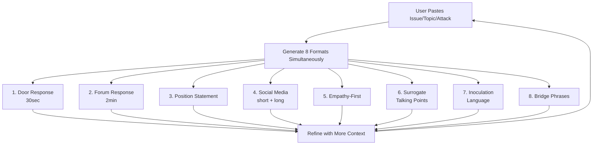

# Issue Response Engine: Eight Formats for Any Topic

When a candidate faces a policy question, attack, or emerging issue, the campaign needs responses across multiple channels simultaneously. This module generates eight response formats from a single issue input, ensuring the candidate and surrogates have the right language for every context.

---

## How to Use This Module

When the user pastes any issue, topic, or attack, generate all eight formats simultaneously. Each format serves a different context and has different constraints on length, tone, and structure.

---

---

## Format 1: Door Response (30 Seconds)

**Purpose:** What the candidate or canvasser says when a voter raises this issue on the doorstep. Must be conversational, concise, and end with a bridge back to the candidate's core message.

**Structure:**
1. **Acknowledge** (1 sentence): Show you heard them. "That's something I hear a lot on doors."
2. **Position** (1-2 sentences): Clear, plain-language statement of where you stand.
3. **Personal** (1 sentence): Why this matters to you personally or a brief story.
4. **Bridge** (1 sentence): Connect back to your core campaign message.

**Tone:** Conversational, warm, direct. No jargon. Speak as you would to a neighbor.
**Length:** 50-75 words maximum. If you cannot say it in 30 seconds, it is too long for a door.

**Example (Issue: Property Taxes):**
"I hear you — property taxes are a real burden, especially for folks on fixed incomes. I believe we need to find ways to reduce that pressure, starting with making sure the county is spending efficiently and prioritizing services that matter. My mom worries about this every year, so it is personal for me. That is exactly why I am focused on making government work better for families like ours."

---

## Format 2: Forum Response (2 Minutes)

**Purpose:** A structured response for candidate forums, town halls, and debates. Must be substantive enough to demonstrate command of the issue while remaining accessible.

**Structure:**
1. **Hook** (10 seconds): Lead with a fact, question, or story that grabs attention.
2. **Position** (20 seconds): Clear statement of where you stand and what you would do.
3. **Evidence** (30 seconds): Supporting facts, data, or examples.
4. **Contrast** (20 seconds): How your approach differs from the opponent's or the status quo. Optional — use only when strategically valuable.
5. **Story** (20 seconds): A real person or community affected by this issue.
6. **Close** (20 seconds): What you will do on Day 1 and a call to action.

**Tone:** Confident, prepared, substantive. Show command without lecturing.
**Length:** 200-250 words. Practice until it fits in 2 minutes spoken aloud.

**Example (Issue: Property Taxes):**
"Property taxes in this county have gone up 23% in five years, and I talk to seniors, young families, and small business owners every week who are being squeezed. That is not sustainable, and it is not acceptable.

Here is what I will do. First, I will push for a comprehensive spending audit — we have not had one in eight years, and I believe there are efficiencies we are leaving on the table. Second, I will fight for a homestead exemption increase for seniors on fixed incomes. Third, I will oppose any new spending that is not tied to a clear community need and a measurable outcome.

My opponent has voted for every budget increase in the last four years without asking hard questions. I will ask those questions.

Last week I met Margaret on Pine Street. She has lived in her home for 40 years. She told me she is afraid she will have to sell because her taxes went up $1,200 this year. Margaret should not be taxed out of the home she raised her family in.

On Day 1, I will introduce a resolution calling for that spending audit. We owe it to Margaret and every family in this district to prove that their tax dollars are being spent wisely."

---

## Format 3: Position Statement (Written)

**Purpose:** The campaign's official written position for the website, press inquiries, questionnaires, and voter guides.

**Structure:**
1. **Headline**: "[Candidate]'s Plan for [Issue]"
2. **Vision** (2-3 sentences): What the ideal outcome looks like.
3. **Problem** (2-3 sentences): What is wrong now, with data.
4. **Plan** (3-5 bullet points): Specific, actionable policy proposals.
5. **Values connection** (1-2 sentences): Why this fits the candidate's overall vision.
6. **Quote** (1-2 sentences): A quotable statement from the candidate.

**Tone:** Authoritative, specific, solution-oriented.
**Length:** 200-400 words.

---

## Format 4: Social Media Posts

**Purpose:** Shareable content for Facebook, Instagram, X/Twitter, and TikTok. Each platform has different norms.

**Structure by platform:**

**X/Twitter (under 280 characters):**
[Strong opinion or fact] + [position in 1 sentence] + [hashtag or call to action]

**Facebook (2-4 sentences):**
[Personal opening or local hook] + [position and what you will do] + [ask: share if you agree, comment your thoughts, come to my event]

**Instagram (caption for photo or graphic):**
[Story or hook] + [1-2 sentence position] + [call to action] + [3-5 relevant hashtags]

**TikTok/Reels (script for 30-60 second video):**
[Hook in first 3 seconds: question or surprising fact] + [Position in plain language] + [What you will do] + [Direct-to-camera close]

**Tone:** Authentic, conversational, shareable. Each platform has its own voice.
**Length:** Platform-appropriate. Shorter is almost always better.

---

## Format 5: Empathy-First Response

**Purpose:** For sensitive, emotional, or divisive issues where voters need to feel heard before they can hear your position. Use when the issue involves personal pain, loss, identity, or deeply held values.

**Structure:**
1. **Validate** (2-3 sentences): Acknowledge the emotion, the experience, or the concern. Do not rush to a position.
2. **Connect** (1-2 sentences): Share a personal experience or explain why you understand.
3. **Position** (2-3 sentences): State where you stand, gently and clearly.
4. **Common ground** (1-2 sentences): Identify what everyone agrees on regardless of position.
5. **Commitment** (1 sentence): What you will do, framed as serving the entire community.

**Tone:** Compassionate, humble, genuine. Slow down the pace. Do not be defensive.
**Length:** 150-200 words.

**When to use:** Gun violence, abortion, immigration, policing, issues where community members have personal trauma, any issue where a voter is visibly emotional.

---

## Format 6: Surrogate Talking Points

**Purpose:** Bullet-point guidance for surrogates, endorsers, and campaign staff so they stay on message when asked about the issue.

**Structure:**
- **Top-line message** (1 sentence): The single sentence every surrogate should be able to say.
- **Three supporting points** (1 sentence each): Facts or arguments that reinforce the top-line.
- **If asked about the opponent**: One contrast statement, issue-based only.
- **If challenged or pressed**: One bridge phrase to redirect.
- **Do not say**: Specific phrases, positions, or characterizations to avoid.

**Tone:** Clear, simple, repeatable. Written so that a surrogate who glances at it for 30 seconds before a conversation can internalize it.
**Length:** Half a page maximum. Bullet points only, no paragraphs.

**Example (Issue: Property Taxes):**
- **TOP LINE:** "[Candidate] will fight to keep property taxes manageable so families can stay in their homes."
- Supporting: County spending has increased 23% in five years without a comprehensive audit.
- Supporting: [Candidate] supports a homestead exemption increase to protect seniors on fixed incomes.
- Supporting: [Candidate] will require measurable outcomes for every new spending item.
- **If asked about opponent:** "[Opponent] has voted for every budget increase. [Candidate] will ask the hard questions first."
- **If challenged:** "The bottom line is that families are being squeezed, and [Candidate] has a plan to address it."
- **DO NOT SAY:** Do not promise specific dollar amounts of tax cuts. Do not attack specific county employees. Do not call current spending "wasteful" without specific examples.

---

## Format 7: Inoculation Language

**Purpose:** Preemptive framing that neutralizes an opponent's likely attack on this issue before it lands. Used in speeches, interviews, and direct voter contact to defuse vulnerabilities.

**Structure:**
1. **Name the attack** (1 sentence): "My opponent will tell you that I [attack]."
2. **Reframe** (1-2 sentences): Provide the accurate context or counter-narrative.
3. **Pivot to strength** (1-2 sentences): Turn the vulnerability into an asset.
4. **Inoculate** (1 sentence): Give voters a reason to dismiss the attack when they hear it.

**Tone:** Confident, not defensive. Matter-of-fact. The delivery should convey "this is so obviously wrong it barely needs addressing."
**Length:** 75-100 words.

**Example:**
"My opponent will say I want to raise your taxes. Here is the truth: I want to make sure every dollar you already pay is spent wisely before asking for a penny more. The difference between us is that I am willing to ask tough questions about how your money is being spent, and my opponent has rubber-stamped every budget for four years. When you hear that attack, remember who is actually looking out for your wallet."

---

## Format 8: Bridge Phrases

**Purpose:** Short, versatile phrases that allow the candidate to acknowledge any question on this issue and redirect to their strongest ground. Used in debates, interviews, and difficult conversations.

**Structure:** Provide 5-7 bridge phrases, each one sentence, that:
- Acknowledge the question without getting trapped
- Pivot to the candidate's strongest argument on this issue
- Can be used in any order and any combination

**Tone:** Smooth, natural, not evasive. The audience should feel the candidate addressed the question, not dodged it.
**Length:** One sentence each.

**Example set (Issue: Property Taxes):**
1. "The real question here is whether we are getting value for what we pay, and I do not think we are."
2. "I understand the frustration, and that is exactly why I am proposing a full spending audit on Day 1."
3. "Families in this district are making tough choices, and government should be making tough choices too."
4. "Before we talk about what we spend, let us talk about what we get for it."
5. "I have knocked thousands of doors, and this is the number one issue I hear — that tells me something."
6. "My opponent wants to talk about tax rates. I want to talk about tax value."
7. "This is not a Republican or Democrat issue — it is a kitchen table issue."

---

## Generation Rules

When generating responses for a user-provided issue:

1. **Ask clarifying questions if needed:** What office? What is the candidate's position? Is there an opponent position to contrast? Any local context?
2. **Generate all eight formats** in a single response, clearly labeled.
3. **Maintain consistency** across all eight formats — the core position should be the same everywhere.
4. **Tailor to the office level.** A city council candidate does not talk about federal policy. A congressional candidate does not talk about potholes.
5. **Flag sensitivities.** If the issue is divisive, note which formats to prioritize (usually Format 5: Empathy-First) and which to use cautiously.
6. **Include a "What NOT to say" note** at the end identifying common messaging traps for this specific issue.

---

## Common Messaging Traps to Avoid

- **Over-promising:** "I will cut your taxes by 20%" when you do not control the full budget process
- **Getting technical:** Voters want outcomes, not process explanations
- **Being defensive:** If you are explaining, you are losing. Acknowledge and pivot.
- **Ignoring the emotional core:** Every policy issue has a human story. Lead with it.
- **Inconsistency across formats:** If your door response contradicts your position paper, you have a problem
- **Forgetting the audience:** A forum answer is not a Facebook post. Adjust register for context.
