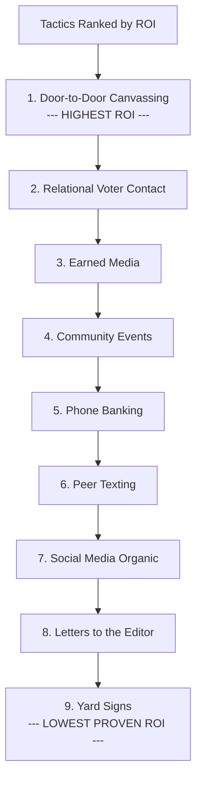

# Low-Cost, High-Impact Tactics: The Small-Budget Campaign Playbook

Most races in America are won with more hustle than money. City council, school board, county commission, state legislature — these races are decided by candidates who outwork their opponents, not outspend them. This module ranks 20+ tactics by cost-per-vote and provides a complete $5,000 campaign plan.

---

## The $5,000 Campaign Plan

This budget assumes a local race (city council, school board, county commission) with 5,000-20,000 registered voters in the district.

| Item | Budget | Purpose |
|---|---|---|
| Walk literature (5,000 pieces) | $750 | Door-to-door handout with candidate bio, priorities, endorsements |
| Yard signs (100) | $800 | Visibility at high-traffic locations and supporter homes |
| Campaign website + domain | $200 | Central information hub, donation page, volunteer sign-up |
| Palm cards (2,000) | $300 | Pocket-sized handout for events and casual encounters |
| Event supplies | $400 | Refreshments, name tags, sign-in sheets for house parties |
| Postage and mailing | $500 | Targeted letters to high-propensity voters in final 2 weeks |
| Digital ads (Facebook/Instagram) | $750 | Targeted awareness and GOTV in final 3 weeks |
| Printing (flyers, posters) | $300 | Community board postings, event flyers, business window signs |
| Phone/text platform | $500 | Peer texting and phone bank tools for volunteer use |
| Reserve/contingency | $500 | Unexpected opportunities or rapid response needs |
| **Total** | **$5,000** | |

The rest is free: your time, your volunteers' time, earned media, social media, and relationships.

---

## 20+ Tactics Ranked by Cost-Per-Vote

### 1. Door-to-Door Canvassing — HIGHEST ROI

**Cost:** Free (volunteer labor) to $2-3/door (paid canvassers)
**Impact:** Highest of any tactic. Peer-reviewed research shows a quality door knock moves vote share by 1-3 percentage points. One conversation at the door is worth 10 mailers.
**Time:** 15-20 doors per hour per canvasser
**Best for:** Every race, every budget

**How to maximize:**
- Knock doors yourself. Voters remember meeting the candidate.
- Target high-propensity, persuadable voters first
- Leave literature with a personal note at doors where no one answers
- Track every contact in a voter file or spreadsheet
- Canvass the same doors twice: introduction early, GOTV close to election

### 2. Relational Voter Contact

**Cost:** Free
**Impact:** Very high. A personal ask from a friend or family member is the most persuasive form of voter contact.
**Time:** 5-10 minutes per contact
**Best for:** Every race, especially first-time candidates with limited name ID

**How to execute:**
- List every person you and your supporters know in the district
- Ask each supporter to personally contact 10 people: call, text, or in-person
- Provide a simple message: "I'm supporting [Candidate] because [reason]. Will you vote for them?"
- Track commitments and follow up before election day

### 3. Handwritten Notes

**Cost:** $0.50-$1.00 per note (card + stamp)
**Impact:** High. Handwritten mail has near-100% open rates and conveys personal attention.
**Time:** 2-3 minutes per note
**Best for:** Small races under 10,000 voters, targeted outreach to key voters

**How to execute:**
- Candidate writes 10-20 notes per day throughout the campaign
- Target: undecided voters identified through canvassing, community leaders, lapsed voters
- Format: "Dear [Name], I'm running for [office] because [reason]. I'd love to earn your vote. — [Candidate]"

### 4. Earned Media

**Cost:** Free
**Impact:** High. A single local news story reaches more voters than weeks of canvassing.
**Time:** 2-5 hours per pitch cycle
**Best for:** Every race

**How to generate:**
- Send press releases for every endorsement, policy announcement, and campaign milestone
- Write letters to the editor and op-eds under the candidate's name
- Pitch stories to local reporters: "Local teacher runs for school board to fix [specific problem]"
- Respond to every local news story that touches your issues with a candidate quote
- Attend public meetings and make news by asking tough questions or proposing solutions

### 5. Community Events and Forums

**Cost:** $0-$100 per event
**Impact:** High. Direct voter contact in a setting where people are already gathered.
**Time:** 2-4 hours per event
**Best for:** Community-oriented races

**How to leverage:**
- Attend every community event in the district: fairs, festivals, farmers markets, block parties
- Host your own: town halls, coffee conversations, meet-and-greets
- Bring palm cards, a sign-in sheet, and a volunteer to capture contact info
- Follow up with every person you meet within 48 hours

### 6. Coffee Conversations / House Parties

**Cost:** $20-$50 per event (coffee and snacks)
**Impact:** High. Small-group settings create deep connections and committed supporters.
**Time:** 1.5-2 hours per event
**Best for:** Primary elections, small districts, early campaign phase

**How to execute:**
- Ask supporters to host 8-15 people in their home
- Candidate speaks for 10 minutes, then 30+ minutes of Q&A
- Every attendee signs in with name, email, phone
- End with a specific ask: volunteer shift, donation, host their own event
- Goal: 2-3 house parties per week in the campaign's first two months

### 7. Letters to the Editor

**Cost:** Free
**Impact:** Medium-high. Published letters reach the paper's full readership and signal grassroots support.
**Time:** 30-60 minutes to write and submit
**Best for:** Every race, especially in communities with strong local papers

**How to scale:**
- Draft 5-10 template letters with different angles (education, economy, safety, character)
- Recruit supporters to personalize and submit under their own names
- Aim for 1-2 published letters per week throughout the campaign
- Vary the authors: parents, veterans, business owners, seniors, young voters

### 8. Phone Banks

**Cost:** Free (volunteers) or $50-$100/month for a dialing platform
**Impact:** Medium. Less effective than door knocks but can reach more voters per hour.
**Time:** 20-30 completed calls per hour per volunteer
**Best for:** Voter identification, GOTV, races with large geographies

### 9. Peer Texting

**Cost:** $50-$200/month for a texting platform
**Impact:** Medium-high. Higher response rates than phone calls for voters under 50.
**Time:** 500-1,000 texts per hour per volunteer
**Best for:** GOTV, event recruitment, voter identification

### 10. Church and Faith Community Appearances

**Cost:** Free
**Impact:** Medium-high. Faith communities are tight-knit, and a pastor's implicit endorsement carries weight.
**Time:** 2-3 hours per appearance
**Best for:** Races in communities with strong faith traditions

**How to approach:**
- Ask for an invitation through a church member who supports you
- Never campaign from the pulpit — attend services, meet people, build relationships
- Offer to speak at community events, not worship services
- Be genuine about your faith connection if you have one; do not fake it

### 11. Social Media (Organic)

**Cost:** Free
**Impact:** Medium. Builds awareness and community but rarely moves votes alone.
**Time:** 30-60 minutes per day
**Best for:** Supplementing other tactics, reaching younger voters, rapid response

**Content that works:**
- Candidate at doors, at events, meeting voters (photos and short video)
- Issue statements tied to local news
- Endorsement announcements
- Volunteer appreciation
- Behind-the-scenes moments that humanize the candidate

### 12. Yard Signs

**Cost:** $5-$10 each for corrugated signs with wire stakes
**Impact:** Low-medium for persuasion, but high for name recognition and supporter morale.
**Time:** 1-2 hours for placement
**Best for:** Races where name ID is a challenge

**Placement strategy:**
- High-traffic intersections and commercial corridors
- Supporter homes along main roads
- Near polling locations (check local regulations on distance)
- Replace stolen or damaged signs within 24 hours

### 13. Literature Drops

**Cost:** $0.10-$0.15 per piece (printing) + volunteer labor
**Impact:** Medium. Less effective than a door conversation but covers more ground.
**Time:** 40-60 doors per hour per volunteer
**Best for:** Supplementing canvass operations, reaching doors where no one answers

### 14. Endorsement Leverage

**Cost:** Free
**Impact:** Medium-high. Maximizes the value of endorsements you have already earned.
**Time:** 2-3 hours per endorsement activation cycle
**Best for:** Every race

**How to leverage:**
- Feature endorsements on all walk lit, palm cards, and mailers
- Ask endorsers to share on their social media
- Include endorser quotes in press releases
- Deploy endorsers as surrogates at community events

### 15. Parade Walking

**Cost:** $50-$200 for banner, shirts, candy/handouts
**Impact:** Low-medium. Visibility and name recognition, not persuasion.
**Time:** 2-4 hours per parade
**Best for:** Early campaign visibility, community connection

### 16. Community Service Events

**Cost:** $0-$100 for supplies
**Impact:** Medium. Demonstrates values through action, generates earned media and social content.
**Time:** 3-5 hours per event
**Best for:** Building community goodwill, countering "just a politician" perception

**Ideas:** Park cleanups, food bank volunteering, school supply drives, senior center visits, trail maintenance.

### 17. Candidate Forums

**Cost:** Free (hosted by civic organizations)
**Impact:** Medium. Reaches engaged voters and generates media coverage.
**Time:** 2-3 hours including prep
**Best for:** Competitive races, establishing credibility against better-known opponents

### 18. Flash Canvassing

**Cost:** Free
**Impact:** Medium. High-energy canvass blitz that builds volunteer morale and covers ground fast.
**Time:** 2-3 hours per blitz
**Best for:** Weekends in the final month

**How to run:** Gather 15-30 volunteers. Brief for 15 minutes. Fan out across a targeted area. Knock for 2 hours. Regroup, debrief, celebrate.

### 19. Local Business Window Signs

**Cost:** $1-$2 per sign (standard letter-size poster)
**Impact:** Low-medium. Signals business community support and builds name ID.
**Time:** 1-2 hours to distribute
**Best for:** Races where economic issues are central

### 20. Adopt-a-Block

**Cost:** Free
**Impact:** Medium. Assigns volunteers to specific blocks for sustained, repeated contact.
**Time:** Ongoing, 1-2 hours per week per volunteer
**Best for:** Hyperlocal races, long campaigns

### 21. Postcard Campaigns

**Cost:** $0.50-$0.75 per card (printing + postage)
**Impact:** Medium. Tangible, brief, and easy to read. Better than a full mailer at this budget.
**Time:** Minimal once printed and addressed
**Best for:** Final two weeks GOTV push

### 22. Public Transit Campaigning

**Cost:** Free
**Impact:** Low-medium. Reaches voters who may not be home during canvass hours.
**Time:** 2-3 hours per session
**Best for:** Urban races with transit ridership

---

## Cost-Per-Vote Summary Table

| Tactic | Estimated Cost Per Vote Gained | Effort Level |
|---|---|---|
| Door-to-door canvassing | $0-$5 | High |
| Relational voter contact | $0 | Medium |
| Handwritten notes | $1-$2 | High |
| Earned media | $0 | Medium |
| House parties | $2-$5 | Medium |
| Letters to the editor | $0 | Low |
| Peer texting | $0.10-$0.50 | Medium |
| Phone banks | $0.50-$2 | Medium |
| Community events | $1-$5 | Medium |
| Social media (organic) | $0 | Low-Medium |
| Yard signs | $10-$50 | Low |
| Literature drops | $0.25-$1 | Medium |
| Digital ads | $5-$25 | Low |
| Direct mail | $10-$50 | Low |

---

## Guiding Principle

Money is a substitute for time. If you have more time than money, invest in the top of this list. If you have more money than time, invest in the bottom. The best campaigns do both.
