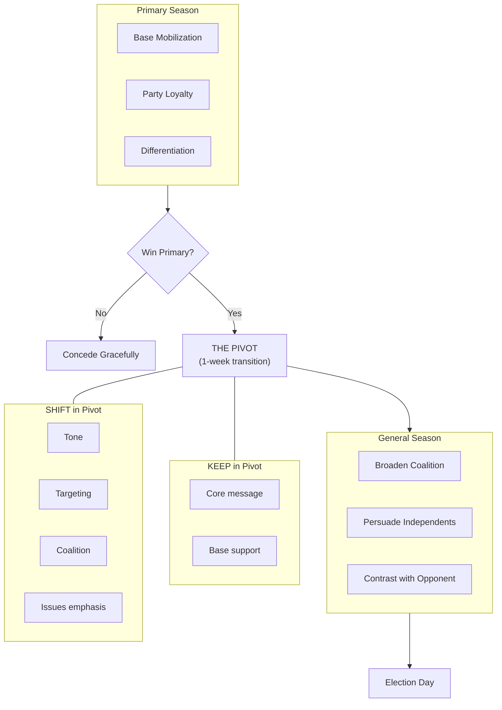

# Primary vs. General Election Strategy

The primary and the general election are fundamentally different contests. They have different electorates, different strategic imperatives, and different messaging requirements. Understanding these differences -- and managing the pivot between them -- is essential for winning both.

---

## Strategy Overview

---

## Primary Election Strategy

### The Electorate Is Different
- Primary voters are fewer, more partisan, and more ideologically committed
- Turnout ranges from 10-30% of registered party voters
- These voters are higher-propensity, pay close attention to intra-party politics, and know policy details
- They respond to endorsements, credentials, and demonstrated party loyalty
- Many have voted in previous primaries and have established preferences

### Base Mobilization Is Everything
- You are not persuading swing voters -- you are activating and mobilizing party faithful
- The campaign that best identifies its supporters and turns them out wins most primaries
- Early voter ID through canvassing and phone calls is the foundation
- Targeted GOTV to identified supporters in the final 10 days is the closer
- Absentee and early vote pushes bank votes before election day

### Party Loyalty Signals
- Demonstrate commitment to the party and its values through action, not just words
- Attend party events, support party candidates, volunteer for party activities
- Reference the party platform and how your positions align
- Use party language and framing -- this audience responds to insider signals
- Never attack the party itself, even if you disagree with specific leaders

### Endorsement Importance
In a primary, endorsements carry outsized weight because voters are choosing between candidates who largely agree on issues:
- **Party leaders and elected officials:** Signal insider trust and viability
- **Advocacy organizations:** Unions, environmental groups, issue organizations that primary voters belong to
- **Community leaders:** Pastors, neighborhood leaders, respected voices in the base
- Seek endorsements early -- being first to lock up key endorsers creates momentum
- Display endorsements prominently in all materials and on your website

### Differentiating from Same-Party Opponents
This is the hardest part of a primary. You largely agree with your opponents on direction. How do you stand out?

**Experience and qualifications:**
"I have the experience to do this job on day one" -- highlight relevant professional, community, or public service background.

**Judgment and character:**
"We agree on goals. The question is who has the judgment to achieve them" -- use personal stories to demonstrate values.

**Electability:**
"I can win the general election. Can my opponent?" -- show polling, coalition breadth, crossover appeal.

**Specificity:**
"My opponent talks about fixing roads. I have a $12 million plan with a funding source" -- be the most concrete candidate in the field.

**Community roots:**
"I have lived in this district for 20 years. I coached your kids" -- deep roots are a powerful primary differentiator.

**Tone in a primary:** Passionate but not destructive. Draw contrasts on issues and qualifications, but avoid personal attacks that leave scars. Your opponents' supporters are people you will need in November.

---

## General Election Strategy

### The Electorate Expands
- General election turnout ranges from 40-70% depending on the race
- Many general voters did not vote in the primary and have no opinion about intra-party debates
- Issue awareness is lower -- your message must be simpler and more accessible
- The universe of persuadable voters is much larger
- You are now competing for independents, low-propensity voters, and potential crossovers

### Persuasion of Independents and Swing Voters
- The central challenge: hold your base while winning the middle
- Identify persuadable voters through data, polling, and canvassing (see `voter-targeting.md`)
- Message to shared values, not partisan identity: community, family, fairness, results
- Deploy validators who appeal beyond your base: business leaders, non-partisan community figures, crossover endorsers
- Invest in paid media to reach voters who do not attend events or answer doors

### Contrast with the Opposing Party
- In the primary, you contrasted on judgment and experience with allies
- In the general, you contrast on values, vision, and record with an opponent from the other party
- Draw clear distinctions: "My opponent supports X. I support Y. Here is why that matters for your family."
- Use the opponent's own record and statements -- let them speak for themselves
- Focus on policy, record, and fitness for office. Avoid purely personal attacks.

### Coalition Building
- Assemble groups who each have their own reason to support you (see `coalition-building.md`)
- Reach out to primary opponents and their supporters -- unify the party first
- Build bridges to independent voters and moderate members of the opposing party
- Organize constituency groups: parents, veterans, small business, labor, faith leaders, etc.

### Moderated Tone
- General election messaging is broader, more inclusive, and less ideological
- Speak to the whole district, not just your party
- Acknowledge complexity -- non-partisan voters respect nuance and honesty
- Be the candidate who listens, not just the candidate who fights

---

## The Pivot: Primary to General

The pivot is the most strategically delicate moment of the campaign. You must broaden your appeal without appearing to flip-flop or abandon your base.

### Timeline
- **Primary night:** Thank supporters, congratulate opponents, begin unity language immediately. Call each opponent personally within 24 hours.
- **Week 1 post-primary:** Meet with primary opponents and their key supporters. Ask for endorsements. Launch updated website and social media with broader tone.
- **Weeks 2-3:** Announce unity endorsements. Release expanded general election platform. Begin general election fundraising push. Launch expanded field program.
- **Week 4+:** Full general election posture. New ad creative, updated mail, refreshed digital content. Opponent contrast begins.

### What to Keep
- Your core values and the 2-3 signature issues that define your candidacy
- Your personal story and biography
- Your base messaging -- continue speaking to party faithful even as you expand
- All endorsements and validators from the primary
- Your grassroots infrastructure and volunteer network

### What to Shift
- **Tone:** From rally-the-base to bring-everyone-together
- **Issue emphasis:** From partisan priorities to shared concerns (economy, safety, schools, infrastructure)
- **Audience:** From party faithful to the full electorate including independents
- **Validators:** Add non-partisan and crossover endorsers alongside party endorsers
- **Vocabulary:** Fewer partisan buzzwords, more common-ground language
- **Channels:** From party events and activist networks to broad media (TV, radio, newspaper, digital)

### Messaging Bridge Language
The key is expansion, not reversal. Never say "I changed my mind." Say "I want to expand this conversation."

**Bridge examples:**
- "In the primary, I talked about holding our party to its values on [issue]. Now I want to bring that same accountability to the whole government."
- "During the primary, I focused on [issue] because it matters to our community. In the general, I want to show how this connects to every family in this district."
- "My opponent may try to define me by the primary. But this community knows me. I have always been about [core value], and that does not change based on which election we are in."
- "I ran in the primary because I believe in [value]. I am running in the general because every voter in this district deserves a representative who fights for [broader framing]."

### What NOT to Do
- Do not disavow positions you took in the primary -- you are on video
- Do not pretend the primary did not happen
- Do not ignore your primary opponents -- their supporters are your path to victory
- Do not change your core message -- expand it
- Do not rush the pivot -- take 1-2 weeks to unify before repositioning

---

## Resource Reallocation Plan

### Fundraising
| Phase | Primary Sources | General Sources |
|---|---|---|
| Donors | Party donors, ideological donors, personal network | Add business donors, PACs, party committees, crossover donors |
| First action | -- | "We won, now we need help for November" appeal to full list |
| Opponent's donors | -- | Reach out to primary opponents' donor lists (with their cooperation) |

### Staff and Volunteers
- **Primary:** Lean team, heavy volunteer reliance, grassroots energy
- **General:** Expand staff for field, comms, digital. Professionalize operations.
- Recruit primary opponents' volunteers -- they are already trained and motivated
- Add general-election specialists: opposition research, debate prep, coalition outreach

### Field Operations
- **Primary turf:** Party strongholds, high-propensity primary voters
- **General turf:** Expand to swing precincts, independent-heavy areas, low-propensity general voters
- Rebuild canvass universe from scratch -- different voters, different message, different scripts
- New walk lists, new phone lists, new text universes

### Communications
- **Primary:** Partisan media, party channels, activist networks
- **General:** Local TV, radio, newspaper, expanded digital ads to broader audiences
- Refresh all creative: website, social media, mail, ads. New look for a new phase.
- Update candidate bio to emphasize breadth, bipartisan accomplishments, crossover appeal

### Budget Shift
| Category | Primary Allocation | General Allocation |
|---|---|---|
| Fundraising | 60% | 30% |
| Voter contact (field + paid media) | 25% | 40% |
| Digital | 10% | 20% |
| Operations | 5% | 10% |

Spend the first 2 weeks post-primary building the war chest. Then shift aggressively to voter contact.

---

## Strategic Comparison

| Dimension | Primary | General |
|---|---|---|
| Electorate size | Small (10-30% turnout) | Large (40-70% turnout) |
| Voter knowledge | High | Low to moderate |
| Key task | Differentiate + mobilize | Persuade + mobilize |
| Message tone | Passionate, specific | Inclusive, forward-looking |
| Contrast target | Same-party opponents (gentle) | Opposing-party opponent (sharp) |
| Endorsement value | Very high (credential stacking) | High (coalition signals) |
| Paid media role | Secondary | Primary |
| Field role | Primary (voter ID + GOTV) | Major (persuasion + expanded GOTV) |
| Coalition scope | Party base | Cross-party |
| Risk of negativity | High (hurts party unity) | Moderate (expected, but calibrate) |

---

## Common Mistakes

1. **Pivoting too early.** Talking about the general before winning the primary alienates your base.
2. **Pivoting too late.** Staying in primary mode lets your general opponent define you first.
3. **Flip-flopping.** Taking opposite positions in primary and general. Everything is recorded.
4. **Ignoring primary opponents.** They have supporters, donors, and volunteers you need in November.
5. **Abandoning your base.** In the rush to win the middle, you lose the people who got you here.
6. **Same campaign, different election.** Failing to change strategy, budget, and tactics for a fundamentally different electorate.
7. **Not planning for both phases from day one.** Smart campaigns budget, staff, and strategize for both the primary and the general simultaneously.
