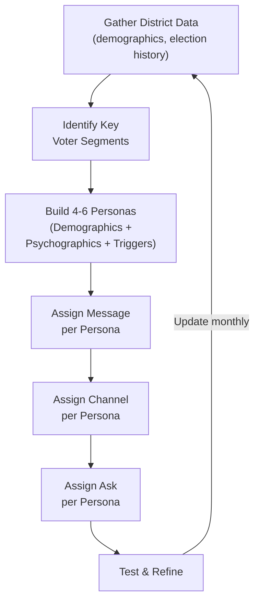

# Voter Personas: Psychographic Voter Profiling

Voter personas translate abstract data into concrete people your campaign can message to, organize around, and design programs for. Instead of targeting "women 35-54," you target "Maria, a working mom who worries about childcare costs and makes voting decisions based on who she trusts to understand her life." Build 4-6 personas for your district and use them to guide every message, mail piece, ad, and door script.

---

## Why Personas Matter

- Demographics tell you who voters are. Psychographics tell you why they vote.
- A 45-year-old suburban woman could be a fiscal conservative, a progressive activist, or a single-issue school safety voter. Demographics alone cannot distinguish them.
- Personas force your campaign to think from the voter's perspective, not the candidate's.
- They align your entire team around shared language: "Is this message for the Concerned Parent or the Young Professional?"
- Resource allocation improves because you know which personas are persuadable and where to find them.

---

## Persona-Building Process

---

## How to Build 4-6 Personas for Any District

### Step 1: Gather Data
- **Voter file:** Age, gender, address, party registration, vote history, ethnicity (where available)
- **Census data:** Income, education, household composition, language, housing tenure
- **Polling and surveys:** Issue priorities, candidate awareness, favorability, media habits
- **Canvass data:** Issue mentions at the door, concerns raised, questions asked
- **Local knowledge:** What your campaign manager, volunteers, and community contacts know

### Step 2: Identify Clusters
Look for natural groupings where demographics, geography, and issues overlap:
- Which neighborhoods share similar concerns?
- Which age groups have similar media habits?
- Which voter segments share issue priorities but differ on other dimensions?
- Where do vote propensity and support level intersect?
- Aim for 4-6 distinct personas covering 70-80% of your target electorate.

### Step 3: Build the Framework
For each persona, define every element below:

| Element | What to Capture |
|---|---|
| **Name and archetype** | A memorable label (e.g., "Concerned Parent") |
| **Demographics** | Age, income, education, location, household composition |
| **Psychographics** | Values, worldview, media habits, community involvement, engagement level |
| **Behavioral triggers** | What motivates their vote, what turns them off, trusted messengers |
| **Key issues** | Top 2-3 issues that drive their decision |
| **Winning message** | The 1-2 sentence pitch that earns their support |
| **Best channel** | How to reach them (doors, digital, mail, events, radio) |
| **The ask** | What you want them to do (vote, volunteer, donate, persuade others) |

### Step 4: Validate and Refine
- Test personas against canvass data -- do the conversations at the door match?
- Share personas with field staff: "Does this ring true?"
- Update monthly as the campaign gathers more voter contact data.

---

## Sample Persona 1: The Concerned Parent

**Name:** The Concerned Parent
**Archetype:** Suburban parent laser-focused on schools and neighborhood safety

**Demographics:** Age 35-45. Household income $65,000-$120,000. College-educated. Suburban subdivision or family-oriented urban neighborhood. Two children in public school. Likely homeowner.

**Psychographics:** Values stability, safety, and opportunity for their kids. Moderately involved in community (PTA, youth sports). Gets news from local Facebook groups, school email lists, and morning TV. Not deeply ideological -- votes based on "who will keep my family safe and my schools strong." Trusts other parents and teachers more than politicians.

**Behavioral triggers:** School quality data (test scores, teacher retention). Local crime reports. Property tax changes. Any perceived threat to children's well-being activates them immediately. Turned off by abstract policy debates that do not connect to daily family life. A candidate who visits a school event matters more than a TV ad.

**Key issues:** School funding and quality. Public safety. Property taxes. Childcare costs.

**Winning message:** "[Candidate] is a parent who understands that strong schools and safe neighborhoods are not partisan issues -- they are the foundation of every family's future."

**Best channel:** Facebook (local parent groups), Saturday morning door-to-door canvassing, school event presence, direct mail to households with school-age children, yard signs in neighborhoods with school bus stops.

**The ask:** Vote. Volunteer for a Saturday canvass shift. Put up a yard sign. Bring another parent to a campaign coffee.

---

## Sample Persona 2: The Retired Veteran

**Name:** The Retired Veteran
**Archetype:** Senior with deep commitment to service, duty, and accountability

**Demographics:** Age 65+. Fixed income (pension, Social Security, savings). Some college or vocational training. Established neighborhood or rural area. Homeowner with paid-off mortgage. Often widowed or living alone.

**Psychographics:** Values honor, duty, accountability, and straight talk. Deeply skeptical of politicians who have never served or sacrificed. Active in veterans' organizations (VFW, American Legion). Gets news from local newspaper, TV news, and talk radio. High-propensity voter -- has voted in every election for decades. Respects experience and plain speaking. Distrusts flashy campaigns and slick messaging.

**Behavioral triggers:** Candidates who demonstrate personal sacrifice or service. Fiscal responsibility and government accountability arguments. Any perception of disrespect toward military or first responders is disqualifying. Responds to personal outreach -- a handshake at the VFW post matters more than a digital ad.

**Key issues:** Veterans' healthcare and benefits. Fiscal responsibility. Public safety. Government accountability and transparency.

**Winning message:** "[Candidate] believes in the same values you served to protect: accountability, fiscal responsibility, and taking care of the people who take care of us."

**Best channel:** VFW/Legion post appearances, local newspaper ads, direct mail (formal tone), personal phone calls from fellow veterans, endorsements from respected veterans' leaders.

**The ask:** Vote. Endorse publicly. Write a letter to the editor. Attend a veterans' roundtable with the candidate.

---

## Sample Persona 3: The Young Professional

**Name:** The Young Professional
**Archetype:** Urban renter navigating housing costs, career building, and climate anxiety

**Demographics:** Age 25-34. Income $40,000-$80,000. Bachelor's degree or higher. Rents an apartment in urban or inner-suburban area. Single or partnered without children. May carry student debt.

**Psychographics:** Values authenticity, progress, and action on climate. Skeptical of traditional politics but not fully disengaged. Follows news through social media and podcasts. Cares deeply about housing affordability and economic opportunity. Low vote propensity relative to education -- intends to vote but life gets in the way. Trusts peers and influencers more than institutions.

**Behavioral triggers:** Authentic, unscripted candidate moments. Specific, actionable policy proposals (not platitudes). Housing cost data for their neighborhood. Climate impacts they can see locally. Turned off by empty slogans, inauthenticity, and candidates out of touch with their economic reality.

**Key issues:** Housing affordability. Climate action. Student debt. Public transit. Social equity.

**Winning message:** "[Candidate] gets it: you should not have to spend 50% of your paycheck on rent. [He/She] has a real plan to build more housing, invest in transit, and take bold action on climate."

**Best channel:** Instagram and TikTok (short-form video), targeted digital ads, text messages, podcast ads, events at breweries and coffee shops, peer-to-peer outreach.

**The ask:** Vote early (remove "life got in the way" barriers). Share a social media post. Bring a friend to vote. Sign up for a text banking shift.

---

## Sample Persona 4: The Small Business Owner

**Name:** The Small Business Owner
**Archetype:** Self-made entrepreneur focused on taxes, regulation, and economic stability

**Demographics:** Age 40-55. Income $80,000-$200,000+ (variable). Owns a local business (retail, restaurant, services, trades). Employs 2-20 people. Lives in the community where they operate. Deep local roots.

**Psychographics:** Values self-reliance, hard work, and economic freedom. Acutely aware of regulatory burden and tax impacts on their bottom line. Engaged in the Chamber of Commerce and business associations. Gets news from business networks, trade publications, and morning news. Politically pragmatic -- supports whoever helps their business thrive. Distrusts government bureaucracy but depends on public infrastructure.

**Behavioral triggers:** Tax policy changes (property, business, payroll). New regulations or permitting burdens. Workforce availability. Infrastructure that directly affects their business (roads, parking, broadband). Responds strongly to candidates who visit the business and ask genuine questions about their challenges.

**Key issues:** Taxes and regulation. Workforce development. Infrastructure. Economic growth. Healthcare costs for employees.

**Winning message:** "[Candidate] knows that small businesses are the backbone of this community and will cut red tape, keep taxes fair, and make sure local businesses -- not just big corporations -- have a seat at the table."

**Best channel:** Chamber of Commerce events and business roundtables, direct mail to business addresses, local newspaper ads, candidate business walk visits, endorsements from respected local business leaders.

**The ask:** Endorse. Host a fundraiser or coffee at the business. Display a yard sign or window poster. Donate.

---

## Sample Persona 5: The Community Elder

**Name:** The Community Elder
**Archetype:** Long-time resident and neighborhood anchor who votes on trust and character

**Demographics:** Age 70+. Fixed income. Has lived in the community 30+ years. Active in church, neighborhood association, or civic groups. May live alone or with spouse. Extended family nearby. High-propensity voter.

**Psychographics:** Values community, trust, continuity, and respect. Deeply connected to the neighborhood and its history. Skeptical of newcomers and change for its own sake. Gets news from local newspaper, TV, and church bulletins. Trusts their pastor, longtime neighbors, and established community leaders. Votes based on character: "Do I know this person? Can I trust them?"

**Behavioral triggers:** Personal relationship with the candidate (they need to have met you). Endorsements from their pastor or a respected longtime neighbor. Candidate presence at community institutions (churches, senior centers, neighborhood meetings). Turned off by slick marketing, negative campaigning, and candidates who only appear at election time.

**Key issues:** Healthcare and Medicare. Social Security. Public safety. Neighborhood preservation. Respect for community institutions.

**Winning message:** "[Candidate] has deep roots in this community and the trust of the people who built it. [He/She] will protect your healthcare, keep your neighborhood safe, and always put this community first."

**Best channel:** Church announcements and bulletins, senior center visits, neighborhood association meetings, local newspaper, personal phone calls, endorsements from pastors and community leaders, handwritten notes from the candidate.

**The ask:** Vote (they will -- they always do). Endorse to their network. Introduce the candidate at church or a neighborhood meeting. Call their grandchildren and tell them to vote.

---

## Sample Persona 6: The First-Time Voter

**Name:** The First-Time Voter
**Archetype:** Newly eligible voter looking for inspiration and a reason to believe politics matters

**Demographics:** Age 18-22. Student or early career. Lives at home, in a dorm, or in a first apartment. Low or dependent income. May not be registered to vote yet.

**Psychographics:** Values authenticity, social justice, and change. Deeply skeptical that politics can actually improve their life, but still idealistic enough to try. Gets all information from TikTok, Instagram, YouTube, and peers. Energized by big ideas and personal stories, not policy white papers. Extremely low vote propensity -- most have never voted and may not know how.

**Behavioral triggers:** Seeing peers vote and talk about it publicly. Candidates who listen and take their concerns seriously. Simple, clear voting instructions (they do not know where their polling place is or what ID they need). Viral social media moments. Turned off by condescension, jargon, and the sense that "my vote does not matter."

**Key issues:** Climate. Gun violence. Student debt. Social justice. Mental health. The feeling that the system is broken and needs new voices.

**Winning message:** "This is your community and your future. [Candidate] is running because your generation deserves leaders who actually listen. Your vote is your voice -- and it matters more than you think."

**Best channel:** TikTok and Instagram (short-form video), peer-to-peer texting, campus events, voter registration drives, dorm canvassing, influencer partnerships, Snapchat.

**The ask:** Register to vote right now (hand them the form or link). Vote early. Share a post. Bring a friend. Tell your story.

---

## Using Personas in Practice

### Message Development
- Write every piece of content for a specific persona. If you cannot name the persona, the message is too generic.
- Test messages against multiple personas: does your education pitch work for the Concerned Parent AND the First-Time Voter?

### Ad Targeting
- Map personas to digital targeting criteria: age, zip code, interests, media consumption
- Create ad variants for each persona with tailored imagery, language, and issues

### Canvass Scripts
- Train canvassers to identify which persona they are likely encountering (neighborhood, age, household cues)
- Provide pivot language for each persona's top issues

### Mail Program
- Design different mail pieces for different personas, sent to matching households via voter file segmentation

### Volunteer Recruitment
- Different personas volunteer for different reasons. The Concerned Parent wants to "help the schools." The First-Time Voter wants to "be part of something." Tailor the recruitment pitch accordingly.

---

## Common Mistakes

1. **Too many personas.** More than 6 and you cannot resource them all. Pick the biggest segments and opportunities.
2. **Based on stereotypes, not data.** Validate with real canvass data, polling, and community input.
3. **Created and ignored.** Every mailer, ad, script, and event should be designed with a specific persona in mind.
4. **Static.** Update monthly as voter contact reveals new patterns and shifts.
5. **Confused for real people.** Personas guide strategy -- they do not replace genuine human connection at the door.
