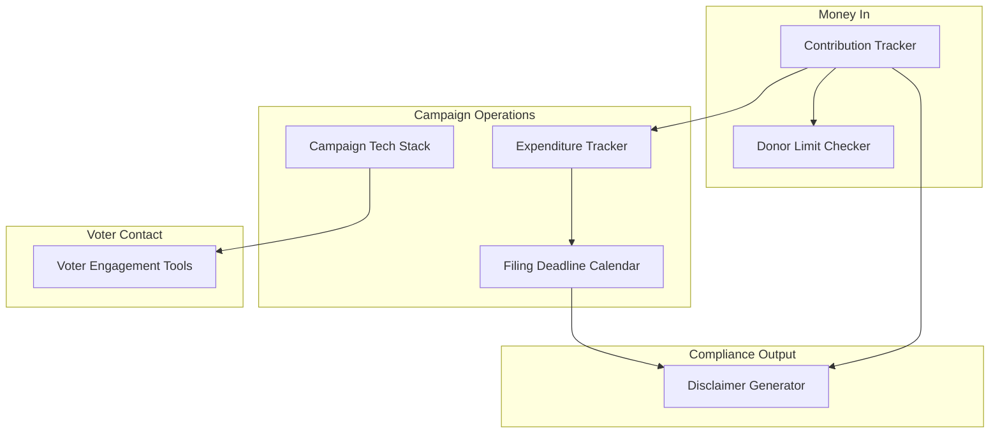

# Tools

Interactive utilities for tracking, checking, and generating campaign artifacts. Each tool provides a structured system you can use repeatedly throughout the campaign.

## Files

- [campaign-tech-stack.md](campaign-tech-stack.md) -- Recommended technology organized by budget tier with free alternatives
- [contribution-tracker.md](contribution-tracker.md) -- Data management system for tracking donations, ensuring compliance, and generating filing exports
- [disclaimer-generator.md](disclaimer-generator.md) -- Generate legally compliant "Paid for by" disclaimers for every medium
- [donor-limit-checker.md](donor-limit-checker.md) -- Decision tree to determine if a donor can legally contribute more
- [expenditure-tracker.md](expenditure-tracker.md) -- Track spending, monitor budgets, ensure reporting compliance, and flag personal use violations
- [filing-deadline-calendar.md](filing-deadline-calendar.md) -- Generate .ics calendar events for federal and state filing deadlines
- [voter-engagement-tools.md](voter-engagement-tools.md) -- Reference index to the 15 interactive voter engagement tools
