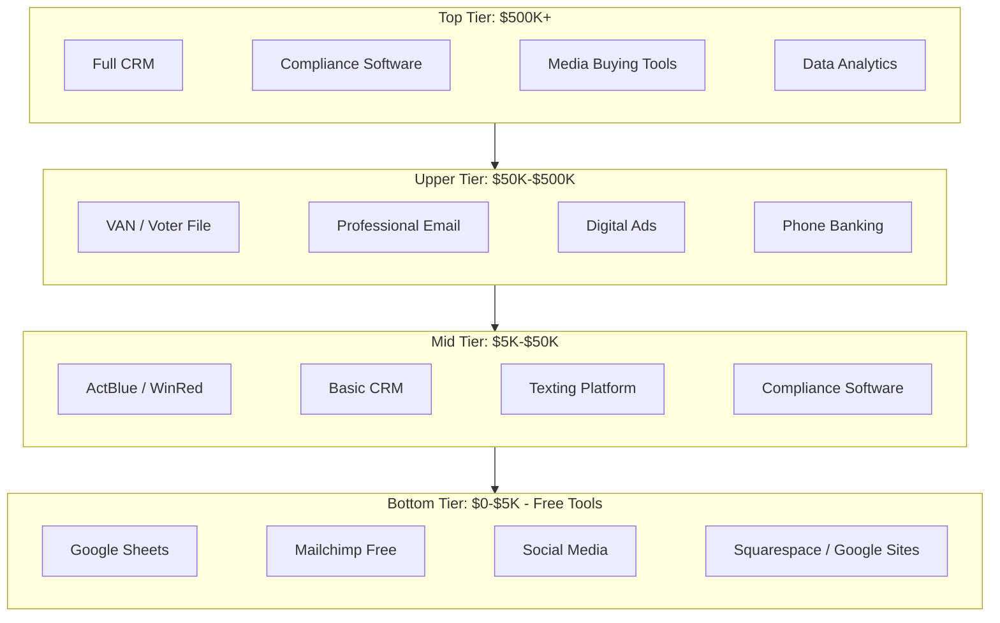

# Campaign Tech Stack

Recommended campaign technology organized by budget tier. Every campaign needs technology for voter data, communications, fundraising, compliance, and digital presence. This guide maps tools to budget levels and identifies free alternatives for every category.



---

## Budget Tier Overview

| Tier | Budget Range | Typical Race | Key Principle |
|---|---|---|---|
| Tier 1 | $0 - $5,000 | School board, small municipal, party precinct | Free tools only; sweat equity replaces software |
| Tier 2 | $5,000 - $50,000 | City council, county commission, state house | Core paid tools; free where possible |
| Tier 3 | $50,000 - $500,000 | State senate, mayor of mid-size city, US House primary | Professional-grade stack; part-time staff |
| Tier 4 | $500,000+ | Competitive US House, US Senate, statewide | Full enterprise stack; dedicated tech staff |

---

## Tier 1: $0 - $5,000 (Free Tools)

The entire stack can be assembled for $0 in software costs. The trade-off is manual work and limited scale.

| Category | Recommended Free Tool | Notes |
|---|---|---|
| CRM / Voter File | Google Sheets + state voter file (public records request) | Download voter file from county clerk or secretary of state. Manage contacts in Google Sheets. |
| Email | Mailchimp Free (up to 500 contacts) or Gmail + BCC | Mailchimp free tier works for small lists. For very small lists, Gmail BCC works (but no tracking). |
| Fundraising | Cash/check + manual tracking OR free ActBlue/WinRed account | ActBlue (Democratic) and WinRed (Republican) charge processing fees but no setup cost. |
| Texting | Personal phone + group text | Limited to ~10 recipients per group text. No mass texting at this tier. |
| Social Media | Direct posting to platforms | Facebook, Instagram, X, NextDoor — all free to post. Use Meta Business Suite (free) to schedule posts. |
| Website | Google Sites, WordPress.com (free tier), or Carrd ($0-19/yr) | A simple one-page site with bio, issues, donate link, and contact info is sufficient. |
| Accounting | Google Sheets or Wave (free accounting software) | Wave offers free invoicing and accounting. Good enough for simple campaigns. |
| Compliance | Spreadsheet-based tracker (see contribution-tracker.md) | Manual tracking using the CSV schemas in this skill. |
| Digital Ads | Organic only at this tier | Boost key posts for $5-20 when possible. Facebook minimum spend is $1/day. |
| Design | Canva Free | Templates for social graphics, flyers, yard sign designs. Free tier is sufficient. |
| Scheduling | Google Calendar (shared) | Shared calendar for candidate schedule, events, filing deadlines. |
| File Storage | Google Drive (15 GB free) | Store photos, documents, receipts, voter data. Share with team. |
| Communication | Signal or WhatsApp group | Free, encrypted team communication. |
| Petition/Forms | Google Forms | Volunteer sign-ups, endorsement requests, event RSVPs. |

**Total software cost: $0**

---

## Tier 2: $5,000 - $50,000

Invest in the tools that save the most time: a real CRM, email platform, and compliance software.

| Category | Recommended Tool | Approximate Cost | Free Alternative |
|---|---|---|---|
| CRM / Voter File | NGP VAN (VoteBuilder) or i360 | $100-500/mo depending on state | Google Sheets + public voter file |
| Email | Mailchimp Essentials or Action Network | $15-100/mo based on list size | Mailchimp free (500 contacts) |
| Fundraising | ActBlue or WinRed + event ticketing (Eventbrite) | Processing fees only (3.95% ActBlue) | Cash/check manual tracking |
| Texting | Hustle or ThruText (peer-to-peer) | $0.03-0.06/text, min ~$200/mo | Personal phone + volunteers |
| Social Media | Meta Business Suite + Buffer or Later (free tier) | $0-15/mo | Direct posting |
| Website | WordPress.org + Bluehost or Squarespace | $12-25/mo | Google Sites, WordPress.com free |
| Accounting | QuickBooks Simple Start or Wave | $0-30/mo | Google Sheets |
| Compliance | ISPolitical or Campaign Deputy | $50-200/mo | Spreadsheet tracker |
| Digital Ads | Facebook Ads Manager + Google Ads | $200-2,000/mo ad spend | Organic posting only |
| Design | Canva Pro | $13/mo | Canva Free |

**Estimated software cost: $300-800/month**

### Tier 2 Priority Stack (if budget is tight, buy these first)
1. Voter file access (VAN/i360) — this is irreplaceable
2. Email platform with tracking — you need open/click rates
3. Online fundraising (ActBlue/WinRed) — processing fees only, no monthly cost
4. Compliance software — prevents fines that cost more than the software

---

## Tier 3: $50,000 - $500,000

Professional-grade tools with automation, analytics, and integration.

| Category | Recommended Tool | Approximate Cost | Free Alternative |
|---|---|---|---|
| CRM / Voter File | NGP VAN (full suite) or PDI/Aristotle | $300-1,000/mo | Public voter file + Sheets |
| Email | Mailchimp Standard, Action Network, or BSD Tools | $50-500/mo | Mailchimp free tier |
| Fundraising | ActBlue/WinRed + Revv or Anedot | Processing fees + $0-200/mo | ActBlue/WinRed alone |
| Texting | Hustle, ThruText, or Spoke (open source) | $200-1,000/mo | Spoke (self-hosted, free) |
| Social Media | Hootsuite or Sprout Social + Meta Business Suite | $50-300/mo | Buffer free + direct posting |
| Website | Custom WordPress + WPEngine or NationBuilder | $30-500/mo | WordPress.com free |
| Accounting | QuickBooks Online | $30-80/mo | Wave (free) |
| Compliance | ISPolitical, Campaign Deputy, or NGP Compliance | $100-500/mo | Spreadsheet tracker |
| Digital Ads | Facebook + Google + programmatic (DSP) | $2,000-20,000/mo spend | Organic only |
| Polling | Change Research, Civiqs, or traditional firm | $5,000-25,000 per poll | SurveyMonkey (informal only) |
| Phone Banking | LiveVox, ThruTalk, or Hubdialer | $200-1,000/mo | Google Voice + volunteers |
| Data/Analytics | TargetSmart or L2 voter data + Tableau Public | $200-1,000/mo | Public voter file + Sheets |
| Design | Canva Pro + freelance designer on retainer | $500-2,000/mo | Canva Free |

**Estimated software cost: $1,500-5,000/month + ad spend**

---

## Tier 4: $500,000+

Enterprise-level tools, dedicated staff, and consultant-managed platforms.

| Category | Recommended Tool | Approximate Cost |
|---|---|---|
| CRM / Voter File | NGP VAN (full), PDI, or Aristotle + TargetSmart data | $500-3,000/mo |
| Email | BSD Tools, Mailchimp Premium, or HubSpot | $300-2,000/mo |
| Fundraising | ActBlue/WinRed + Revv + call-time CRM (CallTime.AI) | $200-1,000/mo + processing |
| Texting | Hustle or ThruText (at scale) + broadcast SMS (Tatango) | $500-5,000/mo |
| Social Media | Sprout Social + Brandwatch + in-house team | $500-3,000/mo |
| Website | Custom-built or NationBuilder + dedicated webmaster | $500-3,000/mo |
| Accounting | QuickBooks Online Advanced + bookkeeper | $200/mo + staff |
| Compliance | NGP Compliance or ISPolitical + compliance attorney | $500-2,000/mo + legal fees |
| Digital Ads | Full-service digital firm OR in-house team + DSP | $10,000-100,000+/mo spend |
| TV/Radio Buying | Optimizer or CMAG + media buying consultant | Consultant fees + media spend |
| Polling | Professional polling firm (Anzalone, GS Strategy, Public Opinion Strategies) | $15,000-50,000 per poll |
| Phone Banking | LiveVox or predictive dialer + call center staff | $1,000-10,000/mo |
| Data/Analytics | Civis Analytics, HaystaqDNA, or TargetSmart full suite | $2,000-10,000/mo |
| Field Management | MiniVAN (mobile app for canvassers) + turf-cutting tools | Included with VAN or $200-500/mo |
| Design/Video | In-house creative team or agency | $3,000-20,000/mo |
| Opposition Research | Dedicated oppo research firm | $10,000-50,000 one-time |

**Estimated software cost: $5,000-20,000/month + consultants + ad spend**

---

## Tool Selection Decision Framework

When choosing between options in any category, evaluate on these criteria:

```
1. INTEGRATION: Does it connect to your other tools?
   - VAN integrates with most Democratic campaign tools
   - i360/PDI integrates with most Republican campaign tools
   - Check API availability for custom integrations

2. DATA PORTABILITY: Can you export your data?
   - Never use a tool that locks in your data
   - Require CSV/API export for all contact and financial data
   - Plan for switching mid-campaign if needed

3. SUPPORT: Is help available when things break?
   - Campaign timelines are unforgiving — a broken tool on Election Day is catastrophic
   - Prefer tools with phone/chat support over email-only
   - Check if support is available evenings/weekends

4. COMPLIANCE: Does the tool meet regulatory requirements?
   - Fundraising tools must process contributions compliantly
   - Texting tools must support opt-out (TCPA compliance)
   - Email tools must support CAN-SPAM (unsubscribe links)
   - Ad tools must support political ad disclaimers

5. SCALABILITY: Will it handle your peak load?
   - Email on Election Day eve: can it send 100,000 emails in 2 hours?
   - Texting on GOTV weekend: can it handle 50,000 texts?
   - Website on announcement day: can it handle a traffic spike?
```

---

## Essential Free Tools Every Campaign Should Use

Regardless of budget, these free tools should be in every campaign's stack:

| Tool | Use | Cost |
|---|---|---|
| Google Workspace (free tier) | Email, docs, sheets, calendar, drive | Free |
| Canva Free | Social media graphics, flyers, signs | Free |
| Meta Business Suite | Facebook/Instagram scheduling + analytics | Free |
| Signal or WhatsApp | Encrypted team communications | Free |
| Google Forms | Volunteer signups, surveys, RSVPs | Free |
| Google Calendar | Shared campaign schedule + filing deadlines | Free |
| Bitly | Link shortening + click tracking | Free (basic) |
| Linktree | Bio link for social media profiles | Free (basic) |
| Unsplash/Pexels | Free stock photography | Free |
| OBS Studio | Live streaming for town halls / events | Free |
| Zoom (free tier) | Virtual meetings, phone banks (40 min limit) | Free |
| Loom | Quick video messages and training for volunteers | Free (basic) |

---

## Security Essentials

Every campaign, regardless of budget, must implement basic cybersecurity:

```
[ ] Two-factor authentication (2FA) on ALL accounts — email, social, banking, CRM
[ ] Unique passwords for every service (use a password manager: Bitwarden is free)
[ ] Separate campaign email accounts (never use personal email for campaign business)
[ ] Encrypted messaging for sensitive discussions (Signal)
[ ] Regular backups of voter data and financial records
[ ] Limit admin access — not everyone needs full permissions
[ ] Review connected apps/permissions quarterly
[ ] Phishing awareness training for all staff and key volunteers
```
