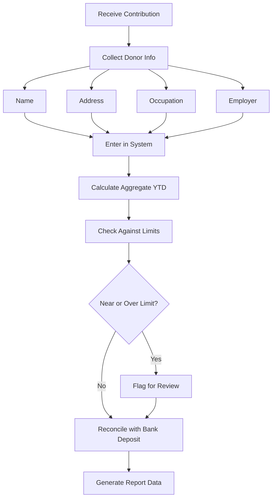

# Contribution Tracker

A data management system for tracking all campaign donations, ensuring compliance with contribution limits, reconciling against bank records, and generating export files for regulatory filings.



---

## CSV Schema

Use this schema as the standard format for tracking every contribution received by the campaign.

```csv
date,donor_name,donor_address,donor_occupation,donor_employer,amount,payment_method,election,aggregate_ytd,itemized_flag,notes
```

### Field Definitions

| Field | Type | Required | Description |
|---|---|---|---|
| `date` | YYYY-MM-DD | Yes | Date the contribution was received (not deposited) |
| `donor_name` | Text | Yes | Full legal name: "Last, First Middle" for individuals; entity name for PACs/orgs |
| `donor_address` | Text | Yes | Full mailing address: "Street, City, State ZIP" |
| `donor_occupation` | Text | Conditional | Required for individuals giving >$200 aggregate (federal). "Self-employed," "Retired," "Not employed" are valid entries. |
| `donor_employer` | Text | Conditional | Required for individuals giving >$200 aggregate (federal). Use "Self-employed," "Retired," "Not employed" as appropriate. |
| `amount` | Decimal | Yes | Dollar amount of this specific contribution. Always positive. Use negative values only for refunds with "REFUND" in notes. |
| `payment_method` | Text | Yes | One of: `check`, `credit_card`, `debit_card`, `cash`, `wire`, `ach`, `online`, `in_kind`, `other` |
| `election` | Text | Yes | Which election: `primary`, `general`, `runoff`, `special`, `convention`, `recount` |
| `aggregate_ytd` | Decimal | Calculated | Running total of all contributions from this donor in the current election cycle |
| `itemized_flag` | Boolean | Calculated | `TRUE` if aggregate_ytd exceeds itemization threshold ($200 federal); `FALSE` otherwise |
| `notes` | Text | No | Free text: earmarking info, bundler name, event name, conduit, special conditions |

### Example CSV Data

```csv
date,donor_name,donor_address,donor_occupation,donor_employer,amount,payment_method,election,aggregate_ytd,itemized_flag,notes
2026-01-15,"Smith, Jane A.","123 Main St, Springfield, IL 62701",Attorney,"Smith & Associates LLP",500.00,online,primary,500.00,TRUE,ActBlue receipt #12345
2026-01-16,"Jones, Robert","456 Oak Ave, Chicago, IL 60601",Retired,Retired,100.00,check,primary,100.00,FALSE,Check #4521
2026-01-20,"Illinois Teachers PAC","789 State St, Springfield, IL 62702",,,2500.00,check,primary,2500.00,TRUE,PAC contribution
2026-02-01,"Smith, Jane A.","123 Main St, Springfield, IL 62701",Attorney,"Smith & Associates LLP",250.00,credit_card,primary,750.00,TRUE,Follow-up donation via website
2026-02-05,"Garcia, Maria","321 Elm Dr, Peoria, IL 61602",Physician,"OSF Healthcare",50.00,cash,primary,50.00,FALSE,Event: Feb 5 fundraiser. Cash receipt issued.
```

---

## JSON Schema

For applications, databases, and API integrations, use this JSON structure.

```json
{
  "contribution": {
    "id": "CONTRIB-2026-00001",
    "date_received": "2026-01-15",
    "date_deposited": "2026-01-17",
    "donor": {
      "id": "DONOR-00042",
      "type": "individual",
      "name_last": "Smith",
      "name_first": "Jane",
      "name_middle": "A.",
      "name_suffix": "",
      "address_street": "123 Main St",
      "address_city": "Springfield",
      "address_state": "IL",
      "address_zip": "62701",
      "occupation": "Attorney",
      "employer": "Smith & Associates LLP",
      "email": "jane.smith@email.com",
      "phone": "217-555-0123"
    },
    "amount": 500.00,
    "payment_method": "online",
    "payment_reference": "ActBlue receipt #12345",
    "election": "primary",
    "aggregate_cycle": 500.00,
    "itemized": true,
    "in_kind_description": null,
    "in_kind_fair_market_value": null,
    "earmarked": false,
    "earmark_conduit": null,
    "bundler": null,
    "batch_id": "BATCH-2026-01-17-A",
    "notes": ""
  }
}
```

### Donor Types

```json
{
  "donor_types": [
    "individual",
    "pac_connected",
    "pac_nonconnected",
    "super_pac",
    "party_committee_national",
    "party_committee_state",
    "party_committee_local",
    "candidate_committee",
    "corporation",
    "labor_organization",
    "partnership",
    "llc",
    "tribal",
    "other"
  ]
}
```

---

## Aggregate Calculation Logic

The most critical compliance function is calculating the running aggregate per donor per election cycle. Getting this wrong means accepting illegal contributions.

### Step-by-Step Aggregate Calculation

```
FOR each new contribution:
  1. IDENTIFY the donor
     - Match on: name + address (primary key)
     - Also check: name + employer, name + ZIP (catch address changes)
     - Flag potential duplicates for manual review

  2. IDENTIFY the election cycle
     - Federal: 2-year cycle (Jan 1 of odd year through Dec 31 of even year)
     - State: varies (check state rules — some are per-calendar-year, 
       some are per-election-cycle, some are per-office)

  3. PULL all prior contributions from this donor in this cycle
     - Sum all amounts (including in-kind fair market values)
     - Subtract any refunds issued to this donor

  4. ADD the new contribution amount to get new aggregate

  5. CHECK against limits:
     - IF new aggregate > per-election limit → REJECT or REFUND excess
     - IF new aggregate > itemization threshold → Mark as itemized
     - IF donor type is prohibited → REJECT entirely

  6. UPDATE the aggregate_ytd field on ALL records for this donor 
     in this cycle (the aggregate field reflects the running total 
     at the time of each contribution)
```

### Aggregate Tracking Table

Maintain a separate donor summary table:

```csv
donor_id,donor_name,cycle,election,total_contributed,total_refunded,net_aggregate,limit,remaining_capacity,itemized
DONOR-00042,"Smith, Jane A.",2025-2026,primary,750.00,0.00,750.00,3300.00,2550.00,TRUE
DONOR-00042,"Smith, Jane A.",2025-2026,general,0.00,0.00,0.00,3300.00,3300.00,FALSE
DONOR-00101,"Jones, Robert",2025-2026,primary,100.00,0.00,100.00,3300.00,3200.00,FALSE
```

### Duplicate Donor Detection

Common issues that create false duplicates:

| Problem | Example | Solution |
|---|---|---|
| Name variations | "Bob Smith" vs "Robert Smith" | Maintain alias table |
| Address changes | Old address vs new address | Match on name + employer |
| Maiden/married name | "Jane Doe" vs "Jane Smith" | Manual review flag |
| Typos | "Smtih" vs "Smith" | Fuzzy matching with review |
| Joint accounts | "Bob & Jane Smith" | Split or attribute to one donor |
| Online vs offline | Different data formats | Normalize on import |

---

## Running Totals and Cash-on-Hand

Track these running totals at all times:

### Daily Cash Flow

```
Opening balance (start of day)
+ Contributions received today
- Expenditures today
- Refunds issued today
= Closing balance (end of day)
```

### Period Summary

```
Cash on hand at beginning of period:    $XX,XXX.XX
+ Total contributions this period:      $XX,XXX.XX
- Total expenditures this period:       $XX,XXX.XX
- Total refunds this period:            $XX,XXX.XX
= Cash on hand at end of period:        $XX,XXX.XX

Total debts and obligations:            $XX,XXX.XX
Net cash position:                      $XX,XXX.XX
```

### Key Metrics to Track

| Metric | Formula | Why It Matters |
|---|---|---|
| Total raised this cycle | Sum of all contributions | Top-line fundraising number |
| Average contribution | Total raised / number of contributions | Donor base health |
| Median contribution | Middle value of all contributions | More accurate than average |
| Donor count (unique) | Count of unique donor IDs | Breadth of support |
| Repeat donor rate | Donors with 2+ contributions / total donors | Loyalty indicator |
| Online vs offline ratio | Online contributions / total contributions | Channel effectiveness |
| Itemized vs unitemized | Itemized total / total raised | Small-dollar health |
| Burn rate | Monthly expenditures / cash on hand | Months of runway |
| Cost per dollar raised | Fundraising expenses / total raised | Fundraising efficiency |

---

## Bank Reconciliation

Every deposit must reconcile against tracked contributions. Discrepancies indicate missing records, data entry errors, or fraud.

### Reconciliation Process

```
1. OBTAIN bank statement for the period
2. LIST all deposits on the bank statement
3. FOR each bank deposit:
   a. MATCH to a batch of contributions in your tracker
   b. VERIFY the deposit amount = sum of contributions in the batch
   c. VERIFY the deposit date is within 10 days of receipt 
      (federal requirement: deposit within 10 days)
   d. FLAG any discrepancies

4. CHECK for undeposited contributions
   - Any contribution in your tracker older than 10 days without 
     a matching deposit = compliance problem

5. CHECK for unexplained deposits
   - Any bank deposit without matching contribution records = 
     potential unreported contribution

6. DOCUMENT reconciliation
   - Date reconciled
   - Who performed reconciliation
   - Discrepancies found and resolved
   - Signature/approval
```

### Reconciliation Template

```csv
bank_deposit_date,bank_deposit_amount,batch_id,batch_total,difference,status,notes
2026-01-17,1500.00,BATCH-2026-01-17-A,1500.00,0.00,RECONCILED,
2026-01-20,3200.00,BATCH-2026-01-20-A,3200.00,0.00,RECONCILED,
2026-01-25,750.00,BATCH-2026-01-25-A,725.00,25.00,DISCREPANCY,Investigating - possible unrecorded cash donation
```

### Online Processor Reconciliation

For ActBlue, WinRed, Anedot, or other online platforms:

```
1. DOWNLOAD transaction report from processor for the period
2. MATCH each transaction to a contribution record
3. VERIFY processor fees are recorded as expenditures (not netted from contributions)
   - Record GROSS contribution amount as the contribution
   - Record processing fee as a separate expenditure to the processor
4. VERIFY disbursement amounts match bank deposits
5. Account for processing delays (contributions received vs disbursed)
```

---

## Export Formats for Filing Software

### FEC Filing (Federal Campaigns)

The FEC uses the .fec file format. Key schedules for contributions:

**Schedule A (Itemized Receipts) — Line-by-Line Format:**

```
SA11AI  [form_type]
C00XXXXXX  [committee_id]
[transaction_id]
[back_reference_tran_id]
[back_reference_sched_name]
IND  [entity_type: IND, COM, PAC, PTY, etc.]
[contributor_last_name]
[contributor_first_name]
[contributor_middle_name]
[contributor_prefix]
[contributor_suffix]
[contributor_street_1]
[contributor_street_2]
[contributor_city]
[contributor_state]
[contributor_zip]
[contributor_employer]
[contributor_occupation]
[contribution_date YYYYMMDD]
[contribution_amount]
[contribution_aggregate]
[memo_code]
[memo_text]
```

**Export mapping from tracker to FEC Schedule A:**

| Tracker Field | FEC Field | Notes |
|---|---|---|
| donor_name (last) | contributor_last_name | Parse from "Last, First" format |
| donor_name (first) | contributor_first_name | Parse from "Last, First" format |
| donor_address | contributor_street_1 through contributor_zip | Parse into components |
| donor_occupation | contributor_occupation | Required if aggregate >$200 |
| donor_employer | contributor_employer | Required if aggregate >$200 |
| date | contribution_date | Format as YYYYMMDD |
| amount | contribution_amount | Decimal, two places |
| aggregate_ytd | contribution_aggregate | At time of contribution |

### FECFile Software Export (CSV)

For import into FECFile (the FEC's free filing software):

```csv
FORM TYPE,FILER COMMITTEE ID,TRANSACTION ID,BACK REFERENCE TRAN ID,BACK REFERENCE SCHED NAME,ENTITY TYPE,CONTRIBUTOR LAST NAME,CONTRIBUTOR FIRST NAME,CONTRIBUTOR MIDDLE NAME,CONTRIBUTOR PREFIX,CONTRIBUTOR SUFFIX,CONTRIBUTOR STREET 1,CONTRIBUTOR STREET 2,CONTRIBUTOR CITY,CONTRIBUTOR STATE,CONTRIBUTOR ZIP,CONTRIBUTOR EMPLOYER,CONTRIBUTOR OCCUPATION,CONTRIBUTION DATE,CONTRIBUTION AMOUNT,CONTRIBUTION AGGREGATE,MEMO CODE,MEMO TEXT/DESCRIPTION
SA11AI,C00XXXXXX,SA11AI-001,,,,IND,Smith,Jane,A.,,,,123 Main St,,Springfield,IL,62701,"Smith & Associates LLP",Attorney,20260115,500.00,500.00,,ActBlue receipt #12345
```

### State-Specific Export Formats

State filing software varies widely. Common formats:

**California (FPPC — CAL-ACCESS):**
- Format: Fixed-width text or CSV
- Key difference: Uses "Filer_ID" and "Filing_ID" system
- Contribution schedule: Schedule A (monetary) and Schedule C (nonmonetary/in-kind)
- Threshold: Itemize contributions $100+

**New York (NYSBOE — EFS):**
- Format: CSV upload
- Key difference: Requires contributor "type code" (individual, corp, LLC, PAC, etc.)
- Threshold: Itemize contributions $99+

**Texas (TEC — EFS):**
- Format: Tab-delimited text
- Key difference: Uses "Filer_ID" and "Report_ID" system
- Threshold: Itemize contributions over $90 (political committees) or $180 (candidates)

**Illinois (ISBE — D-2 System):**
- Format: CSV or direct entry
- Key difference: A-1 schedule for contributions
- Threshold: Itemize all contributions $150+

**Florida (DOS — EFS):**
- Format: CSV upload
- Key difference: Separate fields for in-state vs out-of-state contributors
- Threshold: Itemize all contributions (no unitemized schedule)

### General Export Checklist

Before exporting for any filing:

```
[ ] All contributions in the reporting period are entered
[ ] Aggregate totals are current and accurate
[ ] Occupation/employer fields populated for all itemized donors
[ ] Addresses are complete for all itemized donors
[ ] In-kind contributions have fair market value recorded
[ ] Refunds are recorded and matched to original contributions
[ ] Online processor fees are recorded as separate expenditures
[ ] Earmarked contributions have conduit information
[ ] Bank reconciliation is complete for the period
[ ] Unitemized total = total receipts minus itemized total
[ ] Cash on hand matches bank balance after reconciliation
```

---

## Data Integrity Rules

Apply these validation rules on every data entry:

| Rule | Check | Action on Failure |
|---|---|---|
| Date validity | Date is not in the future | Reject entry |
| Amount positive | Amount > 0 (except refunds) | Reject entry |
| Cash limit | If payment_method = cash, amount <= $100 | Flag for review |
| Name present | donor_name is not blank | Reject entry |
| Address present | donor_address is not blank for itemized | Flag for review |
| Occupation check | If aggregate > $200, occupation not blank | Flag — must obtain within 30 days |
| Employer check | If aggregate > $200, employer not blank | Flag — must obtain within 30 days |
| Duplicate check | Same donor + same amount + same date | Flag for review (may be legitimate) |
| Limit check | Aggregate does not exceed limit | Reject — must refund excess within 60 days |
| Prohibited source | Donor is not on prohibited list | Reject entirely |
| Election designation | Election field is valid | Reject entry |
| Deposit timing | Days between receipt and deposit <= 10 | Flag for immediate deposit |

---

## Best Practices

1. **Enter contributions the day they are received.** Do not batch data entry. The date of receipt is the date the campaign takes possession, not the date you type it in.

2. **Deposit within 10 days.** Federal law requires deposits within 10 days of receipt. Many states require faster — some within 5 business days.

3. **Never net fees.** If a donor gives $100 on ActBlue and ActBlue takes a $3.95 fee, record a $100 contribution and a $3.95 expenditure. Do not record $96.05.

4. **Get occupation and employer early.** Do not wait until filing time. Collect at the point of donation when possible. You have 30 days (federal) to make "best efforts" to obtain this information.

5. **Designate by election.** Every contribution must be designated to a specific election (primary or general). If the donor does not designate, the contribution applies to the next election.

6. **Refund excess promptly.** If you receive a contribution that exceeds the limit, you have 60 days (federal) to refund the excess. Track the deadline.

7. **Back up your data.** Maintain at least two copies of all contribution records. Campaign finance records must be retained for 3 years after filing (federal).

8. **Reconcile monthly at minimum.** Do not wait until filing time to reconcile. Monthly reconciliation catches errors early.
