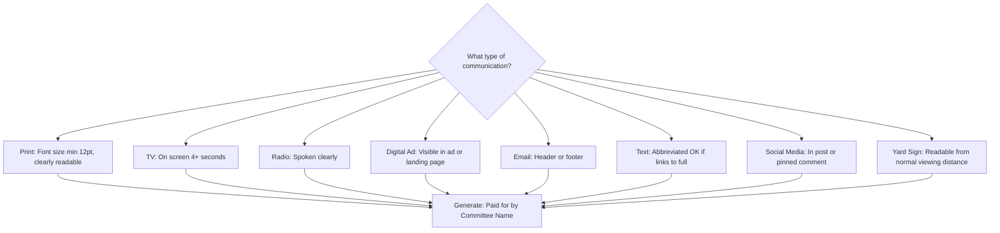

# Disclaimer Generator

Generate legally compliant "Paid for by" disclaimers for every communication medium. Federal law (52 USC 30120) and FEC regulations (11 CFR 110.11) require disclaimers on all public political communications. State laws add additional requirements.



---

## Core Disclaimer Components

Every disclaimer must include:

1. **Who paid for it:** "Paid for by [Committee Name]"
2. **Authorization status:** Whether a candidate authorized the communication
3. **Committee address or website** (varies by state)

### Standard Disclaimer Text

**For an authorized candidate committee:**
```
Paid for by [Committee Name].
```

**For an authorized committee with treasurer identification (some states):**
```
Paid for by [Committee Name], [Treasurer Name], Treasurer.
```

**For independent expenditures (NOT authorized by a candidate):**
```
Paid for by [Organization Name]. Not authorized by any candidate or candidate's committee.
```

**For PACs making independent expenditures:**
```
Paid for by [PAC Name] ([website or address]). Not authorized by any candidate or candidate's committee.
```

---

## Disclaimer by Medium

### Print Materials (Flyers, Brochures, Literature, Mailers)

**Federal requirements:**
- Disclaimer must be "clear and conspicuous"
- Font size: minimum 12-point type for printed materials
- Must be in a printed box set apart from the other text
- Must be of sufficient contrast to be clearly readable

**Template:**
```
┌─────────────────────────────────────────────────┐
│ Paid for by Friends of [Candidate Name].        │
│ [Address or Website]                             │
└─────────────────────────────────────────────────┘
```

**Placement:** Bottom of the piece, back of the mailer, or inside cover. Must be visible without opening an envelope (for mailers, place on the carrier or outer envelope).

**State variations:**
- California: Must include "Additional information is available at fppc.ca.gov" for slate mailers
- New York: Must include treasurer name and committee address
- Texas: "Political advertising paid for by [committee]" (specific phrasing required)
- Florida: "Political advertisement paid for and approved by [candidate name], [party], for [office]"

### Television Ads

**Federal requirements:**
- Disclaimer must appear on screen for at least 4 seconds
- Must be displayed in letters at least 4% of the vertical picture height
- Must have sufficient contrast with the background
- Candidate must provide a "stand by your ad" statement (BCRA requirement):
  - Visual: Candidate's image must appear for the full duration of the statement
  - Audio: Candidate must state: "I'm [name] and I approve this message"

**Template (candidate ad):**
```
[VISUAL — On screen for minimum 4 seconds:]
"Paid for by Friends of [Candidate Name]"

[AUDIO — Candidate voice and image:]
"I'm [Candidate Name] and I approve this message."
```

**Template (independent expenditure/PAC ad):**
```
[VISUAL — On screen for minimum 4 seconds:]
"Paid for by [Organization Name]"
"Not authorized by any candidate or candidate's committee"

[AUDIO:]
"Paid for by [Organization Name]. Not authorized by any candidate 
or candidate's committee."
```

**Production note:** Build the disclaimer into the lower-third graphic. Use white text on dark background or dark text on light background. Do not use colors that blend with the ad footage.

### Radio Ads

**Federal requirements:**
- Disclaimer must be spoken clearly at a normal pace
- Must be audible and intelligible
- Candidate "stand by your ad" statement required:
  - Candidate must personally speak: "I'm [name], candidate for [office], and I approve this message"

**Template (candidate ad — read by announcer at end):**
```
[CANDIDATE VOICE:]
"I'm [Candidate Name], candidate for [Office], and I approve this message."

[ANNOUNCER VOICE:]
"Paid for by Friends of [Candidate Name]."
```

**Template (independent expenditure):**
```
[ANNOUNCER VOICE:]
"Paid for by [Organization Name]. Not authorized by any candidate 
or candidate's committee."
```

**Production note:** The spoken disclaimer takes approximately 5-8 seconds. Budget this into a 30-second or 60-second spot. Record the candidate's approval statement in studio with clean audio.

### Digital Ads (Display, Banner, Pre-Roll Video, Streaming)

**Federal requirements:**
- Must be "clear and conspicuous" within the ad
- For small digital ads where a full disclaimer cannot fit, the FEC allows an "adapted disclaimer" that links to the full text
- Video ads follow the same rules as TV ads

**Full disclaimer (large format ads, landing pages):**
```
Paid for by Friends of [Candidate Name]. [website.com]
```

**Adapted disclaimer (small format — banner ads under 200x200 pixels):**
```
[Ad Text]
Paid for by Friends of [Candidate Name]
[Clear link/button to full disclaimer page]
```

**Pre-roll/streaming video ads:**
- Follow TV ad rules: 4 seconds on screen, candidate approval statement
- If 15-second spot, the disclaimer can be the final frame for 4 seconds

**Platform-specific requirements:**
- Google/YouTube: Requires "Paid for by" in ad itself AND in Google's political ad transparency tool
- Meta/Facebook/Instagram: Requires "Paid for by" disclaimer AND registration in Meta's Ad Library
- X/Twitter: "Paid for by" in ad text; political ad policies may vary

### Email Communications

**Federal requirements:**
- Disclaimer must appear in every campaign email
- Must be clearly visible (not hidden in tiny footer text)

**Template (place at bottom of every email):**
```
---
Paid for by Friends of [Candidate Name]
[Street Address], [City], [State] [ZIP]
[website.com]

[Unsubscribe link]
```

**Best practice:** Include the disclaimer after the email signature but before the unsubscribe link. Use at least 10-point font. Do not use light gray text on white background.

### Text Messages (SMS/MMS)

**Federal requirements:**
- FEC guidance treats texts as written communications requiring disclaimers
- For SMS (character-limited), an adapted disclaimer is acceptable

**Full text message with disclaimer:**
```
[Message content] Paid for by Friends of [Candidate Name]. 
Reply STOP to opt out.
```

**Adapted disclaimer (for very short texts):**
```
[Message content] Pd for by Friends of [Candidate]. 
[Link to full disclaimer] Reply STOP to quit.
```

**Peer-to-peer texting:** Every initial message must include the disclaimer. Follow-up replies in an active conversation thread may not need a repeated disclaimer, but best practice is to include it.

### Social Media Posts (Organic)

**Federal guidance:**
- The FEC has not issued definitive rules for organic social media posts
- Best practice: include "Paid for by" on any post from the official campaign account
- Required if the post is boosted or promoted (becomes a paid ad)

**Template (organic post from campaign account):**
```
[Post content]

Paid for by Friends of [Candidate Name].
```

**Template (social media profile/bio):**
```
Official campaign account for [Candidate Name], candidate for [Office].
Paid for by Friends of [Candidate Name]. [website.com]
```

### Yard Signs and Banners

**Federal requirements:**
- Yard signs, bumper stickers, buttons, and similar small items are exempt from the disclaimer requirement IF they cannot reasonably accommodate a disclaimer
- However, many states REQUIRE disclaimers on yard signs

**Template (when disclaimer is included):**
```
CANDIDATE NAME
for [OFFICE]
────────────────────
Paid for by Friends of [Candidate Name]
```

**Size guidance:**
- Standard yard sign (24"x18"): Disclaimer text at minimum 8-point font along the bottom
- Large signs (4'x8'): Full disclaimer in clearly readable type
- Bumper stickers: Exempt at federal level; check state law

**State requirements on signs:**
- Florida: REQUIRED on all political ads including signs — "Political advertisement paid for and approved by..."
- Texas: REQUIRED — "Political advertising paid for by [committee]"
- California: REQUIRED for committees; candidate's own signs may be exempt
- Many states: No requirement for small items like yard signs and buttons

### Direct Mail Pieces

**Federal requirements:**
- Full disclaimer required, clearly visible
- Must appear on the mailpiece itself (not just the envelope)

**Template (front or back of mailer):**
```
┌──────────────────────────────────────────────────────────┐
│ Paid for by Friends of [Candidate Name]                  │
│ 123 Campaign Trail, Springfield, IL 62701                │
│ www.candidatewebsite.com                                 │
└──────────────────────────────────────────────────────────┘
```

**Placement rules:**
- Must be on the piece itself, not only on the mailing envelope
- If the mailer has a front and back, place on the back
- If multi-page, place on the first or last page
- Must be readable without magnification

---

## State Variation Quick Reference

| State | Phrasing | Additional Requirements |
|---|---|---|
| Federal | "Paid for by [Committee]" | Stand-by-your-ad for broadcast |
| California | "Paid for by [Committee]" | FPPC ID number required |
| Florida | "Political advertisement paid for and approved by [Candidate], [Party], for [Office]" | Specific phrasing mandatory |
| New York | "Paid for by [Committee], [Treasurer], Treasurer" | Treasurer name + address |
| Texas | "Political advertising paid for by [Committee]" | "Political advertising" phrasing |
| Ohio | "Paid for by [Committee], [Treasurer], Treasurer" | Treasurer name required |
| Michigan | "Paid for by [Committee], [Address]" | Address required |
| Illinois | "Paid for by [Committee]" | Similar to federal |
| Pennsylvania | "Paid for by [Committee]" | Similar to federal |

---

## Disclaimer Checklist

Before publishing any campaign communication:

```
[ ] Disclaimer text is present and complete
[ ] Committee name exactly matches official registration
[ ] Authorization status is correct (authorized vs. independent)
[ ] Font size meets minimum requirements for this medium
[ ] Disclaimer is clearly readable (contrast, placement, duration)
[ ] State-specific requirements are met
[ ] For broadcast: candidate stand-by-your-ad statement is included
[ ] For digital: disclaimer appears in the ad AND platform transparency tools
[ ] For mail: disclaimer is on the mailpiece, not only the envelope
[ ] For small items: state law checked — exemption confirmed or disclaimer added
```
