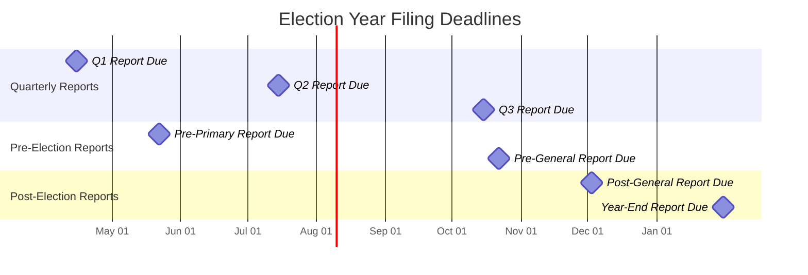

# Filing Deadline Calendar

Generate .ics calendar events for campaign finance filing deadlines. This tool provides templates for federal and state filing schedules, reminder sequences, and penalty information to ensure no deadline is missed.



---

## .ics Event Format

Each filing deadline generates a calendar event in iCalendar (.ics) format. This format is compatible with Google Calendar, Apple Calendar, Outlook, and all standard calendar applications.

### Single Event Template

```ics
BEGIN:VCALENDAR
VERSION:2.0
PRODID:-//Campaign Filing Deadlines//EN
CALSCALE:GREGORIAN
METHOD:PUBLISH
BEGIN:VEVENT
DTSTART;VALUE=DATE:20260415
DTEND;VALUE=DATE:20260416
SUMMARY:FEC Quarterly Report (Q1) DUE
DESCRIPTION:Report: Q1 Quarterly Report\n
 Coverage Period: 01/01/2026 - 03/31/2026\n
 Due Date: 04/15/2026\n
 Trigger: Quarterly filing schedule\n
 File With: FEC (electronically via FECFile or e-filing)\n
 Penalties: $55/day late (first $6,500); then escalating\n
 Notes: Must be RECEIVED by FEC by 11:59 PM ET on due date.
LOCATION:FEC Electronic Filing
STATUS:CONFIRMED
PRIORITY:1
BEGIN:VALARM
TRIGGER:-P30D
ACTION:DISPLAY
DESCRIPTION:REMINDER: Q1 FEC Report due in 30 days (04/15/2026)
END:VALARM
BEGIN:VALARM
TRIGGER:-P14D
ACTION:DISPLAY
DESCRIPTION:REMINDER: Q1 FEC Report due in 14 days (04/15/2026)
END:VALARM
BEGIN:VALARM
TRIGGER:-P7D
ACTION:DISPLAY
DESCRIPTION:REMINDER: Q1 FEC Report due in 7 days. Start finalizing.
END:VALARM
BEGIN:VALARM
TRIGGER:-P1D
ACTION:DISPLAY
DESCRIPTION:URGENT: Q1 FEC Report due TOMORROW (04/15/2026)
END:VALARM
END:VEVENT
END:VCALENDAR
```

### Event Fields Explained

| Field | Purpose | Example |
|---|---|---|
| `DTSTART` | Deadline date | 20260415 |
| `SUMMARY` | Short title for calendar display | FEC Quarterly Report (Q1) DUE |
| `DESCRIPTION` | All filing details in one block | Report name, coverage period, where to file, penalties |
| `LOCATION` | Filing destination | FEC Electronic Filing |
| `PRIORITY` | 1 = highest | Always 1 for filing deadlines |
| `VALARM` | Reminder alerts | 30, 14, 7, and 1 day before |

---

## Reminder Schedule

Every filing deadline should generate four reminders:

| Days Before | Purpose | Action Items |
|---|---|---|
| 30 days | Early warning | Begin gathering records; start bank reconciliation for the period |
| 14 days | Preparation | Complete data entry; reconcile bank statements; run preliminary totals |
| 7 days | Finalization | Generate draft report; treasurer review; resolve discrepancies |
| 1 day | Final check | Final review; submit electronically; confirm receipt/acceptance |

### Reminder Text Templates

**30-day reminder:**
```
FILING DEADLINE: [Report Name] due in 30 days ([Due Date]).
Coverage period: [Start Date] - [End Date].
ACTION: Begin reconciling bank records and entering all transactions 
for this period. Order any missing records now.
```

**14-day reminder:**
```
FILING DEADLINE: [Report Name] due in 14 days ([Due Date]).
ACTION: All transactions for the coverage period must be entered. 
Begin bank reconciliation. Verify all itemized donor information 
(name, address, occupation, employer) is complete.
```

**7-day reminder:**
```
FILING DEADLINE: [Report Name] due in 7 days ([Due Date]).
ACTION: Generate draft report. Treasurer must review all entries.
Verify cash-on-hand matches bank balance. Resolve any discrepancies.
Run the filing software validation checks.
```

**1-day reminder:**
```
URGENT — FILING DEADLINE: [Report Name] due TOMORROW ([Due Date]).
ACTION: Final review and submit. Federal e-filings must be RECEIVED
by 11:59 PM ET. Do not wait until the last hour — system traffic 
causes delays. Confirm the filing system accepted your submission.
```

---

## Federal Filing Schedule (FEC)

### Quarterly Filers (Most Candidate Committees)

| Report | Coverage Period | Due Date | Notes |
|---|---|---|---|
| Q1 (Year 1) | Jan 1 - Mar 31 | April 15 | First report of odd-numbered year |
| Q2 (Year 1) | Apr 1 - Jun 30 | July 15 | |
| Q3 (Year 1) | Jul 1 - Sep 30 | October 15 | |
| Year-End | Oct 1 - Dec 31 | January 31 (next year) | |
| Q1 (Year 2) | Jan 1 - Mar 31 | April 15 | Election year |
| Q2 (Year 2) | Apr 1 - Jun 30 | July 15 | |
| Pre-Primary | Depends on primary date | 12 days before primary | Coverage ends 20 days before primary |
| Pre-General | Depends on general date | 12 days before general (Oct 22, 2026) | Coverage ends 20 days before general |
| Post-General | Day after pre-general close through Nov 23 | December 3 | 30 days after general election |
| Year-End | Nov 24 - Dec 31 | January 31 (next year) | |

### Pre-Election Report Trigger Rules

```
Pre-election reports are TRIGGERED when:
  1. Your committee is on the ballot for that election, OR
  2. Your committee has made expenditures related to that election

Timing:
  - Due: 12 days before the election
  - Coverage period ends: 20 days before the election
  - Late contributions ($1,000+) received after coverage period closes 
    must be reported within 48 hours

Example for November 3, 2026 general election:
  - Coverage period ends: October 14, 2026
  - Report due: October 22, 2026
  - 48-hour reports: October 15 through November 2
```

### 48-Hour and 24-Hour Notices

```
48-HOUR CONTRIBUTION NOTICES (FEC):
  Trigger: Any contribution of $1,000+ received during the 
           pre-election period (after quarterly/pre-election close)
  Due: Within 48 hours of receipt
  File: FEC Form 6 / Schedule A-48

24-HOUR INDEPENDENT EXPENDITURE NOTICES (FEC):
  Trigger: Any independent expenditure of $1,000+ made within 
           20 days of an election
  Due: Within 24 hours
  File: FEC Form 5 / Schedule E-24

Calendar treatment: Create a standing daily reminder during the 
pre-election window: "CHECK: Any $1,000+ contributions or IE 
expenditures today? File 48-hour/24-hour notice if yes."
```

---

## State Filing Schedule Templates

State deadlines vary enormously. Use this template structure and fill in your state's specific dates.

### State Filing Event Template

```ics
BEGIN:VEVENT
DTSTART;VALUE=DATE:[DUE_DATE_YYYYMMDD]
DTEND;VALUE=DATE:[DUE_DATE_PLUS_ONE]
SUMMARY:[STATE] [Report Name] DUE
DESCRIPTION:Report: [Report Name]\n
 Coverage Period: [Start] - [End]\n
 Due Date: [Due Date]\n
 Trigger: [What triggers this filing]\n
 File With: [State agency name and method]\n
 Penalties: [Late filing penalties]\n
 Notes: [State-specific notes]
LOCATION:[State Filing Portal URL]
PRIORITY:1
BEGIN:VALARM
TRIGGER:-P30D
ACTION:DISPLAY
DESCRIPTION:30-day reminder: [STATE] [Report Name] due [Due Date]
END:VALARM
BEGIN:VALARM
TRIGGER:-P14D
ACTION:DISPLAY
DESCRIPTION:14-day reminder: [STATE] [Report Name] due [Due Date]
END:VALARM
BEGIN:VALARM
TRIGGER:-P7D
ACTION:DISPLAY
DESCRIPTION:7-day reminder: [STATE] [Report Name] due [Due Date]
END:VALARM
BEGIN:VALARM
TRIGGER:-P1D
ACTION:DISPLAY
DESCRIPTION:URGENT: [STATE] [Report Name] due TOMORROW
END:VALARM
END:VEVENT
```

### Common State Filing Patterns

**Pattern A — Semi-Annual + Pre-Election (e.g., California, New York):**

| Report | Typical Due Date |
|---|---|
| Semi-Annual #1 | July 31 |
| Pre-Primary | ~12-15 days before primary |
| Pre-General | ~12-15 days before general |
| Semi-Annual #2 / Year-End | January 31 |

**Pattern B — Quarterly (e.g., Illinois, Ohio):**

| Report | Typical Due Date |
|---|---|
| Q1 | April 15 |
| Q2 | July 15 |
| Q3 | October 15 |
| Q4 / Year-End | January 15 or 31 |
| Pre-Election | 10-15 days before each election |

**Pattern C — Monthly (e.g., some local jurisdictions):**

| Report | Due Date |
|---|---|
| Monthly report | 10th or 15th of following month |
| Pre-Election | 7-15 days before election |

---

## Penalty Reference

### Federal (FEC) Late Filing Penalties

```
Administrative fine schedule (approximate):
  - Reports filed 1-4 days late:  $55/day
  - Reports filed 5-9 days late:  Increasing per-day fines
  - Reports filed 10+ days late:  Substantial penalties
  - Reports not filed:            Up to $71,500+ or referral to DOJ

The FEC calculates fines based on:
  1. How late the report was filed
  2. How much financial activity was on the report
  3. Prior history of late filing
  4. Whether it is an election-sensitive report (pre-election reports 
     carry higher penalties)

Late e-filing: The FEC timestamps electronically. A report submitted 
at 12:01 AM ET the day after the deadline is late.
```

### State Penalty Examples

| State | Penalty Structure |
|---|---|
| California | $10/day up to 100% of unreported amount |
| New York | $100-$1,000 per late report; repeat offenders face higher fines |
| Texas | $500/day for late reports; up to $10,000 for knowing violations |
| Florida | $50/day for first 3 days; $500/day thereafter |
| Illinois | $50-$150/day depending on amount of activity |

---

## Calendar Generation Checklist

When setting up a campaign's filing calendar:

```
1. IDENTIFY all jurisdictions where filings are required
   [ ] Federal (FEC) — if running for federal office
   [ ] State — check state election commission requirements
   [ ] County/City — check local filing requirements
   [ ] Party committees — if required by state/national party

2. OBTAIN the official filing schedule for each jurisdiction
   [ ] Download from election commission website
   [ ] Confirm dates for the current election cycle
   [ ] Note any special elections or runoff dates that trigger extra filings

3. CREATE calendar events for every deadline
   [ ] All regular periodic reports (quarterly, semi-annual, monthly)
   [ ] All pre-election reports (primary, general, runoff, special)
   [ ] 48-hour/24-hour notice windows (create daily reminder blocks)
   [ ] Post-election reports
   [ ] Year-end/annual reports
   [ ] Termination report (if applicable)

4. SET reminders at 30/14/7/1 days for each deadline

5. ADD action items to each reminder
   [ ] 30-day: Begin data gathering and reconciliation
   [ ] 14-day: Complete data entry; verify itemized records
   [ ] 7-day: Draft report; treasurer review
   [ ] 1-day: Final check and submit

6. SHARE calendar with
   [ ] Candidate
   [ ] Treasurer
   [ ] Campaign manager
   [ ] Compliance consultant/attorney
   [ ] Bookkeeper/data entry staff
```

---

## Best Practices

1. **File early.** Do not wait until the deadline. Filing 2-3 days early allows time to correct errors flagged by the system.

2. **Confirm acceptance.** After electronic filing, verify the filing system accepted your report. Print or save the confirmation receipt.

3. **Track amendments separately.** If you amend a previously filed report, create a separate calendar event for the amendment with notes on what changed and why.

4. **Account for weekends.** Federal rule: if a deadline falls on a Saturday, Sunday, or federal holiday, the due date moves to the next business day. State rules vary.

5. **Pre-election windows are critical.** Late pre-election reports carry the steepest penalties because they deprive voters of information before they vote.

6. **Keep a master deadline spreadsheet** in addition to the calendar, so all deadlines are visible in one view.
