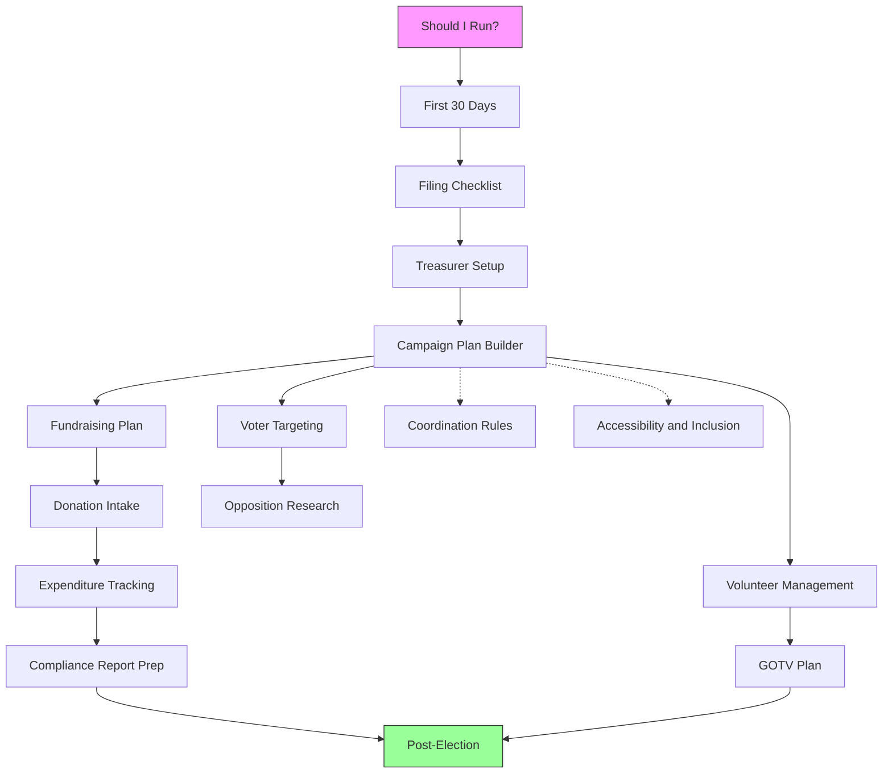

# Workflows

Step-by-step operational guides for every phase of a campaign. Each workflow walks you through a process from start to finish.

## Files

- [accessibility-inclusion.md](accessibility-inclusion.md) -- Making your campaign accessible to voters with disabilities, non-English speakers, and underserved communities
- [campaign-plan-builder.md](campaign-plan-builder.md) -- Comprehensive template for building your full campaign plan
- [compliance-report-prep.md](compliance-report-prep.md) -- Pre-filing checklist for preparing and submitting campaign finance reports
- [coordination-rules.md](coordination-rules.md) -- Understanding when outside-group activity crosses into illegal coordination
- [donation-intake.md](donation-intake.md) -- Step-by-step process for receiving and recording every contribution
- [expenditure-tracking.md](expenditure-tracking.md) -- Tracking, categorizing, and documenting every dollar spent
- [filing-checklist.md](filing-checklist.md) -- Universal checklist for filing candidacy and establishing your campaign entity
- [first-30-days.md](first-30-days.md) -- Day-by-day action plan for the first 30 days after deciding to run
- [fundraising-plan.md](fundraising-plan.md) -- Strategic framework for goal-setting, call time, events, and donor cultivation
- [gotv-plan.md](gotv-plan.md) -- Operational guide for Get Out The Vote in the final days before election
- [opposition-research.md](opposition-research.md) -- Conducting ethical, legal opposition research on opponents and yourself
- [post-election.md](post-election.md) -- What to do after the polls close: win, lose, or recount
- [should-i-run.md](should-i-run.md) -- Structured decision framework for evaluating whether to run for office
- [treasurer-setup.md](treasurer-setup.md) -- Everything your treasurer needs to set up systems, stay compliant, and avoid mistakes
- [volunteer-management.md](volunteer-management.md) -- Recruiting, training, deploying, and retaining campaign volunteers
- [voter-targeting.md](voter-targeting.md) -- Identifying, segmenting, and prioritizing the voters you need to reach
