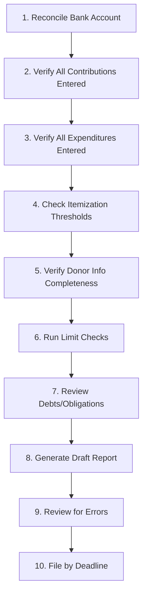

# Compliance Report Preparation

A pre-filing checklist for preparing and filing campaign finance reports. This workflow ensures your reports are accurate, complete, and filed on time. Treat every report filing as a project with a defined timeline, starting at least two weeks before the due date.

---

> **EDUCATIONAL DISCLAIMER:** Campaign finance reporting requirements -- including filing schedules, itemization thresholds, required data fields, and electronic filing rules -- vary significantly by jurisdiction. Federal campaigns file with the FEC; state and local campaigns file with their respective regulatory bodies. Verify all requirements for your specific race. Consider having a campaign finance attorney review your first report. This guide is for educational purposes and does not constitute legal advice.

---

## Process Overview

---

## Report Preparation Timeline

| Days Before Deadline | Task |
|---|---|
| 14 days | Begin reconciliation; request missing donor info |
| 10 days | Complete bank reconciliation; review all contributions |
| 7 days | Review all expenditures; verify categorization |
| 5 days | Draft the report; run checks |
| 3 days | Full review by treasurer and one additional reviewer |
| 1 day | Final corrections; prepare for filing |
| Deadline | File the report; retain confirmation |

---

## Step 1: Reconcile Bank Statement

The bank statement is your ground truth. Everything starts here.

- [ ] Obtain the bank statement for the reporting period
- [ ] Compare every deposit on the statement to contributions in your records
- [ ] Compare every withdrawal/debit on the statement to expenditures in your records
- [ ] Identify and resolve any discrepancies (missing entries, incorrect amounts, timing differences)
- [ ] Verify the opening balance matches the closing balance from the prior report
- [ ] Verify the closing balance matches the bank statement ending balance
- [ ] Account for any outstanding checks (issued but not yet cashed)
- [ ] Account for any deposits in transit
- [ ] Document the reconciliation (a signed reconciliation sheet is best practice)

---

## Step 2: Verify Contributions

### Completeness Check

- [ ] Confirm every contribution received during the period is recorded
- [ ] Cross-reference online payment platform reports with your internal records
- [ ] Cross-reference event attendance lists with contribution records (did everyone who paid get recorded?)
- [ ] Verify the total contributions recorded match the total deposits on the bank statement

### Donor Information Completeness

- [ ] Review all contributions for required donor information (name, address, employer, occupation)
- [ ] Identify any contributions above the itemization threshold that are missing required data
- [ ] Send "best efforts" requests for missing information (letter, email, or phone call)
- [ ] Document all attempts to obtain missing information (date, method, response)
- [ ] For donor information that cannot be obtained despite best efforts, note it in your records

### Itemization

- [ ] Identify all contributors whose aggregate contributions exceed the itemization threshold for the reporting period
- [ ] Federal threshold: $200 aggregate per cycle; state/local thresholds vary
- [ ] Prepare itemized entries for each contributor above the threshold
- [ ] Verify that itemized entries include all required fields
- [ ] Calculate aggregate totals for non-itemized contributions

---

## Step 3: Verify Expenditures

### Completeness Check

- [ ] Confirm every expenditure during the period is recorded
- [ ] Cross-reference credit card statements with expenditure records
- [ ] Verify the total expenditures recorded match total debits on the bank statement
- [ ] Confirm receipts are on file for all expenditures

### Categorization Review

- [ ] Review the purpose/description field for each expenditure (it must be specific enough for public understanding)
- [ ] Bad example: "Services" or "Supplies"
- [ ] Good example: "500 campaign door hangers" or "Digital advertising -- Facebook ads, March 2026"
- [ ] Verify expenditure categories match your budget categories and reporting requirements
- [ ] Identify any expenditures that could be questioned as personal use and ensure they have thorough documentation

### Vendor Information

- [ ] Verify payee names and addresses are complete for all itemized expenditures
- [ ] Confirm the itemization threshold for expenditures in your jurisdiction
- [ ] Prepare itemized entries for each payee above the threshold

---

## Step 4: Check Contribution Limits

- [ ] Run a cumulative contribution report by donor for the election cycle
- [ ] Flag any donors who have reached or exceeded the contribution limit
- [ ] If any over-limit contributions are identified, verify they have been refunded or redesignated
- [ ] Document any refunds issued for over-limit contributions
- [ ] For donors approaching the limit, flag them to prevent future over-limit acceptance

---

## Step 5: Review Debts and Obligations

- [ ] List all outstanding debts owed BY the committee (unpaid invoices, loans, credit card balances)
- [ ] List all debts owed TO the committee (loans made, pledges receivable -- if reportable)
- [ ] For loans, record: lender, date, amount, terms, interest rate, repayment schedule
- [ ] Include candidate loans to the campaign
- [ ] Report all debts on the filing even if you plan to pay them before the next report

---

## Step 6: In-Kind Contributions

- [ ] Review all in-kind contributions received during the period
- [ ] Verify fair market value is documented for each
- [ ] Confirm each in-kind contribution is recorded as both a contribution and an expenditure
- [ ] Include in-kind contributions in your contribution totals

---

## Step 7: Draft the Report

- [ ] Use the form or electronic filing system required by your regulatory body
- [ ] Enter summary totals: total receipts, total disbursements, cash on hand, debts
- [ ] Enter itemized contributions
- [ ] Enter itemized expenditures
- [ ] Enter unitemized totals
- [ ] Enter debt schedules
- [ ] Verify all required schedules are included
- [ ] Verify mathematical accuracy (totals, running balances, cash on hand calculation)
- [ ] Cash on hand formula: Prior cash on hand + total receipts - total disbursements = ending cash on hand

---

## Step 8: Review the Draft

Two people should review every report. The treasurer reviews first; then one additional reviewer (campaign manager, attorney, or bookkeeper).

### Treasurer Review

- [ ] Verify all totals are mathematically correct
- [ ] Spot-check 10-20 individual entries against source documents
- [ ] Review the report for completeness (no blank required fields)
- [ ] Confirm the cash on hand figure matches the bank reconciliation
- [ ] Look for obvious errors: wrong dates, wrong amounts, misspelled names

### Second Reviewer

- [ ] Independent review of summary totals
- [ ] Check for entries that look unusual or could attract scrutiny
- [ ] Verify the report is internally consistent
- [ ] Confirm all required schedules and attachments are included

---

## Step 9: File the Report

- [ ] File electronically if required or available (faster, reduces errors)
- [ ] If filing on paper, make a complete copy before submitting
- [ ] File before the deadline (not on the deadline -- give yourself a buffer)
- [ ] Obtain and retain the confirmation of filing (receipt, confirmation number, email)
- [ ] If the filing system generates a PDF of the filed report, download and save it
- [ ] The filed report is a public document -- review it as if a reporter will read it tomorrow, because they might

---

## Step 10: Post-Filing Tasks

- [ ] Archive all supporting documents for the reporting period
- [ ] Note any corrections needed for the next report (amended entries, late-arriving information)
- [ ] Update your filing calendar -- mark this report as complete and review the next deadline
- [ ] Brief the candidate and campaign manager on the filed report's key numbers
- [ ] Prepare talking points in case media inquires about the report
- [ ] If errors are discovered after filing, file an amendment promptly

---

## Common Errors to Avoid

1. **Mathematical errors.** Double-check every total. Use formulas in your spreadsheet or software.
2. **Missing itemized entries.** If a donor crosses the threshold mid-period, all prior contributions must be itemized retroactively.
3. **Vague purpose descriptions.** "Consulting" is not enough. "Campaign strategy consulting, March 2026" is better.
4. **Wrong reporting period dates.** Ensure you are reporting for the correct date range.
5. **Forgetting debts.** Unpaid bills, loans, and credit card balances are all reportable debts.
6. **Mismatched cash on hand.** If your ending cash on hand does not match your bank balance (adjusted for outstanding items), something is wrong.
7. **Late filing.** Penalties, public embarrassment, and potential legal consequences. There is no excuse.

Every report you file is a public commitment to transparency. Accuracy and timeliness are non-negotiable.
