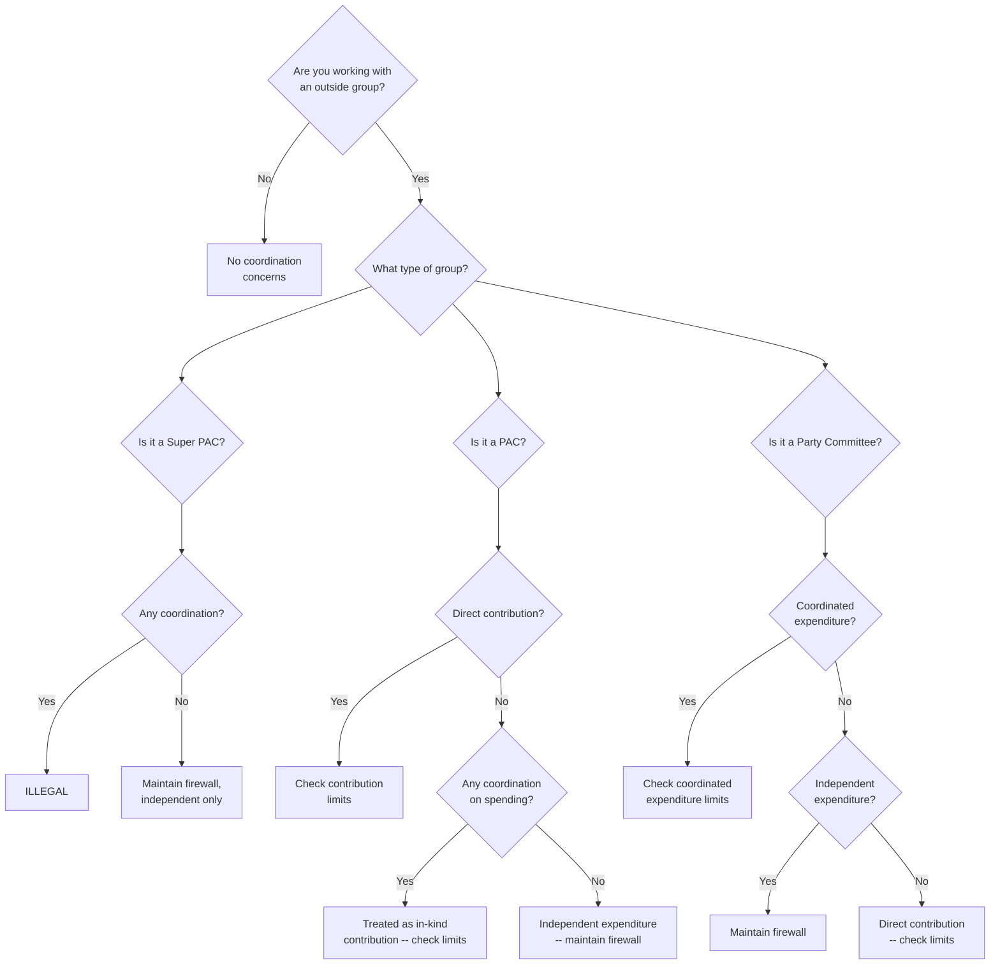

# Coordination Rules

A guide to understanding coordination rules in U.S. campaign finance law. Coordination rules determine when communication or activity between a campaign and outside groups constitutes an illegal in-kind contribution. Violating coordination rules can result in fines, criminal penalties, and campaign-ending scandals.

---

> **EDUCATIONAL DISCLAIMER:** Coordination rules are among the most complex areas of campaign finance law. Federal rules are established by the FEC and interpreted by federal courts. State and local rules vary widely and may be more or less restrictive than federal law. The information below provides a general educational overview of federal coordination principles. It is NOT a substitute for legal advice. Any campaign that interacts with outside groups -- PACs, Super PACs, 501(c)(4) organizations, or party committees -- should consult a campaign finance attorney. This guide is for educational purposes and does not constitute legal advice.

---

## Decision Tree: Working with Outside Groups

---

## What Is Coordination?

Coordination occurs when an outside group (PAC, Super PAC, 501(c)(4), or individual) creates, produces, or distributes a communication or engages in activity that is done in cooperation with, at the request or suggestion of, or with the material involvement of a candidate or campaign.

**Why it matters:** If an expenditure is "coordinated" with a campaign, it is treated as an in-kind contribution to that campaign. That means it counts against contribution limits, must be reported, and -- in the case of groups that cannot legally contribute (like Super PACs or corporations in some jurisdictions) -- it is illegal.

---

## Federal Coordination Standards

Under FEC rules, a communication is coordinated if it meets a three-part test:

### 1. Payment (Source of Funds)
The communication is paid for by someone other than the candidate or the candidate's campaign.

### 2. Content Standard
The communication meets one of these content criteria:
- It is an electioneering communication (broadcast ad mentioning a candidate within 30 days of a primary or 60 days of a general election)
- It expressly advocates the election or defeat of a clearly identified candidate
- It is a public communication that republishes or disseminates campaign materials
- The communication refers to a candidate, a political party, or an election in certain contexts

### 3. Conduct Standard
The communication is created with one of these forms of conduct:
- **Request or suggestion:** The campaign requested or suggested the communication
- **Material involvement:** The campaign was materially involved in decisions about content, timing, location, audience, or distribution
- **Substantial discussion:** The communication was made after substantial discussion between the spender and the campaign
- **Common vendor:** A common vendor used non-public campaign information to create the communication
- **Former employee/contractor:** A former campaign employee or contractor used non-public information to create the communication within a certain window (typically 120 days)

All three prongs (payment, content, and conduct) must be met for coordination to exist.

---

## What Constitutes Coordination: Practical Examples

### Clearly Coordinated (Likely Illegal)
- A Super PAC asks the campaign what message to use in their ads, and the campaign tells them
- A campaign shares its internal polling data with an outside group that then uses it to target ads
- A campaign consultant simultaneously advises both the campaign and an "independent" group on the same race
- A candidate tells a wealthy supporter "I sure wish someone would run ads about [specific topic] in [specific market]"

### Clearly NOT Coordinated (Independent)
- A Super PAC creates and airs ads based solely on publicly available information, with no contact with the campaign about the ads
- An individual spends their own money on a yard sign without any campaign involvement
- A party committee makes an independent expenditure based on its own research, with a firewall separating the IE team from the party's coordinated team

### Gray Areas (Consult an Attorney)
- Social media interactions between campaign staff and outside group staff
- Attending the same public events or conferences
- Using publicly available campaign messaging as inspiration for outside group ads
- Shared fundraising consultants who work for both the campaign and a PAC (even on different races)

---

## Safe Harbors

The FEC recognizes several safe harbors -- activities that are NOT considered coordination:

- [ ] **Publicly available information:** Using information that is publicly available (public statements, public campaign plans, FEC filings) to inform independent spending
- [ ] **Endorsements:** A candidate endorsing another candidate or responding to questions about their campaign is generally not coordination with an IE group
- [ ] **Issue advocacy:** Genuine issue advocacy that does not expressly advocate for or against a candidate (though this line is blurry)
- [ ] **Vendor firewalls:** Using the same vendor as a campaign is permitted if the vendor maintains an adequate firewall (see below)

---

## Firewalls

A firewall is an internal policy within a consulting firm, party committee, or organization that prevents the flow of non-public campaign information to people working on independent expenditures.

### Firewall Requirements
- [ ] Written firewall policy that clearly separates personnel working on coordinated vs. independent activities
- [ ] Physical and digital separation of files, data, and communications
- [ ] No sharing of non-public strategic information (internal polling, targeting data, media plans, ad scripts, campaign strategy memos)
- [ ] Training for all staff on the firewall policy
- [ ] Enforcement mechanisms (consequences for violating the firewall)
- [ ] Documentation that the firewall is in place and being followed

### Common Firewall Situations
- **Party committees:** The DCCC, NRCC, and state parties often run both coordinated and independent expenditure programs. They must maintain firewalls between these operations.
- **Consulting firms:** A firm that advises a campaign AND a Super PAC on the same race faces extreme coordination risk. Firewalls may be insufficient; separate firms are safer.
- **Shared office space:** If a campaign and an outside group share office space, robust separation is essential (separate rooms, separate networks, no casual conversations about strategy).

---

## Super PACs and Independence

Super PACs (independent expenditure-only committees) can raise and spend unlimited amounts, but they MUST operate independently of candidates and campaigns.

### What Super PACs Can Do
- Raise unlimited contributions from individuals, corporations, unions, and other PACs
- Spend unlimited amounts on independent expenditures (ads, mail, etc.)
- Use publicly available information to inform their spending decisions
- Communicate with the public about candidates and elections

### What Super PACs Cannot Do
- Coordinate their spending with a candidate or campaign (as defined above)
- Contribute directly to a candidate or campaign
- Share non-public strategic information with a candidate or campaign

### Candidate Involvement with Super PACs
- A candidate can ask people to contribute to a Super PAC (with some restrictions on the ask amount)
- A candidate CANNOT direct or control how the Super PAC spends its money
- A candidate's former staff can work for a Super PAC, but must observe cooling-off periods and cannot use non-public campaign information

---

## 501(c)(4) Organizations

501(c)(4) social welfare organizations can engage in political activity, but it cannot be their primary purpose.

- [ ] 501(c)(4)s are not required to disclose their donors publicly (sometimes called "dark money")
- [ ] They can run issue ads and, to a limited extent, expressly advocate for candidates
- [ ] They are subject to the same coordination rules as other outside groups
- [ ] A campaign cannot set up a 501(c)(4) as a vehicle to evade contribution limits
- [ ] Coordination between a campaign and a 501(c)(4) can result in the spending being treated as an in-kind contribution -- which is illegal if the 501(c)(4) is funded by prohibited sources

---

## Party Coordinated Expenditures

Political parties have a special category of spending called "coordinated expenditures" that other outside groups do not have.

- [ ] Federal law allows party committees to make limited coordinated expenditures on behalf of their nominees
- [ ] Coordinated expenditure limits are set by the FEC and adjusted for inflation each cycle
- [ ] These expenditures are made in cooperation with the campaign (unlike independent expenditures)
- [ ] Common uses: direct mail, polling, media production
- [ ] The party and the campaign can discuss strategy, content, and targeting for coordinated expenditures
- [ ] Coordinated expenditures are separate from and in addition to direct contributions from the party to the campaign

---

## Practical Guidelines for Campaigns

### Do
- [ ] Consult a campaign finance attorney before any interaction with outside groups
- [ ] Treat all non-public campaign information as confidential
- [ ] Train all staff on coordination rules (what they can and cannot say to outside groups)
- [ ] If an outside group contacts you, do not discuss strategy, messaging, timing, or targeting
- [ ] Document any contacts with outside groups (date, who, what was discussed)
- [ ] Make your campaign's public messaging, schedule, and positions clearly available online

### Do Not
- [ ] Share internal polling, targeting data, or strategic memos with outside groups
- [ ] Suggest to anyone what an outside group should say, when, or where
- [ ] Use back channels, intermediaries, or winks and nods to signal to outside groups
- [ ] Allow campaign staff to simultaneously work for a Super PAC on your race
- [ ] Assume that informal conversations are not covered by coordination rules

---

## When in Doubt

If you are unsure whether an activity constitutes coordination, assume it does and stop. Consult a campaign finance attorney before proceeding. The penalties for coordination violations can include:

- The coordinated expenditure being treated as an excessive or prohibited in-kind contribution
- Fines from the FEC or state regulatory body
- Criminal prosecution in egregious cases
- Devastating media coverage and loss of public trust

Coordination rules exist to maintain the integrity of contribution limits. Respecting them is both a legal obligation and an ethical one.
