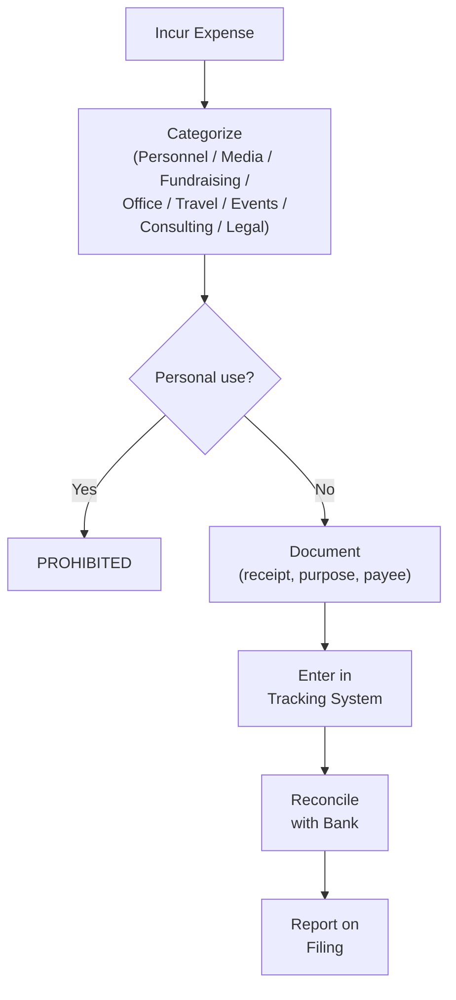

# Expenditure Tracking

A comprehensive guide to tracking, categorizing, and documenting every dollar your campaign spends. Proper expenditure tracking is not optional -- it is a legal requirement that protects the candidate, the treasurer, and the campaign from compliance violations and public embarrassment.

---

> **EDUCATIONAL DISCLAIMER:** Expenditure reporting requirements, categories, and restrictions vary by jurisdiction. Federal campaigns follow FEC rules; state and local campaigns follow their respective regulatory bodies. The guidance below reflects general best practices. Verify the specific requirements for your race and consult a campaign finance attorney if needed. This guide is for educational purposes and does not constitute legal advice.

---

## Expenditure Recording Requirements

For every campaign expenditure, record:

| Field | Description | Example |
|---|---|---|
| Date | Date the expense was incurred or paid | 03/15/2026 |
| Payee | Full legal name of the person or business paid | Main Street Print Co. |
| Payee address | Mailing address of the payee | 123 Main St, Springfield, IL 62701 |
| Amount | Exact dollar amount | $1,250.00 |
| Purpose | Clear, specific description of what was purchased | 5,000 campaign door hangers |
| Category | Budget category for internal tracking | Printing / Literature |
| Payment method | Check, debit, credit card, cash, wire | Check #1042 |
| Invoice / receipt | Reference number or file location | Filed: 2026-03-15-MainStPrint.pdf |

- [ ] Record every expenditure within 24 hours of the transaction
- [ ] Retain the original receipt or invoice for every expenditure
- [ ] Never make an expenditure without a clear campaign purpose

---

## Expenditure Categories

Use consistent categories to track spending against your budget. Common categories:

### Staff and Consultants
- Staff salaries and wages
- Payroll taxes and benefits
- Consultant fees (campaign manager, media, fundraising, polling, legal)
- Independent contractor payments

### Paid Media
- Television advertising (production and airtime)
- Radio advertising (production and airtime)
- Digital advertising (social media, search, display, streaming)
- Newspaper and print advertising

### Direct Mail
- Design and printing
- Postage and mailing house fees
- List acquisition or rental

### Field Operations
- Canvassing materials (walk cards, door hangers, clipboards)
- Phone banking costs (auto-dialer, phone service)
- Volunteer supplies (water, snacks, t-shirts)
- Staging locations for canvass launches

### Campaign Literature and Signs
- Yard signs and stakes
- Bumper stickers
- Business cards and palm cards
- Banners and posters

### Events
- Venue rental
- Catering and refreshments
- Event supplies and decorations
- Entertainment or speaker fees

### Fundraising Costs
- Online platform fees (processing fees on donations)
- Event costs attributable to fundraising
- Printing and mailing of solicitations
- Donor management software

### Office and Operations
- Office rent and utilities
- Office supplies and equipment
- Phone and internet service
- Software and technology subscriptions
- Insurance

### Travel
- Candidate travel (mileage, fuel, parking, tolls)
- Staff travel
- Lodging for campaign travel
- Meals during campaign travel (document the campaign purpose)

### Legal and Accounting
- Attorney fees
- Accountant or bookkeeper fees
- Filing fees

---

## Personal Use Prohibition

This is one of the most important rules in campaign finance law. Campaign funds may NOT be used for personal expenses.

### The Test

> "Would this expense exist irrespective of the campaign?" If the answer is yes, it is a personal use expense and cannot be paid with campaign funds.

### Clearly Prohibited

- [ ] Mortgage, rent, or utilities for the candidate's personal residence
- [ ] Personal clothing (suits, shoes, everyday wear)
- [ ] Gym memberships or personal health expenses
- [ ] Personal vehicle purchase or lease payments
- [ ] Household groceries or personal meals (not campaign-related)
- [ ] Tuition or student loan payments
- [ ] Country club or social club dues (unless directly campaign-related)
- [ ] Family vacations or personal travel
- [ ] Gifts to family members

### Clearly Permitted

- [ ] Yard signs and campaign literature
- [ ] Advertising and media buys
- [ ] Staff salaries for campaign work
- [ ] Office rent for campaign headquarters
- [ ] Travel for campaign events
- [ ] Meals at campaign meetings or events with a documented campaign purpose

### Gray Areas (Use Caution)

- [ ] Meals: permitted when directly campaign-related (meeting with donors, staff working sessions); prohibited when personal
- [ ] Travel: permitted when for campaign events; prohibited when personal. Mixed-purpose trips should be carefully documented with campaign costs separated
- [ ] Childcare: some jurisdictions now permit campaign funds for childcare during campaign activities; check your rules
- [ ] Cell phone: if used for both personal and campaign purposes, only the campaign portion is a legitimate expense

**When in doubt, do not use campaign funds.** Pay personally and avoid the issue entirely.

---

## Documentation Best Practices

### Receipts and Invoices

- [ ] Collect a receipt for every expenditure, no matter how small
- [ ] For expenses without a receipt (rare), create a contemporaneous written record
- [ ] Scan or photograph receipts and store digitally (paper receipts fade)
- [ ] Organize receipts by month and category
- [ ] For credit card purchases, retain both the credit card statement AND the individual receipt

### Vendor Management

- [ ] Obtain W-9 forms from vendors and contractors before the first payment
- [ ] Issue 1099 forms to vendors paid $600+ in a calendar year (if required)
- [ ] Keep a vendor file with: W-9, contract or agreement, invoices, payment records
- [ ] Verify that vendors are legitimate businesses (not fronts for prohibited contributions)
- [ ] Pay vendors by check or electronic transfer for a clear paper trail

### Contracts and Agreements

- [ ] Put all consultant and vendor agreements in writing
- [ ] Specify the scope of work, payment terms, and deliverables
- [ ] Include a termination clause
- [ ] Keep signed copies of all agreements on file

---

## Petty Cash

Petty cash creates compliance risk. Minimize its use.

- [ ] Check if your jurisdiction allows petty cash disbursements
- [ ] If used, set a low maximum amount (e.g., $100 total fund)
- [ ] Withdraw petty cash by check from the campaign account (creates a paper trail)
- [ ] Require a receipt for every petty cash expenditure
- [ ] Maintain a petty cash log: date, amount, purpose, receipt reference
- [ ] Reconcile petty cash at least weekly
- [ ] Replenish by check only, with the total matching receipts collected

---

## Credit and Debit Cards

- [ ] If using a campaign credit or debit card, issue it in the committee's name
- [ ] Limit the number of cardholders (treasurer and campaign manager at most)
- [ ] Require a receipt for every card transaction
- [ ] Review statements monthly and reconcile with recorded expenditures
- [ ] Pay credit card balances in full from the campaign account each month
- [ ] A credit card balance carried month-to-month is a debt and must be reported

---

## In-Kind Expenditure Reporting

When someone donates goods or services to the campaign, it must be reported as both a contribution received and an expenditure made.

- [ ] Determine the fair market value (FMV) of the donated goods or services
- [ ] Record the in-kind contribution (see `donation-intake.md`)
- [ ] Record a corresponding in-kind expenditure for the same FMV
- [ ] The expenditure category should match what was donated (e.g., donated printing = Printing category)
- [ ] Common in-kind items: event space, food/beverages, printing, professional services

---

## Weekly Expenditure Review

- [ ] Enter all expenditures from the past week into the tracking system
- [ ] Verify all receipts are collected and filed
- [ ] Compare spending to budget by category
- [ ] Flag any unusual or undocumented expenses
- [ ] Update cash flow projection based on actual spending

## Monthly Reconciliation

- [ ] Reconcile all recorded expenditures against the bank statement
- [ ] Identify any discrepancies and resolve them
- [ ] Review spending by category against the budget
- [ ] Prepare a spending summary for the campaign manager and candidate
- [ ] File all monthly records in the archive

---

## Red Flags

- An expenditure without a receipt or documentation
- A payment to a vendor with no written agreement
- An expense that could be construed as personal use
- Cash payments with no receipt (especially amounts over $50)
- A vendor that cannot provide a W-9 or legitimate business address
- Spending that significantly exceeds budget in any category without authorization
- Payments to the candidate or the candidate's family members (permissible in some jurisdictions for specific purposes, but always scrutinized -- document carefully)

Track every dollar. Document every purchase. When the next campaign finance report is due (see `compliance-report-prep.md`), you will be grateful for the discipline.
