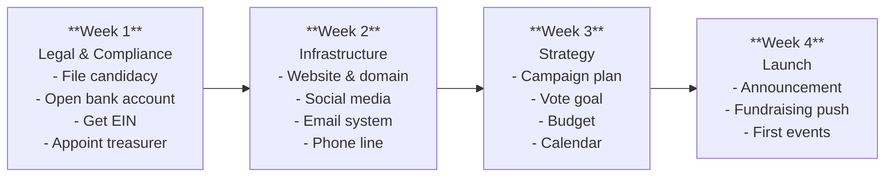

# First 30 Days Action Plan

A day-by-day action plan for the first 30 days after deciding to run for office. This guide assumes you have already made the decision to run (see `should-i-run.md`) and are ready to begin building your campaign.

---

## Week 1: Legal and Compliance Foundation (Days 1-7)

The first week is about establishing your campaign as a legal entity. Nothing else should happen publicly until these steps are complete.

> **EDUCATIONAL DISCLAIMER:** Campaign filing requirements, contribution limits, and reporting obligations vary significantly by jurisdiction (federal, state, county, municipal). The steps below are general best practices. Always verify the specific requirements for your race with your local elections office, secretary of state, or the Federal Election Commission (FEC). Consider consulting a campaign finance attorney before filing. This guide is for educational purposes and does not constitute legal advice.

### Day 1: Research Filing Requirements
- [ ] Identify the office you are running for and its governing election authority
- [ ] Obtain candidate filing packet from the appropriate elections office
- [ ] Determine filing deadlines (candidacy declaration, petition deadlines, financial disclosure)
- [ ] Identify the campaign finance regulatory body for your race
- [ ] Research contribution limits applicable to your race
- [ ] Research reporting schedule (filing dates for campaign finance reports)
- [ ] Note any residency, age, or other eligibility requirements
- [ ] Determine if a filing fee or petition signatures are required

### Day 2: Legal Preparation
- [ ] Consult with a campaign finance attorney (even a brief call is valuable)
- [ ] Review any personal legal or financial issues that could affect candidacy
- [ ] Determine if you need to resign from any current positions before filing
- [ ] Review conflict-of-interest requirements for the office
- [ ] Identify whether you need to file a personal financial disclosure
- [ ] Begin gathering required documents (birth certificate, proof of residency, etc.)

### Day 3: File Statement of Candidacy
- [ ] Complete the statement of candidacy or declaration of intent form
- [ ] File with the appropriate elections office
- [ ] Pay any required filing fee
- [ ] Obtain confirmation of filing and keep a copy
- [ ] Note any additional deadlines triggered by filing

### Day 4: Register Campaign Committee
- [ ] Choose a committee name (typically "Friends of [Name]" or "[Name] for [Office]")
- [ ] Complete the statement of organization / committee registration form
- [ ] Designate an official campaign committee
- [ ] File the committee registration with the appropriate regulatory body
- [ ] Obtain confirmation and committee ID number

### Day 5: Appoint Treasurer and Open Bank Account
- [ ] Select a campaign treasurer (cannot be the candidate in some jurisdictions)
- [ ] Brief the treasurer on responsibilities (see `treasurer-setup.md`)
- [ ] Apply for an Employer Identification Number (EIN) from the IRS (can be done online at irs.gov)
- [ ] Open a dedicated campaign bank account using the committee name and EIN
- [ ] Ensure the bank account requires dual signatures if desired
- [ ] Set up a record-keeping system for contributions and expenditures
- [ ] Order checks with the committee name and address

### Day 6: Compliance Systems Setup
- [ ] Choose a campaign finance tracking system (spreadsheet or software like ISPolitical, NGP VAN, or Anedot)
- [ ] Set up contribution intake procedures (see `donation-intake.md`)
- [ ] Set up expenditure tracking procedures (see `expenditure-tracking.md`)
- [ ] Create a filing calendar with all report due dates
- [ ] Establish a document retention system (physical and digital)
- [ ] Review prohibited contribution sources for your jurisdiction

### Day 7: Week 1 Review
- [ ] Confirm all filings are submitted and acknowledged
- [ ] Verify bank account is open and operational
- [ ] Confirm EIN has been received
- [ ] Review compliance calendar and set reminders for all deadlines
- [ ] Ensure treasurer is comfortable with their responsibilities
- [ ] Address any outstanding legal questions
- [ ] Begin personal financial planning for the campaign period

---

## Week 2: Infrastructure and Operations (Days 8-14)

With the legal foundation in place, build the operational infrastructure your campaign needs to function.

### Day 8: Digital Presence - Domain and Website
- [ ] Register a campaign domain name (ideally [Name]for[Office].com or [Name][Year].com)
- [ ] Select a website platform (NationBuilder, WordPress, Squarespace, or similar)
- [ ] Draft essential website pages: Home, About, Issues, Donate, Contact, Volunteer
- [ ] Set up SSL certificate (https) for the site
- [ ] Write candidate bio (200 words and 500 words versions)
- [ ] Gather or schedule a professional headshot and campaign photos
- [ ] Set up a donation page integrated with your compliance system
- [ ] Include required "Paid for by" disclaimer on all pages

### Day 9: Social Media Setup
- [ ] Create or convert campaign accounts: Facebook Page, X/Twitter, Instagram, TikTok (as appropriate)
- [ ] Use consistent naming, branding, and profile photos across platforms
- [ ] Write platform-appropriate bios for each account
- [ ] Follow relevant local media, political accounts, and community organizations
- [ ] Draft a social media content calendar framework
- [ ] Identify who will manage social media (candidate, staff, or volunteer)
- [ ] Review social media policies for paid advertising disclaimers

### Day 10: Email and Communications
- [ ] Set up a campaign email address (e.g., info@campaign.com)
- [ ] Select an email marketing platform (Mailchimp, Action Network, or similar)
- [ ] Create an email signup form and embed on website
- [ ] Draft a welcome email sequence for new subscribers
- [ ] Begin building your initial email list (personal contacts who have opted in)
- [ ] Create email templates: fundraising ask, event invite, newsletter, volunteer recruitment
- [ ] Set up a campaign phone number (Google Voice, dedicated cell, or VoIP)

### Day 11: Campaign Branding
- [ ] Develop campaign logo and color scheme
- [ ] Create yard sign design
- [ ] Design business cards for the candidate
- [ ] Create letterhead and envelope templates
- [ ] Develop a palm card / rack card design
- [ ] Establish brand guidelines document for consistency
- [ ] Ensure all materials include required legal disclaimers

### Day 12: Data and Technology
- [ ] Obtain access to the voter file for your district (via state party, secretary of state, or vendor)
- [ ] Set up a CRM or voter contact database (VAN/VoteBuilder, PDI, L2, or similar)
- [ ] Set up a volunteer management system
- [ ] Create a shared drive for campaign documents (Google Drive, Dropbox)
- [ ] Establish communication channels for the team (Slack, Signal, group text)
- [ ] Set up a campaign calendar accessible to all team members

### Day 13: Physical Infrastructure
- [ ] Determine if you need a campaign office (many local races operate from home)
- [ ] If needed, identify potential office locations (visibility, parking, affordability)
- [ ] Set up a mailing address (office, PO Box, or registered agent)
- [ ] Order initial campaign materials (business cards at minimum)
- [ ] Organize a filing system for physical documents and receipts

### Day 14: Week 2 Review
- [ ] Test website functionality including donation page
- [ ] Verify all social media accounts are live and consistent
- [ ] Confirm email system is operational
- [ ] Test all communication channels
- [ ] Verify voter file access is working
- [ ] Compile a contact list of everyone you know (for Week 3-4 outreach)
- [ ] Ensure all infrastructure has proper legal disclaimers

---

## Week 3: Strategy and Planning (Days 15-21)

With infrastructure ready, develop the strategic plan that will guide every campaign decision.

### Day 15: Race Analysis
- [ ] Research the district: demographics, voting history, registration data
- [ ] Identify the incumbent (if any) and their strengths/weaknesses
- [ ] Research potential primary and general election opponents
- [ ] Analyze past election results for your target office (last 3-4 cycles)
- [ ] Identify key precincts (high turnout, swing, base)
- [ ] Map the political landscape: allied organizations, opposition groups, key influencers

### Day 16: Vote Goal Calculation
- [ ] Determine expected voter turnout (based on past comparable elections)
- [ ] Calculate your win number: (expected turnout / 2) + 1, plus a safety margin of 3-5%
- [ ] Break down vote goal by precinct or geographic area
- [ ] Identify your base vote (reliable supporters based on party registration and vote history)
- [ ] Calculate the persuasion universe (voters you need to move)
- [ ] Determine voter contact goals needed to hit your win number
- [ ] Document assumptions and methodology (see `campaign-plan-builder.md`)

### Day 17: Budget Development
- [ ] Research what comparable campaigns have spent in your area
- [ ] Develop a preliminary campaign budget with major categories
- [ ] Set a fundraising goal (total amount needed)
- [ ] Create a fundraising plan with monthly targets (see `fundraising-plan.md`)
- [ ] Identify the largest expense categories (mail, digital ads, signs, staff)
- [ ] Build a cash flow projection month by month
- [ ] Identify potential cost savings (volunteer labor, in-kind donations)

### Day 18: Message Development
- [ ] Identify the top 3 issues for your electorate
- [ ] Develop your core campaign message (why you, why now, why this office)
- [ ] Write a 30-second elevator pitch
- [ ] Write a 2-minute stump speech outline
- [ ] Develop issue position statements (1 paragraph each for top 5-7 issues)
- [ ] Identify your contrast with opponents (without going negative prematurely)
- [ ] Test your message with trusted advisors and adjust

### Day 19: Campaign Calendar
- [ ] Map all key dates: filing deadlines, primary, general election, early voting
- [ ] Identify major community events to attend or participate in
- [ ] Schedule debate and forum dates (if known)
- [ ] Plan announcement timing and strategy
- [ ] Set monthly milestones for fundraising, voter contact, and endorsements
- [ ] Block candidate time for call time (fundraising) daily
- [ ] Build in time for family and personal obligations

### Day 20: Team Building
- [ ] Identify key roles to fill: campaign manager, treasurer, fundraiser, field director, communications
- [ ] Begin recruiting for unfilled positions (paid or volunteer)
- [ ] Develop an organizational chart (see `campaign-plan-builder.md`)
- [ ] Create a volunteer recruitment plan (see `volunteer-management.md`)
- [ ] Identify an informal advisory council or kitchen cabinet
- [ ] Schedule weekly team meetings

### Day 21: Week 3 Review
- [ ] Complete a draft campaign plan document (see `campaign-plan-builder.md`)
- [ ] Review budget and fundraising targets with treasurer
- [ ] Finalize campaign calendar for the next 90 days
- [ ] Confirm core message and talking points
- [ ] Ensure team roles are assigned and understood
- [ ] Prepare announcement materials for Week 4

---

## Week 4: Launch (Days 22-28)

Time to go public. Execute your launch with energy and purpose.

### Day 22: Pre-Launch Preparation
- [ ] Finalize announcement press release
- [ ] Prepare announcement email to your full contact list
- [ ] Create social media announcement content (graphics, video if possible)
- [ ] Brief your inner circle and key supporters so they are ready to amplify
- [ ] Prepare a media contact list (local reporters, editors, bloggers)
- [ ] Plan the announcement event logistics (location, time, speakers, crowd)
- [ ] Prepare the candidate's announcement speech

### Day 23: Soft Launch / Insider Notification
- [ ] Call your top 25 supporters personally to tell them you are running
- [ ] Ask each to commit to a specific action: donate, host an event, volunteer, endorse
- [ ] Send personal notes to elected officials and community leaders
- [ ] Request early endorsements from those willing to be public on announcement day
- [ ] Line up 5-10 people to donate on announcement day to build momentum

### Day 24: Announcement Day
- [ ] Send press release to media list early in the morning
- [ ] Publish announcement on website and social media simultaneously
- [ ] Send announcement email to full list
- [ ] Hold announcement event (if planned)
- [ ] Make candidate available for media interviews
- [ ] Ask supporters to share announcement on social media
- [ ] Send first fundraising ask to email list and personal contacts
- [ ] Post on social media throughout the day with different content angles
- [ ] Thank everyone who engages, donates, or shares

### Day 25: Post-Announcement Follow-Up
- [ ] Send thank-you notes to announcement day donors
- [ ] Follow up with media who did not cover the announcement
- [ ] Respond to any incoming press inquiries
- [ ] Post announcement recap and photos on social media
- [ ] Send a second fundraising email ("In case you missed it")
- [ ] Begin scheduling house parties and meet-and-greets

### Day 26: First Fundraising Push
- [ ] Begin daily call time: 1-2 hours minimum calling potential donors
- [ ] Set up your call time system: list, script, quiet room, tracker (see `fundraising-plan.md`)
- [ ] Make personal asks to your top 50 prospective donors
- [ ] Schedule your first fundraising event (house party within 2-3 weeks)
- [ ] Set a 30-day fundraising goal and track daily progress

### Day 27: First Community Engagement
- [ ] Attend a community event or meeting as a candidate
- [ ] Begin door-to-door introductions in your neighborhood
- [ ] Schedule meetings with community leaders and organizational heads
- [ ] Identify upcoming public forums or candidate events to attend
- [ ] Begin collecting voter contact information at every interaction

### Day 28: Week 4 / Month 1 Review
- [ ] Assess announcement coverage and reach
- [ ] Review first week fundraising totals
- [ ] Count new email subscribers, social media followers, volunteer signups
- [ ] Evaluate what worked and what needs adjustment
- [ ] Update the campaign plan based on real-world feedback
- [ ] Set specific goals for Month 2 (fundraising, voter contacts, events, endorsements)
- [ ] Schedule next week's activities

---

## Days 29-30: Month 1 Close-Out

### Day 29: Financial Review
- [ ] Reconcile all contributions received with bank deposits
- [ ] Enter all expenditures into tracking system
- [ ] Review cash on hand
- [ ] Assess fundraising progress against goal
- [ ] Ensure all donor information is complete and compliant
- [ ] Review upcoming filing deadlines

### Day 30: Strategic Assessment
- [ ] Write a one-page campaign status memo covering:
  - Funds raised and cash on hand
  - Voter contacts made
  - Volunteers recruited
  - Endorsements secured
  - Media coverage received
  - Key challenges identified
  - Adjustments needed to the campaign plan
- [ ] Share the memo with your core team
- [ ] Celebrate completing Month 1 -- the hardest month is behind you
- [ ] Set Month 2 priorities and begin executing

---

## Key Principles for the First 30 Days

1. **Compliance first.** Never accept a dollar or spend a dollar before your legal structure is in place.
2. **Move quickly but carefully.** Speed matters in campaigns, but mistakes in the first 30 days can haunt you for the entire race.
3. **Ask for help.** You cannot do this alone. Identify your first 5 volunteers and give them real responsibilities.
4. **Start raising money immediately.** The earlier you start, the easier it gets. Call time is non-negotiable.
5. **Document everything.** Every contribution, every expenditure, every commitment. Your future self (and your treasurer) will thank you.
6. **Stay focused.** The first 30 days are about foundation. Resist the urge to skip ahead to tactics before strategy is set.
