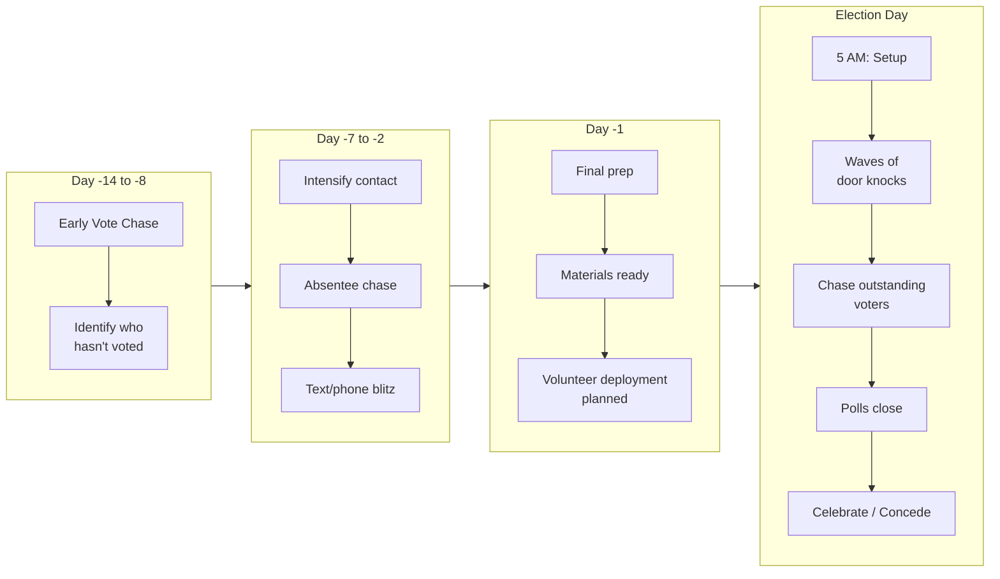

# GOTV Plan

A detailed operational guide for Get Out The Vote (GOTV) -- the final push to ensure every supporter actually casts a ballot. GOTV is where campaigns are won or lost. The best message, the biggest war chest, and the most volunteers mean nothing if your supporters do not vote. Start planning GOTV early but execute it in the final days.

---

## GOTV Final Two Weeks Timeline

---

## GOTV Overview

GOTV has one goal: convert identified supporters into actual voters. By this point in the campaign, persuasion is mostly over. The question is not "who will they vote for?" but "will they vote at all?"

### Who is in the GOTV Universe?
- [ ] Voters you have identified as supporters through canvassing, phone calls, and other contacts
- [ ] Voters in your base who have lower vote propensity (they support you but might not show up)
- [ ] Voters who requested absentee ballots but have not yet returned them
- [ ] Supporters who have not yet voted during early voting

### Who is NOT in the GOTV Universe?
- Voters identified as opponents (contacting them reminds them to vote against you)
- Voters you have never contacted and know nothing about
- High-propensity base voters who always vote (they do not need a reminder)

---

## The 4-3-2-1 Contact Schedule

The GOTV contact schedule intensifies as election day approaches. Each contact is a reminder to vote with information on how and where to do so.

| Days Out | Contact | Method | Message |
|---|---|---|---|
| 4 days (Thursday before Tuesday election) | First GOTV contact | Phone call or text | "Election is Tuesday. Here is your polling location and hours." |
| 3 days (Friday) | Second GOTV contact | Door knock or phone | "Are you planning to vote? Do you know where to go?" |
| 2 days (Saturday) | Third GOTV contact | Door knock | "Election is in 2 days. Do you have a plan to vote?" |
| 1 day (Monday) | Final GOTV contact | Phone, text, and/or door | "Tomorrow is election day. Your polling place is [X]. Polls open at [time]." |
| Election Day | Election day chase | Phone, text, door | "Have you voted yet? Polls close at [time]. Need a ride?" |

- [ ] Build your GOTV contact plan using this framework
- [ ] Adjust timing for early voting states (GOTV starts earlier)
- [ ] Each contact should include: polling location, hours, what to bring (ID if required)

---

## Early Vote and Absentee Chase

In states with early voting or no-excuse absentee voting, GOTV starts weeks before election day.

### Absentee Ballot Tracking
- [ ] Identify supporters who requested absentee ballots (from voter file or public records)
- [ ] Track which ballots have been returned (many states make this data available)
- [ ] Contact supporters whose ballots have NOT been returned with reminders
- [ ] Provide instructions: how to fill out the ballot, where to return it, deadlines
- [ ] Offer to help with ballot drop-off if legal in your jurisdiction
- [ ] Continue tracking and contacting until all targeted absentee ballots are returned or the deadline passes

### Early Vote Chase
- [ ] Determine early voting dates, locations, and hours
- [ ] Contact supporters before early voting opens with location and schedule information
- [ ] During the early vote period, check public early vote data daily (many states release this)
- [ ] Cross-reference early voters against your supporter list
- [ ] Remove voters who have already voted from your GOTV contact list (do not waste resources)
- [ ] Intensify contact with supporters who have not yet voted as early voting nears its end
- [ ] Organize "vote together" events: groups going to early vote locations together

---

## Election Day Operations

### Command Center
- [ ] Establish a central command center (campaign office, volunteer's home, or rented space)
- [ ] Set up phone lines, computers, and a data tracking system
- [ ] Post a whiteboard or digital dashboard with key metrics: voters contacted, votes confirmed, outstanding targets
- [ ] Assign a GOTV director to manage all election day operations
- [ ] Establish communication channels with all field teams (group text, radio, or app)

### Polling Location Coverage
- [ ] Assign volunteers to each polling location in your district (if permitted by law)
- [ ] Determine legal boundaries for campaign activity near polls (varies by jurisdiction, typically 25-150 feet)
- [ ] Volunteers at polls should greet friendly voters (from your list) and remind them of your candidate
- [ ] Station a poll monitor (not a campaigner) inside the polling place if your jurisdiction allows poll watchers
- [ ] Provide poll volunteers with: candidate literature (for outside the restricted zone), voter lists, phone for reporting

### Voter Check-Off System (Knock and Drag)
- [ ] Obtain the list of voters who have voted throughout election day (many jurisdictions provide periodic updates)
- [ ] Cross-reference voted list against your supporter target list
- [ ] Identify supporters who have NOT yet voted as the day progresses
- [ ] Deploy "knock and drag" teams to the homes of supporters who have not yet voted
- [ ] Intensify contacts in the final 2-3 hours before polls close
- [ ] This is the most critical operation of election day -- prioritize it above all else

---

## Volunteer Deployment

### GOTV Volunteer Needs

| Role | People Needed | Schedule |
|---|---|---|
| Door knockers (4-day GOTV) | As many as possible | Thu-Mon before election |
| Phone/text bankers | 10-20+ | Thu-Mon and election day |
| Poll greeters | 1-2 per polling location | Election day, all hours |
| Poll watchers | 1 per polling location | Election day, rotating shifts |
| Drivers (ride to polls) | 3-5+ | Election day |
| Data trackers | 2-3 | Election day (command center) |
| Knock and drag teams | 5-10+ | Election day, especially afternoon |
| Command center coordinator | 1-2 | Election day |

- [ ] Recruit all GOTV volunteers at least 2 weeks before election day
- [ ] Confirm every volunteer 48 hours before their shift
- [ ] Over-recruit by 30% to account for no-shows
- [ ] Brief all volunteers on their specific roles and provide written instructions
- [ ] Have food and water available for volunteers throughout election day

### Volunteer Shift Schedule (Election Day)

| Shift | Hours | Focus |
|---|---|---|
| Morning | 6 AM - 12 PM | Poll coverage, first round of phone/text contacts |
| Afternoon | 12 PM - 4 PM | Knock and drag, ongoing phone/text, poll coverage |
| Closing push | 4 PM - polls close | All hands on deck: knock and drag non-voters, final calls/texts |

---

## Ride to the Polls

- [ ] Set up a ride-to-polls phone number or signup (promote it in GOTV contacts)
- [ ] Recruit volunteer drivers with vehicles
- [ ] Coordinate ride requests through the command center
- [ ] Dispatch drivers to pick up voters and transport them to their polling location
- [ ] Prioritize elderly and mobility-impaired supporters
- [ ] Ensure drivers understand they cannot campaign inside their vehicle while transporting voters (some jurisdictions restrict this)
- [ ] Have a backup plan (rideshare credits, public transit information) if volunteer drivers are insufficient

---

## Poll Monitoring

> **EDUCATIONAL DISCLAIMER:** Poll watcher and poll monitor rules vary by state. In most states, poll watchers must be officially designated by a party or candidate and may observe specific processes. Understand your state's laws before deploying anyone inside a polling place. This guide is for educational purposes and does not constitute legal advice.

- [ ] Determine your state's poll watcher laws and application process
- [ ] Apply for poll watcher credentials well in advance (deadlines vary)
- [ ] Train poll watchers on what they can and cannot do
- [ ] Poll watchers observe: voter check-in process, ballot handling, vote counting procedures
- [ ] Poll watchers report irregularities to the campaign's legal team immediately
- [ ] Have an attorney or legal contact on call throughout election day
- [ ] Document any issues with specific detail: time, location, what happened, who was involved

---

## GOTV Materials Checklist

- [ ] Updated walk lists and turf packets for GOTV canvassing
- [ ] Phone scripts for GOTV calls (shorter and more urgent than persuasion scripts)
- [ ] Polling location information for every precinct in your district
- [ ] Palm cards or door hangers with candidate name and polling info
- [ ] Volunteer instruction packets for each role
- [ ] Clipboards, pens, and phone chargers
- [ ] Water, snacks, and coffee for volunteers
- [ ] Campaign literature for poll greeters (outside the restricted zone)
- [ ] A "ride to polls" phone number printed on all materials

---

## GOTV Timeline

| When | Action |
|---|---|
| 6-8 weeks out | Finalize GOTV universe; begin recruiting GOTV volunteers |
| 4 weeks out | Begin absentee chase (if applicable); confirm GOTV volunteer commitments |
| 2 weeks out | Begin early vote chase; finalize election day plan; print GOTV materials |
| 1 week out | Confirm all volunteers; finalize turf packets and walk lists; set up command center |
| 4 days out | Begin 4-3-2-1 contact schedule |
| Election day | Execute election day operations; knock and drag; ride to polls |
| Election night | Celebrate or regroup (see `post-election.md`) |

---

## Key Principles

1. **Only contact supporters.** GOTV is not persuasion. Contacting undecided or hostile voters during GOTV wastes resources and can backfire.
2. **Subtract voters who have voted.** Every contact with someone who already voted is a wasted contact. Update your lists constantly.
3. **The last two hours matter most.** Deploy maximum resources in the final hours before polls close.
4. **Data drives everything.** Real-time data on who has and has not voted is the single most important GOTV asset.
5. **Plan for chaos.** Election day never goes perfectly. Build flexibility and backup plans into every part of your operation.
