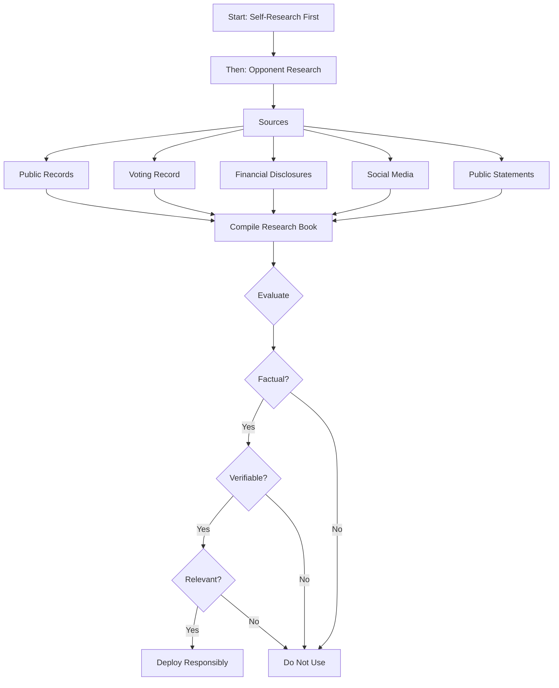

# Opposition Research

A guide to conducting thorough, ethical, and legally sound opposition research. Oppo research is the process of gathering publicly available information about your opponents -- and about yourself -- to inform campaign strategy. Good campaigns research themselves first and their opponents second.

---

## Opposition Research Process

---

## Why Opposition Research Matters

Opposition research serves three purposes:

1. **Self-defense:** Know your own vulnerabilities before your opponents or the press discover them.
2. **Contrast:** Identify legitimate policy and record differences to draw clear distinctions for voters.
3. **Preparation:** Anticipate attacks and prepare responses before they come.

Opposition research is NOT about inventing attacks, spreading misinformation, or engaging in personal destruction. Stick to facts, public records, and verifiable information.

---

## Self-Research: Always Start Here

Research yourself first. If there is something damaging in your background, assume your opponents will find it.

### Personal Records
- [ ] Google your own name (with and without middle name, maiden name, nicknames)
- [ ] Search social media history: Facebook, X/Twitter, Instagram, TikTok, LinkedIn, old platforms (MySpace, etc.)
- [ ] Search for archived versions of your social media and websites (Wayback Machine at archive.org)
- [ ] Review your public court records (civil and criminal, all jurisdictions where you have lived)
- [ ] Check property records and tax assessment history
- [ ] Review any professional licensing records and disciplinary actions
- [ ] Check for bankruptcy filings
- [ ] Review corporate filings and business registrations you are associated with
- [ ] Review academic records and any publicly available transcripts or honors

### Public Statements and Positions
- [ ] Compile all public statements, op-eds, letters to the editor, and media interviews
- [ ] Review any testimony you have given (government hearings, court proceedings)
- [ ] Identify any past statements that contradict your current positions
- [ ] Review any petitions, ballot measures, or political activities you have supported

### Financial and Professional
- [ ] Review any required financial disclosures
- [ ] Check for liens, judgments, or collections
- [ ] Review your credit report (not public, but creditors and legal proceedings can reveal issues)
- [ ] Identify any business associations that could be controversial
- [ ] Review your voting record (have you voted consistently? missed elections?)

### Self-Research Assessment
- [ ] List every potential vulnerability you identified
- [ ] For each vulnerability, prepare a factual explanation and response
- [ ] Determine which vulnerabilities are manageable and which are potentially disqualifying
- [ ] Brief your campaign manager and communications team on all findings
- [ ] Do NOT hide vulnerabilities from your own team -- surprises lose campaigns

---

## Opponent Research: Public Records

All opposition research should be based on publicly available information. Never use illegal methods, hack accounts, or misrepresent yourself to obtain information.

### Government and Court Records
- [ ] Court records: civil lawsuits, criminal cases, divorces, restraining orders (search all jurisdictions)
- [ ] Property records: ownership, tax assessments, purchases, sales
- [ ] Business filings: corporations, LLCs, partnerships (secretary of state filings)
- [ ] Professional licenses and disciplinary actions
- [ ] Bankruptcy filings (federal court PACER system)
- [ ] Campaign finance records: their own past donations and the donations their campaigns have received
- [ ] Financial disclosure filings (if they hold or have held public office)
- [ ] Lobbying registrations and disclosures

### Voting Record and Legislative History
- [ ] If the opponent holds or held elected office, obtain their complete voting record
- [ ] Identify votes that are unpopular with the electorate or inconsistent with their public statements
- [ ] Review bills they sponsored, co-sponsored, or blocked
- [ ] Review committee assignments and attendance
- [ ] Check for any ethics complaints or investigations
- [ ] Review official statements, floor speeches, and committee hearing transcripts

### Public Statements and Media
- [ ] News archive search: search their name in local and national news databases
- [ ] Editorial board endorsement questionnaires they have completed
- [ ] Debate transcripts and video from prior campaigns
- [ ] Published letters to the editor, op-eds, and opinion columns
- [ ] Podcast appearances, radio interviews, and public speaking engagements
- [ ] Social media history (all platforms, going back as far as possible)
- [ ] Campaign websites from prior races (check Wayback Machine)

### Financial Disclosures
- [ ] Personal financial disclosures filed with government bodies
- [ ] Business interests, board memberships, and financial holdings
- [ ] Potential conflicts of interest between their financial holdings and their public duties
- [ ] Charitable contributions and organizational affiliations

### Campaign Finance Research
- [ ] Review their campaign finance reports (who funds them?)
- [ ] Identify their largest donors and any patterns (industry concentrations, special interests)
- [ ] Check for any campaign finance violations, fines, or late filings
- [ ] Review independent expenditures made on their behalf

---

## Social Media Research

- [ ] Screenshot and archive relevant posts (social media can be deleted)
- [ ] Review posts, comments, likes, shares, and follows
- [ ] Check for personal accounts vs. official accounts
- [ ] Look for deleted or hidden posts using archive tools
- [ ] Review the accounts they follow and groups they belong to
- [ ] Note any posts that reveal positions, associations, or character
- [ ] Be thorough but fair -- context matters. A joke from 15 years ago is different from a policy statement made last year.

---

## Ethical Boundaries

### Do
- Use publicly available information and records
- Verify every fact from at least two independent sources before using it
- Focus on the opponent's public record, policy positions, and qualifications
- Draw legitimate contrasts on issues that matter to voters
- Present information accurately and in context

### Do Not
- Hack, steal, or illegally access private information
- Misrepresent yourself to obtain records (do not pretend to be someone else)
- Use information about the opponent's minor children
- Fabricate, exaggerate, or distort information
- Target an opponent's race, religion, ethnicity, gender, sexual orientation, or disability
- Traffic in unverified rumors or anonymous allegations
- Coordinate opposition research deployment with outside groups in ways that violate coordination rules (see `coordination-rules.md`)
- Record conversations without consent in states that require two-party consent

---

## Organizing Your Research

### The Opposition Research Book

Compile your findings into a structured document:

1. **Biographical summary:** basic facts about the opponent
2. **Professional and business history**
3. **Political record:** votes, positions, statements
4. **Financial summary:** disclosures, donors, business interests
5. **Legal history:** lawsuits, violations, issues
6. **Potential vulnerabilities:** organized by topic, with source citations
7. **Contrast points:** side-by-side comparisons on key issues
8. **Source documentation:** keep copies of all source materials (screenshots, records, articles)

- [ ] Cite every fact with a source (document name, date, URL, or record reference)
- [ ] Keep the research book updated throughout the campaign
- [ ] Limit access to the full book to the candidate, campaign manager, and communications director

---

## Deployment: Using Opposition Research

### Timing
- Do NOT release all your research at once -- deploy strategically over the course of the campaign
- Save the most impactful contrasts for when the electorate is paying the most attention (final weeks)
- Respond to attacks with pre-prepared research quickly (within hours, not days)

### Methods
- Direct mail contrasting your record with the opponent's
- Digital advertising highlighting specific votes or positions
- Press releases and media pitches with sourced documentation
- Debate preparation: build questions and responses around research findings
- Earned media: provide documented research to journalists covering the race

### Rules of Deployment
- [ ] Every claim you make publicly must be documented and verifiable
- [ ] Include source citations in all public communications
- [ ] Anticipate how the opponent will respond and prepare counter-responses
- [ ] Do not deploy research that could backfire or generate sympathy for the opponent
- [ ] Test contrast messages with focus groups or trusted advisors before going public
- [ ] All paid communications using opposition research must include required disclaimers

---

## Key Principles

1. **Research yourself first.** The most dangerous attacks are the ones you did not see coming about yourself.
2. **Facts only.** Every claim must be sourced and verifiable. If you cannot prove it, do not use it.
3. **Context matters.** Present information fairly. Distorted facts erode your credibility more than your opponent's.
4. **Legal compliance.** Only use legal, publicly available sources. Never cross ethical or legal lines.
5. **Strategic patience.** The best opposition research is deployed at the right moment, not the first moment.
