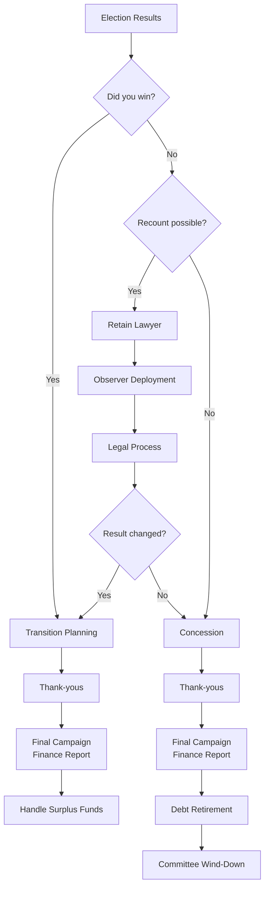

# Post-Election Guide

Everything that happens after the polls close. Whether you win, lose, or face a recount, your conduct in the days and weeks after election day defines your reputation. Handle this phase with discipline and grace.

---

## Post-Election Decision Tree

---

## Election Night Protocol

### Before Results Come In
- [ ] Gather core team, family, and key supporters at your election night location
- [ ] Have two speeches fully prepared: victory and concession
- [ ] Designate one person as results monitor (tracking by precinct against projections)
- [ ] Have your campaign attorney on standby for close-result scenarios
- [ ] Assign a press spokesperson for all media inquiries
- [ ] Prepare a private space for the candidate away from the crowd

### As Results Come In
- [ ] Track results by precinct and compare to your win-number model
- [ ] Do not make public statements until the picture is clear
- [ ] Wait for official or near-complete results before any declaration
- [ ] Consult campaign manager and attorney before calling the race
- [ ] If the margin is within recount territory, do not concede -- wait and consult counsel

---

## If You WIN

### Election Night Actions
- [ ] Wait for your opponent to concede (customary but not required) or for results to be decisive
- [ ] Call your opponent to thank them for a hard-fought race
- [ ] Deliver your victory speech

**Victory Speech Structure (8-12 minutes):**
1. Thank the voters for their trust
2. Thank your opponent and call for unity
3. Thank your campaign team, volunteers, and staff by name where possible
4. Thank your family -- they sacrificed the most
5. Thank your donors and endorsers
6. Restate the 2-3 core issues you ran on
7. Outline your vision and first priorities in office
8. Close with an aspirational call to service

**Tone:** Humble, grateful, forward-looking. You won -- do not spike the football. Half the electorate did not vote for you. Speak to them too.

### First 48 Hours After a Win
- [ ] Issue a press release and social media victory statement
- [ ] Send a thank-you email blast to your full supporter list
- [ ] Call major donors personally (top 25 minimum)
- [ ] Call every endorser personally
- [ ] Call your top 10 volunteers personally
- [ ] Designate a media spokesperson for post-election press
- [ ] Begin transition planning (do not start governing -- focus on gratitude first)

### Transition Planning
- [ ] Research the transition process: swearing-in date, office setup, staffing timeline
- [ ] Begin identifying candidates for staff roles, appointed positions, advisory roles
- [ ] Schedule a meeting with the outgoing officeholder (if applicable and willing)
- [ ] Schedule meetings with key stakeholders: department heads, community leaders, partner agencies
- [ ] Review the budget and operations of the office you are entering
- [ ] Identify your first 90-day priorities in office
- [ ] Attend any required orientation or training for new officeholders
- [ ] Set up your official office (separate from campaign office -- do not mix government and campaign)

### Hiring for Office
- [ ] Define roles and responsibilities for each position
- [ ] Prioritize: chief of staff or equivalent first, then constituent services, then policy
- [ ] Consider retaining experienced staff from the previous officeholder
- [ ] Recruit from your campaign team where appropriate (but not everyone is suited for governing)
- [ ] Post positions publicly -- governing staff should reflect the community you serve

---

## If You LOSE

### Election Night Actions
- [ ] Accept the result once it is clear. Do not wait unnecessarily.
- [ ] Call your opponent to congratulate them
- [ ] Deliver your concession speech promptly

**Concession Speech Structure (5-8 minutes):**
1. Acknowledge the result clearly and congratulate your opponent by name
2. Thank your supporters, volunteers, donors, and family
3. Reaffirm the values and issues you ran on -- they still matter
4. Call for unity and encourage supporters to stay civically engaged
5. Express gratitude for the democratic process
6. Close with hope

**Tone:** Gracious, dignified, brief. Do not assign blame. Do not make excuses. Your supporters are hurting -- give them something to be proud of.

### Concession Call Etiquette
- Call before your public concession speech
- Keep it brief: congratulate, wish them well, offer to help with transition if appropriate
- Be sincere -- your opponent can tell if you are not
- If you cannot reach them, leave a message and try again

### Thank-You Communications (First 7 Days)
- [ ] **Donors:** Personal calls to top 25 donors. Personalized email to all donors within 48 hours. Handwritten notes to top 50 within 2 weeks.
- [ ] **Volunteers:** Personal calls to volunteer captains. Mass thank-you email to all volunteers. Host a thank-you gathering within 2-3 weeks.
- [ ] **Endorsers:** Personal calls to every endorser within 48 hours. Written thank-you notes within 1 week.
- [ ] **Family:** Private time with family immediately. They need to hear from you, not the campaign.
- [ ] **Staff:** Meet individually with each paid staff member. Thank them. Discuss timeline for final pay and transition.
- [ ] **Opponent:** A brief, gracious written note regardless of the race's tone.

### Post-Loss Reflection
- [ ] Allow yourself time to grieve -- losing is painful and that is normal
- [ ] Resist the urge to publicly relitigate the race
- [ ] Debrief with your core team after 2-3 weeks (not immediately -- emotions are too raw)
- [ ] Document lessons learned for yourself or future candidates
- [ ] Consider your next chapter: run again, support another candidate, pursue appointed office, return to private life

---

## Final Campaign Finance Report

> **EDUCATIONAL DISCLAIMER:** Post-election reporting requirements vary by jurisdiction. Federal campaigns have specific post-election report due dates. State and local requirements vary. This guide is for educational purposes and does not constitute legal advice.

- [ ] Identify the post-election report due date (typically 30 days after the election)
- [ ] Follow the full report preparation process (see `compliance-report-prep.md`)
- [ ] Report all contributions received through the end of the reporting period
- [ ] Report all expenditures made through the reporting period
- [ ] Report all outstanding debts and obligations
- [ ] File on time -- post-election reports receive heavy public and media scrutiny
- [ ] Continue filing on schedule until the committee is formally terminated

---

## Debt Retirement Plan

If your campaign owes money, you must retire debts before closing the committee.

- [ ] Compile a complete list of all debts: vendors, loans, credit cards, candidate personal loans
- [ ] Prioritize: legal obligations first (vendor contracts, payroll), then loans
- [ ] Continue fundraising to retire debt (contribution limits still apply post-election)
- [ ] Negotiate with vendors if necessary -- some will accept partial payment to close the account
- [ ] Candidate personal loans: federal rules limit the amount a candidate can repay themselves from post-election contributions (check current FEC rules for amount and deadline)
- [ ] Document all debt retirement activity in ongoing campaign finance reports
- [ ] Do not dissolve the committee until all debts are settled, forgiven, or written off

---

## Surplus Funds Options

If money remains after all debts are paid, you must dispose of it properly.

> **EDUCATIONAL DISCLAIMER:** Rules for surplus fund disposition vary by jurisdiction. Verify with your regulatory body.

| Option | Details |
|---|---|
| **Donate to charity** | Transfer to one or more 501(c)(3) organizations. Popular and good optics. |
| **Transfer to future campaign committee** | If you plan to run again, keep the committee open and retain funds. Rules vary by jurisdiction. |
| **Return to donors** | Refund contributions pro-rata. Rare but legally clean. |
| **Transfer to party** | Give to your local, state, or national party committee. Builds goodwill. |
| **Donate to other candidates** | Contribute to other campaigns (subject to contribution limits). |
| **Transfer to officeholder account** | Some jurisdictions allow accounts for official duties. |

**What you CANNOT do:** Convert campaign funds to personal use. This is illegal everywhere. No personal expenses, investments, or gifts to yourself or family.

---

## Recount Procedures

### Automatic Recount Thresholds
Thresholds vary by state. Common patterns:
- **Percentage-based:** Automatic recount if margin is less than 0.5% (some states use 0.25% or 1%)
- **Fixed-number:** Automatic recount if margin is fewer than a set number of votes
- **No automatic recount:** Some states only allow requested recounts

Check your state's specific threshold before election night so you know what to expect.

### Requested Recount Process
- [ ] Determine the deadline for requesting a recount (often 2-5 days after certification)
- [ ] Assess the cost -- some jurisdictions charge the requesting candidate (refunded if the result changes)
- [ ] Consult your campaign attorney before deciding
- [ ] File the recount petition with the appropriate authority by the deadline
- [ ] Continue fundraising if needed to cover recount costs

### Legal Representation
- [ ] Retain an election lawyer at filing (not after election day -- it is too late)
- [ ] Have counsel review recount statutes and procedures in advance
- [ ] Engage recount-experienced counsel if your regular attorney lacks this expertise
- [ ] Budget for legal costs: recounts can cost $10,000 to $100,000+ depending on scope

### Observer Deployment
- [ ] Recruit trained observers for every recount counting location
- [ ] Train observers: what to watch for, how to challenge, what they cannot do
- [ ] Credential observers through the proper legal channels
- [ ] Establish a real-time communication chain: observers report to a legal coordinator, who reports to counsel
- [ ] Maintain composure -- observers must be professional, not confrontational

---

## Committee Termination

### Requirements
- [ ] All debts retired or formally forgiven
- [ ] All surplus funds disposed of properly
- [ ] Account balance at zero (or within the regulatory threshold)
- [ ] All required reports filed and up to date

### Timeline
- [ ] File the final/termination report with your campaign finance regulatory body
- [ ] Indicate on the report that this is the final report and the committee is terminating
- [ ] Close the campaign bank account
- [ ] Cancel all recurring expenses: subscriptions, software, phone lines, PO boxes
- [ ] Notify the IRS if the committee had an EIN

### Record Retention
- [ ] Retain all campaign records for a minimum of 3 years (5+ years recommended, longer in some jurisdictions)
- [ ] Records to keep: all financial records, contribution records, expenditure receipts, bank statements, reports filed, contracts, correspondence
- [ ] Store securely -- these records may be needed for audits, legal inquiries, or future campaigns
- [ ] Retain the treasurer's contact information and records access in case of future inquiries
- [ ] Do not destroy records prematurely -- check your jurisdiction's specific retention requirements

---

## Looking Ahead

Whether you won or lost:
- [ ] Debrief with your core team (what worked, what failed, what you would do differently)
- [ ] Maintain your supporter list and relationships (with consent for future communication)
- [ ] If you lost: consider running again, supporting another candidate, or pursuing other civic roles
- [ ] If you won: govern well -- the best re-election strategy is doing the job you were elected to do
- [ ] Thank your family one more time. They gave more than anyone.
