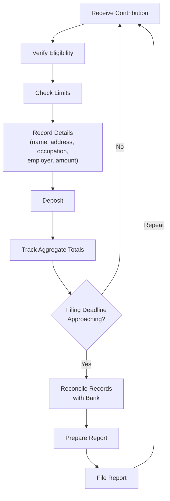

# Treasurer Setup Guide

The campaign treasurer is the legal custodian of your campaign's finances. In many jurisdictions, the treasurer bears personal liability for the accuracy of campaign finance reports. This guide covers everything your treasurer needs to know to set up systems, stay compliant, and avoid costly mistakes.

---

> **EDUCATIONAL DISCLAIMER:** Treasurer responsibilities, reporting requirements, and personal liability vary significantly by jurisdiction. Federal campaigns are governed by the FEC; state and local campaigns are governed by their respective election commissions or secretaries of state. The information below provides general best practices. Your treasurer should review the specific rules for your jurisdiction and consider consulting a campaign finance attorney. This guide is for educational purposes and does not constitute legal advice.

---

## Bank Account Setup

The campaign bank account is the foundation of financial compliance. Every dollar in and every dollar out must flow through this account.

- [ ] Open a dedicated checking account in the committee's legal name
- [ ] Use the committee's EIN (not the candidate's SSN)
- [ ] Determine signatory authority (treasurer alone is typical; some campaigns require dual signatures)
- [ ] Order checks with the committee name, address, and account number
- [ ] Set up online banking and enable transaction alerts
- [ ] Set up a debit card only if absolutely necessary (checks and electronic transfers are preferred for documentation)
- [ ] Do NOT open savings accounts, CDs, or investment accounts without checking your jurisdiction's rules
- [ ] Do NOT commingle campaign funds with personal funds under any circumstances
- [ ] Deposit all contributions into this account -- no exceptions
- [ ] Pay all campaign expenses from this account -- no exceptions

### Petty Cash (If Permitted)
- [ ] Check if your jurisdiction allows petty cash disbursements
- [ ] If permitted, set a maximum petty cash amount (typically $100 or less)
- [ ] Require receipts for all petty cash expenditures
- [ ] Replenish petty cash by check from the campaign account
- [ ] Track all petty cash transactions in your records

---

## Record-Keeping Requirements

### Contribution Records

For every contribution received, record:

- [ ] Full legal name of the contributor
- [ ] Mailing address
- [ ] Date received
- [ ] Amount
- [ ] Contribution type (check, cash, online, in-kind)
- [ ] Employer and occupation (required above certain thresholds in most jurisdictions)
- [ ] Cumulative total from this contributor for the election cycle
- [ ] Check number or transaction ID

### Expenditure Records

For every expenditure, record:

- [ ] Date of the expenditure
- [ ] Payee name and address
- [ ] Amount
- [ ] Purpose / description of the expense
- [ ] Category (staff, media, printing, postage, travel, etc.)
- [ ] Check number or payment method
- [ ] Invoice or receipt (retain the original)

### Record-Keeping Template

| Date | Type | Name/Payee | Amount | Purpose | Running Balance |
|---|---|---|---|---|---|
| MM/DD | Contribution | Jane Smith | +$250.00 | Individual contribution | $250.00 |
| MM/DD | Expenditure | Print Shop Inc. | -$150.00 | 500 palm cards | $100.00 |
| MM/DD | Contribution | John Doe | +$100.00 | Individual contribution | $200.00 |

---

## Report Filing

### Filing Calendar

- [ ] Obtain the complete filing calendar from your campaign finance regulatory body
- [ ] Enter every filing deadline into a calendar with reminders at 30, 14, and 7 days before
- [ ] Identify which reports are mandatory regardless of activity
- [ ] Determine if electronic filing is required or optional
- [ ] Know the penalties for late filing (fines, public notice, potential legal action)

### Report Preparation Process

Follow the `compliance-report-prep.md` workflow for each report. Summary:

1. Reconcile bank statement with internal records
2. Verify all contribution data is complete (names, addresses, employer/occupation)
3. Verify all expenditure data is complete and properly categorized
4. Check for contributions that exceed limits
5. Calculate totals: receipts, disbursements, cash on hand, debts
6. Draft the report using the required form or software
7. Review the draft for errors (the treasurer and one other person should review)
8. File by the deadline
9. Retain a copy of the filed report and confirmation of filing

### Common Report Types
- Pre-primary report
- Pre-general report
- Quarterly reports
- Post-election report
- Year-end / annual report
- 48-hour notices (for large last-minute contributions, federal campaigns)
- Termination report (when closing the committee)

---

## Compliance Essentials

### Contribution Limits

- [ ] Know the per-election contribution limit for individuals
- [ ] Know the per-election limit for PACs (if applicable)
- [ ] Know the aggregate limits (if applicable -- note: federal aggregate limits were struck down; state rules vary)
- [ ] Track cumulative contributions by donor to prevent over-limit acceptance
- [ ] Return or refund any over-limit contributions within the required timeframe

### Prohibited Sources

- [ ] Know which sources are prohibited in your jurisdiction (common prohibitions include: foreign nationals, government contractors, corporations in some jurisdictions, anonymous donors above a threshold)
- [ ] Establish a screening process for contributions (see `donation-intake.md`)
- [ ] Return prohibited contributions immediately upon discovery

### Personal Use Prohibition

Campaign funds cannot be used for personal expenses. This is a bright-line rule in virtually every jurisdiction.

- [ ] No personal mortgage, rent, or utility payments
- [ ] No personal clothing (unless campaign-specific costumes/uniforms)
- [ ] No personal vehicle payments
- [ ] No personal travel unrelated to the campaign
- [ ] No gifts to family members
- [ ] When in doubt, ask: "Would this expense exist regardless of the campaign?" If yes, it is likely personal use.

---

## Common Mistakes to Avoid

1. **Late filings.** The number one treasurer mistake. Set reminders early and often.
2. **Incomplete donor information.** Missing employer/occupation data is the most common filing deficiency. Collect it at the time of the contribution.
3. **Commingling funds.** Never mix personal and campaign money. Not even temporarily.
4. **Missing receipts.** No receipt means no documentation. Require receipts for everything.
5. **Accepting prohibited contributions.** Screen every contribution before depositing.
6. **Failing to track in-kind contributions.** Goods and services donated to the campaign are contributions and must be reported at fair market value.
7. **Not reconciling regularly.** Reconcile your bank statement monthly at minimum.
8. **Improper cash handling.** Cash contributions over the legal threshold (often $100) may be prohibited. Know the rules.
9. **Ignoring debt reporting.** Unpaid bills and loans to the campaign are debts and must be reported.
10. **Not keeping copies.** Retain copies of every filed report, every check, every receipt, every deposit slip. Keep records for at least 3-5 years after the committee terminates (longer in some jurisdictions).

---

## Red Flags That Require Immediate Attention

- A contribution that exceeds the legal limit
- A contribution from a source that may be prohibited (corporation, foreign national, anonymous above threshold)
- A check that bounces or a credit card charge that is reversed
- An expenditure that lacks documentation or a clear campaign purpose
- A discrepancy between your records and the bank statement
- A complaint or inquiry from the regulatory body
- A media inquiry about campaign finances
- Any suggestion from a campaign team member to "handle something off the books"

**Response to red flags:** Stop, document the issue, consult the candidate and (if needed) a campaign finance attorney. Do not try to fix compliance problems by obscuring them -- transparency is always the safest course.

---

## Treasurer Checklist: Weekly Tasks

- [ ] Record all contributions received during the week
- [ ] Record all expenditures made during the week
- [ ] Deposit all checks and cash received
- [ ] File receipts for all expenditures
- [ ] Review bank account for any unexpected transactions
- [ ] Follow up on any contributions missing required donor information
- [ ] Update the running cash-on-hand figure
- [ ] Brief the candidate or campaign manager on financial status

## Treasurer Checklist: Monthly Tasks

- [ ] Reconcile bank statement with internal records
- [ ] Review cumulative contribution totals by donor for limit compliance
- [ ] Prepare a financial summary (total raised, total spent, cash on hand)
- [ ] Review upcoming filing deadlines
- [ ] Archive the month's records (digital and physical)
- [ ] Flag any compliance concerns for resolution

---

## Resources

- Your jurisdiction's campaign finance regulatory body website
- FEC website (fec.gov) for federal races
- Campaign finance software options: ISPolitical, NGP VAN, Anedot, Campaign Deputy
- A campaign finance attorney familiar with your jurisdiction's rules

The treasurer role is demanding but essential. A good treasurer keeps the campaign out of trouble and lets the candidate focus on winning votes.
